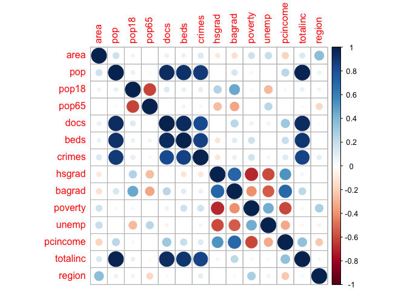

Jing Lyu
================
LYU JING
11/22/2021

``` r
library(tidyverse)
```

    ## ── Attaching packages ─────────────────────────────────────── tidyverse 1.3.1 ──

    ## ✓ ggplot2 3.3.5     ✓ purrr   0.3.4
    ## ✓ tibble  3.1.5     ✓ dplyr   1.0.7
    ## ✓ tidyr   1.1.3     ✓ stringr 1.4.0
    ## ✓ readr   2.0.1     ✓ forcats 0.5.1

    ## ── Conflicts ────────────────────────────────────────── tidyverse_conflicts() ──
    ## x dplyr::filter() masks stats::filter()
    ## x dplyr::lag()    masks stats::lag()

``` r
cdi = read.csv("data/cdi.csv")


cdi_cor = cdi %>% 
  select(-id,-cty,-state)
```

``` r
cdi.cor = cor(cdi_cor)


library(corrplot)
```

    ## corrplot 0.92 loaded

``` r
corrplot(cdi.cor)
```

<!-- -->
