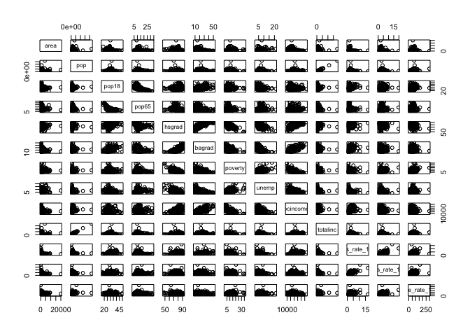
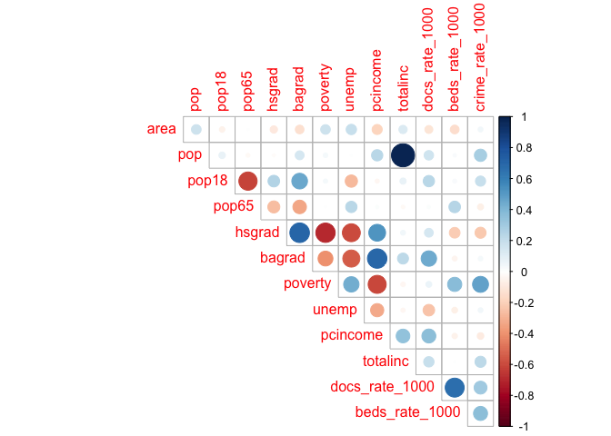
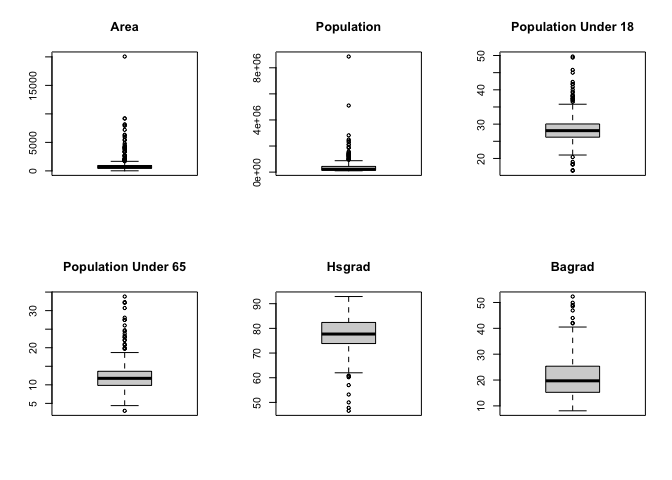
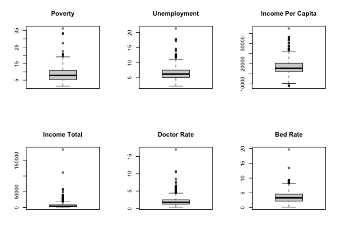
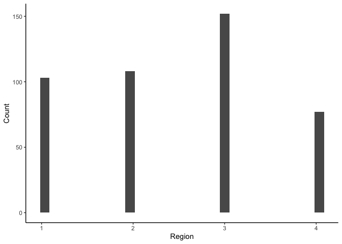
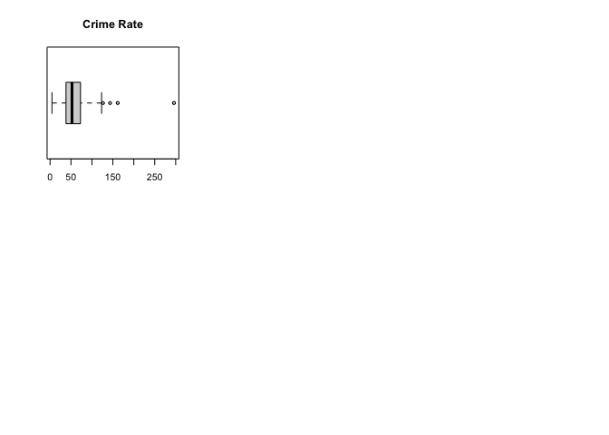

Mingkuan’s Part
================
Mingkuan Xu (mx2262)
12/4/2021

``` r
library(tidyverse)
library(corrplot)
```

### Data Preprocessing

After importing the csv file containing the County Demographic
Information (CDI) data, we notice that crimes, physicians, and hospital
beds are given as numbers, while other info are given as proportions. We
therefore compute the number of crimes, physicians, and hospital beds
per 1000 people.

``` r
cdi_data = read.csv("./data/cdi.csv") %>%
  janitor::clean_names() %>%
  mutate(
    cty_state = str_c(cty,",",state),
    docs_rate_1000 = 1000 * docs/pop, # Compute number of doctors/hospital beds per 1000 people.
    beds_rate_1000 = 1000 * beds/pop,
    crime_rate_1000 = 1000 * crimes/pop,
    density = as.numeric(pop)/as.numeric(area)) %>% # Compute number of crimes per 1000 people.) 
  dplyr::select(-docs,-beds,-crimes) %>%
  relocate(id,cty_state,cty,density)

knitr::kable(head(cdi_data))
```

|  id | cty_state   | cty      |    density | state | area |     pop | pop18 | pop65 | hsgrad | bagrad | poverty | unemp | pcincome | totalinc | region | docs_rate_1000 | beds_rate_1000 | crime_rate_1000 |
|----:|:------------|:---------|-----------:|:------|-----:|--------:|------:|------:|-------:|-------:|--------:|------:|---------:|---------:|-------:|---------------:|---------------:|----------------:|
|   1 | Los_Ange,CA | Los_Ange |  2183.0453 | CA    | 4060 | 8863164 |  32.1 |   9.7 |   70.0 |   22.3 |    11.6 |   8.0 |    20786 |   184230 |      4 |       2.671394 |       3.125295 |        77.73026 |
|   2 | Cook,IL     | Cook     |  5396.4767 | IL    |  946 | 5105067 |  29.2 |  12.4 |   73.4 |   22.8 |    11.1 |   7.2 |    21729 |   110928 |      2 |       2.968227 |       4.221296 |        85.58869 |
|   3 | Harris,TX   | Harris   |  1629.9589 | TX    | 1729 | 2818199 |  31.3 |   7.1 |   74.9 |   25.4 |    12.5 |   5.7 |    19517 |    55003 |      3 |       2.680080 |       4.417360 |        89.96029 |
|   4 | San_Dieg,CA | San_Dieg |   594.0585 | CA    | 4205 | 2498016 |  33.5 |  10.9 |   81.9 |   25.3 |     8.1 |   6.1 |    19588 |    48931 |      4 |       2.363876 |       2.473563 |        69.58362 |
|   5 | Orange,CA   | Orange   |  3051.3367 | CA    |  790 | 2410556 |  32.6 |   9.2 |   81.2 |   27.8 |     5.2 |   4.8 |    24400 |    58818 |      4 |       2.514772 |       2.642129 |        59.95463 |
|   6 | Kings,NY    | Kings    | 32403.7183 | NY    |   71 | 2300664 |  28.3 |  12.4 |   63.7 |   16.6 |    19.5 |   9.5 |    16803 |    38658 |      1 |       2.112868 |       3.886704 |       295.98672 |

## Exploratory Analysis

``` r
cdi_data_exp = cdi_data %>%
  dplyr::select(-id,-cty,-state, -cty_state,-region) 

# data exploratory
pairs(cdi_data_exp)
```

<!-- -->

``` r
# correlation plot
cdi_data_cor = cor(cdi_data_exp)
corrplot(cdi_data_cor, type = "upper", diag = FALSE)
```

<!-- -->

``` r
crime_1000_cor = data.frame(cdi_data_cor) %>% 
  dplyr::select("Crime Rate (Per 1000)" = crime_rate_1000) %>% 
  t()

knitr::kable(crime_1000_cor,digits = 2) 
```

|                       | density | area |  pop | pop18 | pop65 | hsgrad | bagrad | poverty | unemp | pcincome | totalinc | docs_rate_1000 | beds_rate_1000 | crime_rate_1000 |
|:----------------------|--------:|-----:|-----:|------:|------:|-------:|-------:|--------:|------:|---------:|---------:|---------------:|---------------:|----------------:|
| Crime Rate (Per 1000) |    0.48 | 0.04 | 0.28 |  0.19 | -0.07 |  -0.23 |   0.04 |    0.47 |  0.04 |    -0.08 |     0.23 |           0.31 |           0.36 |               1 |

``` r
par(mfrow=c(2,3))
boxplot(cdi_data_exp$area,main="Area")
boxplot(cdi_data_exp$pop,main="Population")
boxplot(cdi_data_exp$pop18,main="Population Under 18")
boxplot(cdi_data_exp$pop65,main="Population Under 65")
boxplot(cdi_data_exp$hsgrad,main="Hsgrad")
boxplot(cdi_data_exp$bagrad,main="Bagrad")
```

<!-- -->

``` r
par(mfrow=c(2,3))
boxplot(cdi_data_exp$poverty,main="Poverty")
boxplot(cdi_data_exp$unemp,main="Unemployment")
boxplot(cdi_data_exp$pcincome,main="Income Per Capita")
boxplot(cdi_data_exp$totalinc,main="Income Total")
boxplot(cdi_data_exp$docs_rate_1000,main="Doctor Rate")
boxplot(cdi_data_exp$beds_rate_1000,main="Bed Rate")
```

<!-- -->

``` r
ggplot(cdi_data,aes(cdi_data$region)) + 
  geom_histogram() +
  theme_classic() +
  xlab("Region")+
  ylab("Count")
```

    ## Warning: Use of `cdi_data$region` is discouraged. Use `region` instead.

    ## `stat_bin()` using `bins = 30`. Pick better value with `binwidth`.

<!-- -->

``` r
boxplot(cdi_data_exp$crime_rate_1000,main="Crime Rate",horizontal = TRUE)
```

<!-- -->
