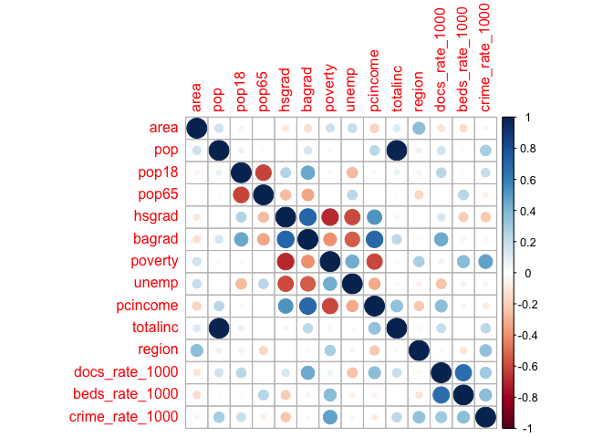
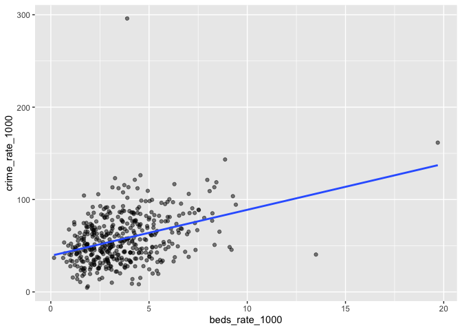
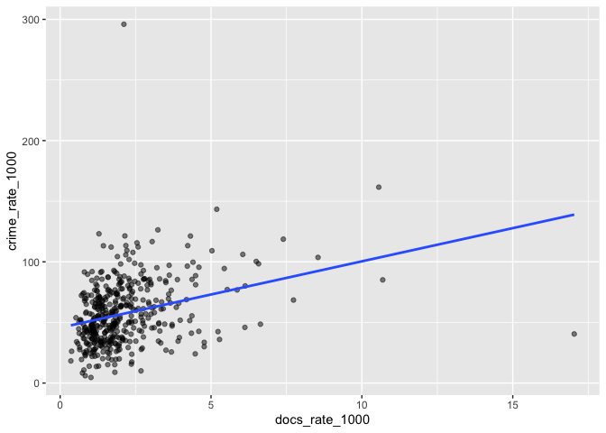
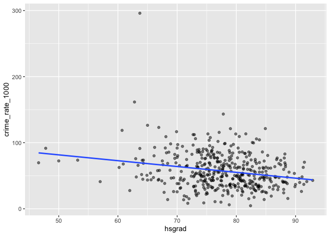

YiqunJin
================
Yiqun Jin
11/22/2021

## Load Data

``` r
cdi_df = read.csv("data/cdi.csv") %>% 
  janitor::clean_names() %>%
  mutate(
    cty_state = str_c(cty,",",state),
    docs_rate_1000 = 1000 * docs/pop, # Compute number of doctors/hospital beds per 1000 people.
    beds_rate_1000 = 1000 * beds/pop,
    crime_rate_1000 = 1000 * crimes/pop) %>% # Compute number of crimes per 1000 people.) 
  select(-docs,-beds,-crimes) %>%
  relocate(id,cty_state,cty)
```

## Crime Rate Correlation

``` r
cdi_cor = cdi_df %>% 
  select(-id,-cty_state, -cty, -state) %>% 
  cor() 
 
corrplot(cdi_cor)
```

<!-- -->

According to the plot above, we can see the poverty (Percent below
poverty level), beds(Number of hospital beds), docs (Number of active
physicians) have positive relationship with crime rate.

Percent high school graduates (Percent of persons 25 years old or older
twho completed 12 or more years of school) show a light negative
relationship with crime rate.

## Variable Information

| var      | var\_meaning                     |
|:---------|:---------------------------------|
| id       | ID number                        |
| cty      | County name                      |
| state    | State name                       |
| area     | Land area                        |
| pop      | Total population                 |
| pop18    | Percent of population aged 18-34 |
| pop65    | Percent of population aged 65+   |
| docs     | Number of active physicians      |
| beds     | Number of hospital beds          |
| crimes   | Total serious crimes             |
| hsgrad   | Percent high school graduates    |
| bagrad   | Percent bachelor’s degrees       |
| poverty  | Percent below poverty level      |
| unemp    | Percent unemployment             |
| pcincome | Per capita income                |
| totalinc | Total personal income            |
| region   | Geographic region                |

## Crime Rate v.s. Poverty

Poverty: Percent of 1990 total population with income below poverty
level

``` r
ggplot(cdi_df, aes(x = poverty, y = crime_rate_1000)) + geom_point(alpha = .5) + geom_smooth(method = "lm", se = FALSE)
```

    ## `geom_smooth()` using formula 'y ~ x'

<!-- -->

``` r
reg_poverty = lm(cdi_df$crime_rate_1000 ~ cdi_df$poverty) 
summary(reg_poverty)
```

    ## 
    ## Call:
    ## lm(formula = cdi_df$crime_rate_1000 ~ cdi_df$poverty)
    ## 
    ## Residuals:
    ##     Min      1Q  Median      3Q     Max 
    ## -64.008 -14.578  -2.561  13.605 208.853 
    ## 
    ## Coefficients:
    ##                Estimate Std. Error t value Pr(>|t|)    
    ## (Intercept)     33.1390     2.4435   13.56   <2e-16 ***
    ## cdi_df$poverty   2.7690     0.2472   11.20   <2e-16 ***
    ## ---
    ## Signif. codes:  0 '***' 0.001 '**' 0.01 '*' 0.05 '.' 0.1 ' ' 1
    ## 
    ## Residual standard error: 24.12 on 438 degrees of freedom
    ## Multiple R-squared:  0.2226, Adjusted R-squared:  0.2209 
    ## F-statistic: 125.4 on 1 and 438 DF,  p-value: < 2.2e-16

``` r
fitted_value =  reg_poverty$fitted.values
reg_poverty %>% broom::tidy()
```

    ## # A tibble: 2 × 5
    ##   term           estimate std.error statistic  p.value
    ##   <chr>             <dbl>     <dbl>     <dbl>    <dbl>
    ## 1 (Intercept)       33.1      2.44       13.6 3.14e-35
    ## 2 cdi_df$poverty     2.77     0.247      11.2 8.92e-26

## Crime Rate v.s. Beds

Beds: Total number of beds, cribs, and bassinets during 1990

``` r
ggplot(cdi_df, aes(x = beds_rate_1000, y = crime_rate_1000)) + geom_point(alpha = .5) + geom_smooth(method = "lm", se = FALSE)
```

    ## `geom_smooth()` using formula 'y ~ x'

<!-- -->

``` r
reg_beds = lm(cdi_df$crime_rate_1000 ~ cdi_df$beds_rate_1000) 
summary(reg_beds)
```

    ## 
    ## Call:
    ## lm(formula = cdi_df$crime_rate_1000 ~ cdi_df$beds_rate_1000)
    ## 
    ## Residuals:
    ##     Min      1Q  Median      3Q     Max 
    ## -65.817 -16.918  -2.435  14.607 237.519 
    ## 
    ## Coefficients:
    ##                       Estimate Std. Error t value Pr(>|t|)    
    ## (Intercept)            39.1234     2.5284  15.474  < 2e-16 ***
    ## cdi_df$beds_rate_1000   4.9771     0.6076   8.191 2.87e-15 ***
    ## ---
    ## Signif. codes:  0 '***' 0.001 '**' 0.01 '*' 0.05 '.' 0.1 ' ' 1
    ## 
    ## Residual standard error: 25.48 on 438 degrees of freedom
    ## Multiple R-squared:  0.1328, Adjusted R-squared:  0.1308 
    ## F-statistic: 67.09 on 1 and 438 DF,  p-value: 2.875e-15

``` r
reg_beds %>% broom::tidy()
```

    ## # A tibble: 2 × 5
    ##   term                  estimate std.error statistic  p.value
    ##   <chr>                    <dbl>     <dbl>     <dbl>    <dbl>
    ## 1 (Intercept)              39.1      2.53      15.5  2.12e-43
    ## 2 cdi_df$beds_rate_1000     4.98     0.608      8.19 2.87e-15

## Crime Rate v.s. Docs

docs (Number of active physicians)

``` r
ggplot(cdi_df, aes(x = docs_rate_1000, y = crime_rate_1000)) + geom_point(alpha = .5) + geom_smooth(method = "lm", se = FALSE)
```

    ## `geom_smooth()` using formula 'y ~ x'

<!-- -->

``` r
reg_docs = lm(cdi_df$crime_rate_1000 ~ cdi_df$docs_rate_1000) 
summary(reg_docs)
```

    ## 
    ## Call:
    ## lm(formula = cdi_df$crime_rate_1000 ~ cdi_df$docs_rate_1000)
    ## 
    ## Residuals:
    ##     Min      1Q  Median      3Q     Max 
    ## -98.454 -17.719  -3.074  16.651 238.756 
    ## 
    ## Coefficients:
    ##                       Estimate Std. Error t value Pr(>|t|)    
    ## (Intercept)            45.6642     2.1220  21.520  < 2e-16 ***
    ## cdi_df$docs_rate_1000   5.4744     0.8107   6.753 4.62e-11 ***
    ## ---
    ## Signif. codes:  0 '***' 0.001 '**' 0.01 '*' 0.05 '.' 0.1 ' ' 1
    ## 
    ## Residual standard error: 26.04 on 438 degrees of freedom
    ## Multiple R-squared:  0.0943, Adjusted R-squared:  0.09223 
    ## F-statistic:  45.6 on 1 and 438 DF,  p-value: 4.616e-11

``` r
reg_docs %>% broom::tidy()
```

    ## # A tibble: 2 × 5
    ##   term                  estimate std.error statistic  p.value
    ##   <chr>                    <dbl>     <dbl>     <dbl>    <dbl>
    ## 1 (Intercept)              45.7      2.12      21.5  1.29e-70
    ## 2 cdi_df$docs_rate_1000     5.47     0.811      6.75 4.62e-11

## Crime Rate v.s. hsgrad

``` r
ggplot(cdi_df, aes(x = hsgrad, y = crime_rate_1000)) + geom_point(alpha = .5) + geom_smooth(method = "lm", se = FALSE)
```

    ## `geom_smooth()` using formula 'y ~ x'

<!-- -->

``` r
reg_docs = lm(cdi_df$crime_rate_1000 ~ cdi_df$hsgrad) 
summary(reg_docs)
```

    ## 
    ## Call:
    ## lm(formula = cdi_df$crime_rate_1000 ~ cdi_df$hsgrad)
    ## 
    ## Residuals:
    ##    Min     1Q Median     3Q    Max 
    ## -54.07 -18.46  -3.64  16.37 226.47 
    ## 
    ## Coefficients:
    ##               Estimate Std. Error t value Pr(>|t|)    
    ## (Intercept)   125.6947    14.1191   8.902  < 2e-16 ***
    ## cdi_df$hsgrad  -0.8820     0.1813  -4.865  1.6e-06 ***
    ## ---
    ## Signif. codes:  0 '***' 0.001 '**' 0.01 '*' 0.05 '.' 0.1 ' ' 1
    ## 
    ## Residual standard error: 26.65 on 438 degrees of freedom
    ## Multiple R-squared:  0.05126,    Adjusted R-squared:  0.0491 
    ## F-statistic: 23.67 on 1 and 438 DF,  p-value: 1.601e-06

``` r
reg_docs %>% broom::tidy()
```

    ## # A tibble: 2 × 5
    ##   term          estimate std.error statistic  p.value
    ##   <chr>            <dbl>     <dbl>     <dbl>    <dbl>
    ## 1 (Intercept)    126.       14.1        8.90 1.46e-17
    ## 2 cdi_df$hsgrad   -0.882     0.181     -4.86 1.60e- 6

## Abstract

## Introduction

## Methods

## Results

## Conclusion/Discussion
