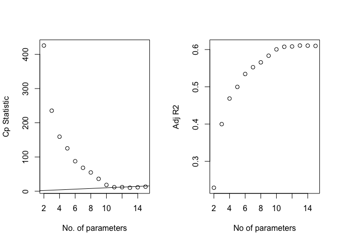

Yushan Wang
================

## Variable information:

``` r
var <- c("id", "cty", "state", "area",  "pop", "pop18", "pop65",    "docs", "beds", "crimes",   "hsgrad",   "bagrad",   "poverty",  "unemp",    "pcincome", "totalinc", "region")

var_meaning <- c("ID number", "
County name", "State name", "Land area", "Total population", "Percent of population aged 18-34", "Percent of population aged 65+", "Number of active physicians", "Number of hospital beds", "Total serious crimes", "Percent high school graduates", "Percent bachelor’s degrees
", "Percent below poverty level", "Percent unemployment", "Per capita income", "Total personal income", "Geographic region")

var_info <- data.frame(var, var_meaning)

knitr::kable(var_info)
```

| var      | var\_meaning                     |
|:---------|:---------------------------------|
| id       | ID number                        |
| cty      | County name                      |
| state    | State name                       |
| area     | Land area                        |
| pop      | Total population                 |
| pop18    | Percent of population aged 18-34 |
| pop65    | Percent of population aged 65+   |
| docs     | Number of active physicians      |
| beds     | Number of hospital beds          |
| crimes   | Total serious crimes             |
| hsgrad   | Percent high school graduates    |
| bagrad   | Percent bachelor’s degrees       |
| poverty  | Percent below poverty level      |
| unemp    | Percent unemployment             |
| pcincome | Per capita income                |
| totalinc | Total personal income            |
| region   | Geographic region                |

## load data

``` r
cdi_data = read_csv("./data/cdi.csv") %>%
  janitor::clean_names() %>%
  mutate(
    cty_state = str_c(cty,",",state),
    docs_rate_1000 = 1000 * docs/pop, # Compute number of doctors/hospital beds per 1000 people.
    beds_rate_1000 = 1000 * beds/pop,
    crime_rate_1000 = 1000 * crimes/pop) %>% # Compute number of crimes per 1000 people.) 
  select(-docs,-beds,-crimes) %>%
  relocate(id,cty_state,cty)
```

    ## Rows: 440 Columns: 17

    ## ── Column specification ────────────────────────────────────────────────────────
    ## Delimiter: ","
    ## chr  (2): cty, state
    ## dbl (15): id, area, pop, pop18, pop65, docs, beds, crimes, hsgrad, bagrad, p...

    ## 
    ## ℹ Use `spec()` to retrieve the full column specification for this data.
    ## ℹ Specify the column types or set `show_col_types = FALSE` to quiet this message.

``` r
cdi_model = cdi_data %>% 
  select(-id,-cty_state, -cty,-state) %>% 
  mutate(region = factor(region))
```

## Criteria based selection

``` r
# remove categorical variable: region
cdi_model_bestsub = 
  cdi_model %>% 
  select(-region)

mat = as.matrix(cdi_model_bestsub)
# Printing the 2 best models of each size, using the Cp criterion:
leaps(x = mat[,1:12], y = mat[,13], nbest = 2, method = "Cp") #9
```

    ## $which
    ##        1     2     3     4     5     6     7     8     9     A     B     C
    ## 1  FALSE FALSE FALSE FALSE FALSE FALSE  TRUE FALSE FALSE FALSE FALSE FALSE
    ## 1  FALSE FALSE FALSE FALSE FALSE FALSE FALSE FALSE FALSE FALSE FALSE  TRUE
    ## 2  FALSE FALSE FALSE FALSE FALSE FALSE  TRUE FALSE FALSE FALSE  TRUE FALSE
    ## 2  FALSE  TRUE FALSE FALSE FALSE FALSE  TRUE FALSE FALSE FALSE FALSE FALSE
    ## 3  FALSE  TRUE FALSE FALSE FALSE FALSE  TRUE FALSE FALSE FALSE  TRUE FALSE
    ## 3  FALSE FALSE FALSE FALSE FALSE FALSE  TRUE FALSE FALSE  TRUE  TRUE FALSE
    ## 4  FALSE  TRUE FALSE FALSE FALSE FALSE  TRUE FALSE  TRUE  TRUE FALSE FALSE
    ## 4  FALSE  TRUE FALSE FALSE FALSE FALSE  TRUE FALSE FALSE  TRUE  TRUE FALSE
    ## 5  FALSE  TRUE FALSE FALSE FALSE FALSE  TRUE  TRUE  TRUE  TRUE FALSE FALSE
    ## 5  FALSE  TRUE  TRUE FALSE FALSE FALSE  TRUE FALSE  TRUE  TRUE FALSE FALSE
    ## 6  FALSE  TRUE  TRUE FALSE FALSE FALSE  TRUE FALSE  TRUE  TRUE FALSE  TRUE
    ## 6  FALSE  TRUE  TRUE FALSE FALSE FALSE  TRUE FALSE  TRUE  TRUE  TRUE FALSE
    ## 7  FALSE  TRUE  TRUE FALSE FALSE FALSE  TRUE  TRUE  TRUE  TRUE FALSE  TRUE
    ## 7   TRUE  TRUE  TRUE FALSE FALSE FALSE  TRUE FALSE  TRUE  TRUE FALSE  TRUE
    ## 8   TRUE  TRUE  TRUE FALSE FALSE FALSE  TRUE  TRUE  TRUE  TRUE FALSE  TRUE
    ## 8  FALSE  TRUE  TRUE FALSE FALSE FALSE  TRUE  TRUE  TRUE  TRUE  TRUE  TRUE
    ## 9   TRUE  TRUE  TRUE FALSE FALSE FALSE  TRUE  TRUE  TRUE  TRUE  TRUE  TRUE
    ## 9   TRUE  TRUE  TRUE  TRUE FALSE FALSE  TRUE  TRUE  TRUE  TRUE FALSE  TRUE
    ## 10  TRUE  TRUE  TRUE FALSE FALSE  TRUE  TRUE  TRUE  TRUE  TRUE  TRUE  TRUE
    ## 10  TRUE  TRUE  TRUE  TRUE FALSE FALSE  TRUE  TRUE  TRUE  TRUE  TRUE  TRUE
    ## 11  TRUE  TRUE  TRUE  TRUE FALSE  TRUE  TRUE  TRUE  TRUE  TRUE  TRUE  TRUE
    ## 11  TRUE  TRUE  TRUE FALSE  TRUE  TRUE  TRUE  TRUE  TRUE  TRUE  TRUE  TRUE
    ## 12  TRUE  TRUE  TRUE  TRUE  TRUE  TRUE  TRUE  TRUE  TRUE  TRUE  TRUE  TRUE
    ## 
    ## $label
    ##  [1] "(Intercept)" "1"           "2"           "3"           "4"          
    ##  [6] "5"           "6"           "7"           "8"           "9"          
    ## [11] "A"           "B"           "C"          
    ## 
    ## $size
    ##  [1]  2  2  3  3  4  4  5  5  6  6  7  7  8  8  9  9 10 10 11 11 12 12 13
    ## 
    ## $Cp
    ##  [1] 168.583973 238.434725 110.655294 117.054420  75.155242  83.225659
    ##  [7]  41.466446  56.587194  22.916004  22.986238   8.751537  13.536256
    ## [13]   5.756546   8.644560   6.035823   7.421464   7.519632   7.909715
    ## [19]   9.211736   9.386140  11.095118  11.147190  13.000000

``` r
# Printing the 2 best models of each size, using the adjusted R^2 criterion:
leaps(x = mat[,1:12], y = mat[,13], nbest = 2, method = "adjr2")
```

    ## $which
    ##        1     2     3     4     5     6     7     8     9     A     B     C
    ## 1  FALSE FALSE FALSE FALSE FALSE FALSE  TRUE FALSE FALSE FALSE FALSE FALSE
    ## 1  FALSE FALSE FALSE FALSE FALSE FALSE FALSE FALSE FALSE FALSE FALSE  TRUE
    ## 2  FALSE FALSE FALSE FALSE FALSE FALSE  TRUE FALSE FALSE FALSE  TRUE FALSE
    ## 2  FALSE  TRUE FALSE FALSE FALSE FALSE  TRUE FALSE FALSE FALSE FALSE FALSE
    ## 3  FALSE  TRUE FALSE FALSE FALSE FALSE  TRUE FALSE FALSE FALSE  TRUE FALSE
    ## 3  FALSE FALSE FALSE FALSE FALSE FALSE  TRUE FALSE FALSE  TRUE  TRUE FALSE
    ## 4  FALSE  TRUE FALSE FALSE FALSE FALSE  TRUE FALSE  TRUE  TRUE FALSE FALSE
    ## 4  FALSE  TRUE FALSE FALSE FALSE FALSE  TRUE FALSE FALSE  TRUE  TRUE FALSE
    ## 5  FALSE  TRUE FALSE FALSE FALSE FALSE  TRUE  TRUE  TRUE  TRUE FALSE FALSE
    ## 5  FALSE  TRUE  TRUE FALSE FALSE FALSE  TRUE FALSE  TRUE  TRUE FALSE FALSE
    ## 6  FALSE  TRUE  TRUE FALSE FALSE FALSE  TRUE FALSE  TRUE  TRUE FALSE  TRUE
    ## 6  FALSE  TRUE  TRUE FALSE FALSE FALSE  TRUE FALSE  TRUE  TRUE  TRUE FALSE
    ## 7  FALSE  TRUE  TRUE FALSE FALSE FALSE  TRUE  TRUE  TRUE  TRUE FALSE  TRUE
    ## 7   TRUE  TRUE  TRUE FALSE FALSE FALSE  TRUE FALSE  TRUE  TRUE FALSE  TRUE
    ## 8   TRUE  TRUE  TRUE FALSE FALSE FALSE  TRUE  TRUE  TRUE  TRUE FALSE  TRUE
    ## 8  FALSE  TRUE  TRUE FALSE FALSE FALSE  TRUE  TRUE  TRUE  TRUE  TRUE  TRUE
    ## 9   TRUE  TRUE  TRUE FALSE FALSE FALSE  TRUE  TRUE  TRUE  TRUE  TRUE  TRUE
    ## 9   TRUE  TRUE  TRUE  TRUE FALSE FALSE  TRUE  TRUE  TRUE  TRUE FALSE  TRUE
    ## 10  TRUE  TRUE  TRUE FALSE FALSE  TRUE  TRUE  TRUE  TRUE  TRUE  TRUE  TRUE
    ## 10  TRUE  TRUE  TRUE  TRUE FALSE FALSE  TRUE  TRUE  TRUE  TRUE  TRUE  TRUE
    ## 11  TRUE  TRUE  TRUE  TRUE FALSE  TRUE  TRUE  TRUE  TRUE  TRUE  TRUE  TRUE
    ## 11  TRUE  TRUE  TRUE FALSE  TRUE  TRUE  TRUE  TRUE  TRUE  TRUE  TRUE  TRUE
    ## 12  TRUE  TRUE  TRUE  TRUE  TRUE  TRUE  TRUE  TRUE  TRUE  TRUE  TRUE  TRUE
    ## 
    ## $label
    ##  [1] "(Intercept)" "1"           "2"           "3"           "4"          
    ##  [6] "5"           "6"           "7"           "8"           "9"          
    ## [11] "A"           "B"           "C"          
    ## 
    ## $size
    ##  [1]  2  2  3  3  4  4  5  5  6  6  7  7  8  8  9  9 10 10 11 11 12 12 13
    ## 
    ## $adjr2
    ##  [1] 0.2208622 0.1308443 0.2964871 0.2882216 0.3434222 0.3329740 0.3882228
    ##  [8] 0.3686020 0.4135409 0.4134496 0.4332585 0.4270212 0.4384731 0.4346996
    ## [15] 0.4394238 0.4376091 0.4387978 0.4382857 0.4378947 0.4376653 0.4367352
    ## [22] 0.4366665 0.4355418

``` r
# Function regsubsets() performs a subset selection by identifying the "best" model that contains
b = regsubsets(crime_rate_1000 ~ ., data = cdi_model_bestsub)
rs = summary(b) # area, pop, pop18, poverty, unemp, pincome, totalinc, bed_rate_1000
# bagrad, unemp different with stepwise

# plot of Cp and Adj-R2 as functions of parameters
par(mfrow=c(1,2))

plot(2:9, rs$cp, xlab="No. of parameters", ylab="Cp Statistic") 
abline(0,1)

plot(2:9, rs$adjr2, xlab="No of parameters", ylab="Adj R2")
```

<!-- -->

``` r
rs$cp #8!!!
```

    ## [1] 168.583973 110.655294  75.155242  41.466446  22.916004   8.751537   5.756546
    ## [8]   6.035823

``` r
# another way
#BestSub(cdi_model_bestsub[,c(1:13)],cdi_model_bestsub$crime_rate_1000, method = "sse", num=1) 
# results: remove unemp, pincome, docs_rate_1000
```
