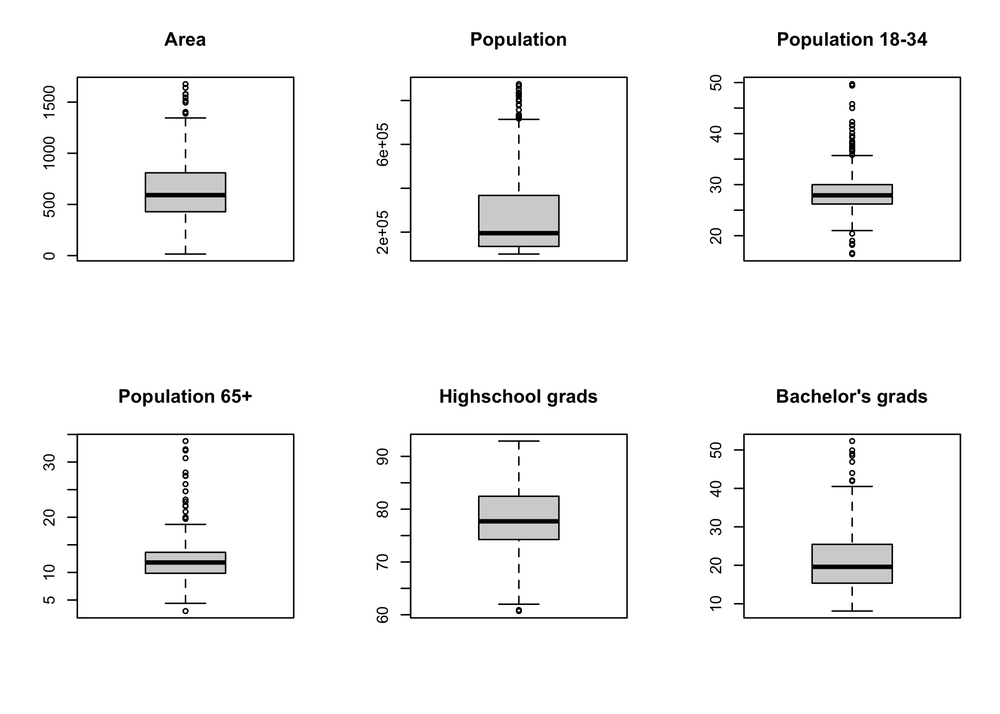
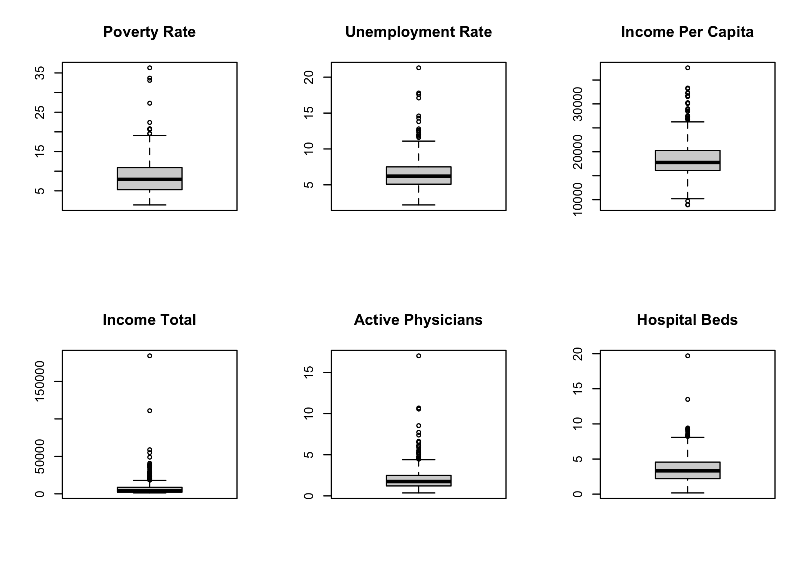
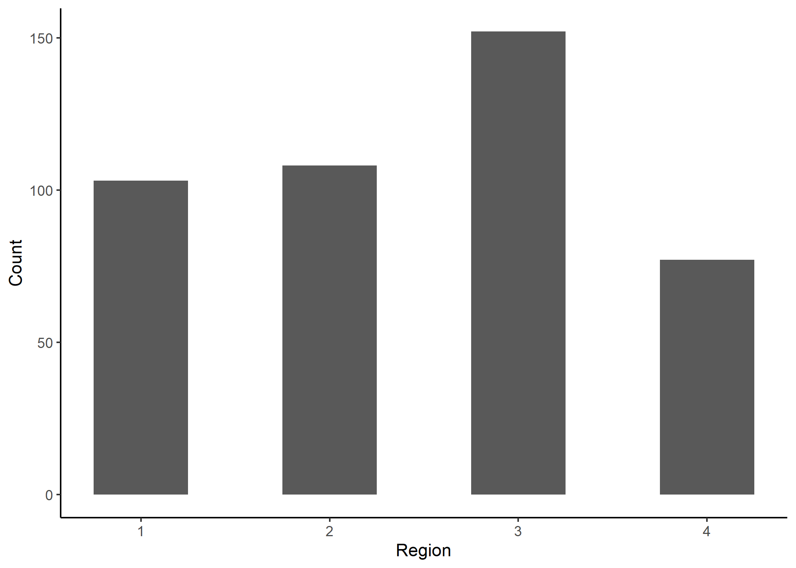
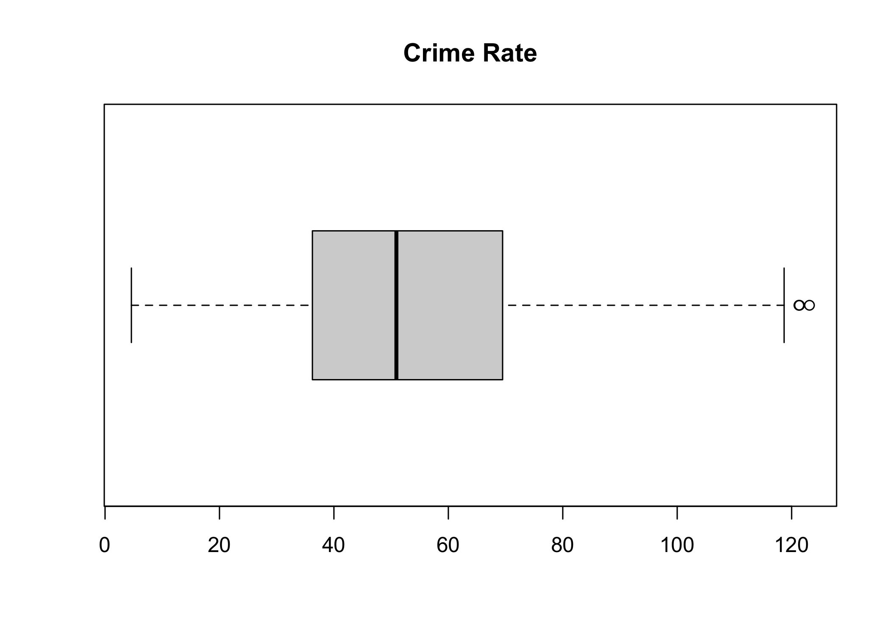
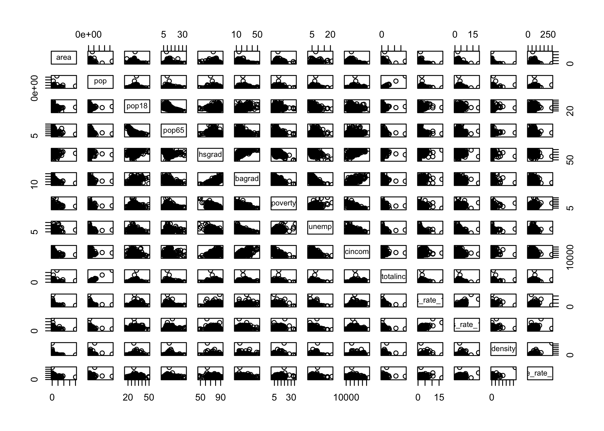
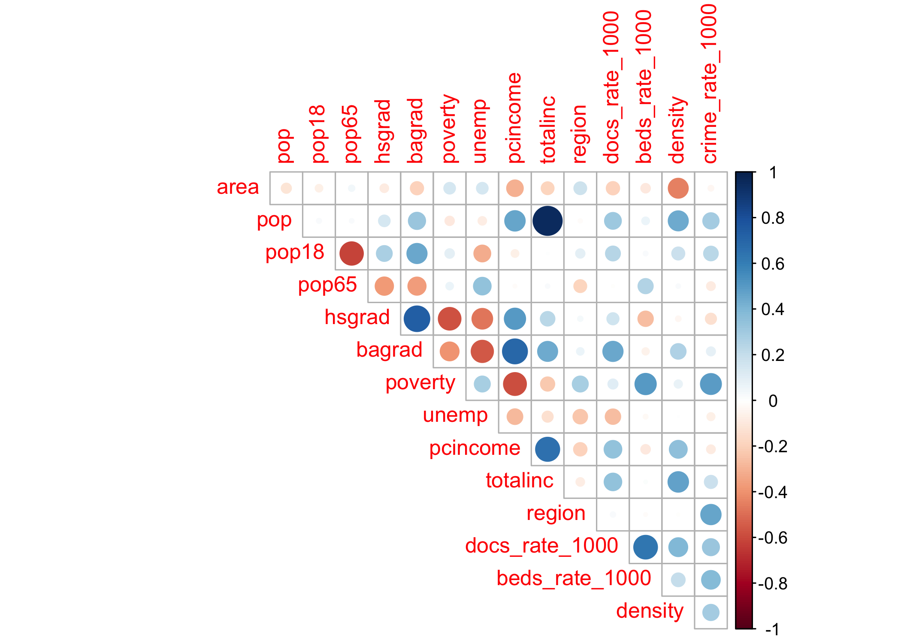
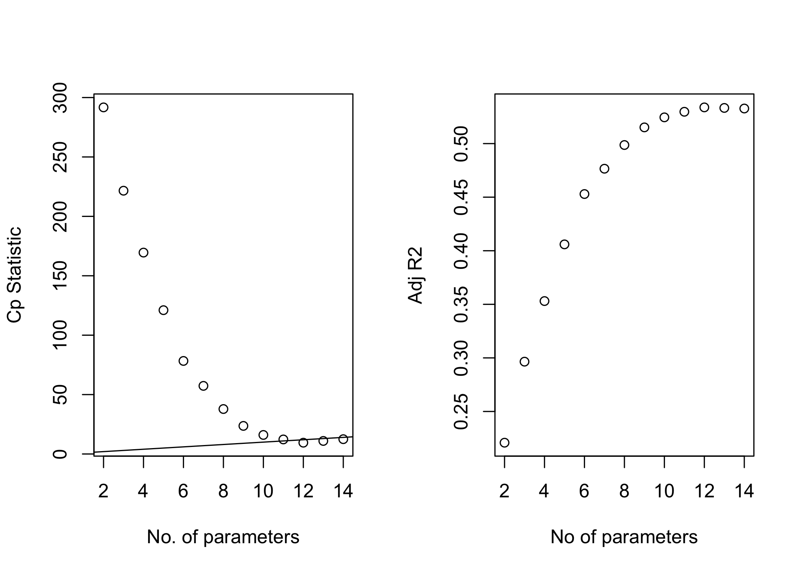
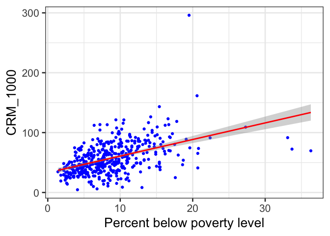

BIST8130 - Final Proejct Codings
================
11/22/2021

``` r
library(tidyverse)
library(corrplot)
library(leaps)
```

### Step 1: Data Preprocessing

After importing the csv file containing the County Demographic
Information (CDI) data, we notice that crimes, physicians, and hospital
beds are given as numbers, while other info are given as proportions. We
therefore compute the number of crimes, physicians, and hospital beds
per 1000 people.

``` r
cdi_data = read_csv("./data/cdi.csv") %>%
  janitor::clean_names() %>%
  mutate(
    cty_state = str_c(cty,",",state),
    docs_rate_1000 = 1000 * docs/pop, # Compute number of doctors/hospital beds per 1000 people.
    beds_rate_1000 = 1000 * beds/pop,
    crime_rate_1000 = 1000 * crimes/pop) %>% # Compute number of crimes per 1000 people.) 
  dplyr::select(-docs,-beds,-crimes) %>%
  relocate(id,cty_state,cty)
```

    ## Rows: 440 Columns: 17

    ## ── Column specification ────────────────────────────────────────────────────────
    ## Delimiter: ","
    ## chr  (2): cty, state
    ## dbl (15): id, area, pop, pop18, pop65, docs, beds, crimes, hsgrad, bagrad, p...

    ## 
    ## ℹ Use `spec()` to retrieve the full column specification for this data.
    ## ℹ Specify the column types or set `show_col_types = FALSE` to quiet this message.

``` r
knitr::kable(head(cdi_data))
```

|  id | cty\_state   | cty       | state | area |     pop | pop18 | pop65 | hsgrad | bagrad | poverty | unemp | pcincome | totalinc | region | docs\_rate\_1000 | beds\_rate\_1000 | crime\_rate\_1000 |
|----:|:-------------|:----------|:------|-----:|--------:|------:|------:|-------:|-------:|--------:|------:|---------:|---------:|-------:|-----------------:|-----------------:|------------------:|
|   1 | Los\_Ange,CA | Los\_Ange | CA    | 4060 | 8863164 |  32.1 |   9.7 |   70.0 |   22.3 |    11.6 |   8.0 |    20786 |   184230 |      4 |         2.671394 |         3.125295 |          77.73026 |
|   2 | Cook,IL      | Cook      | IL    |  946 | 5105067 |  29.2 |  12.4 |   73.4 |   22.8 |    11.1 |   7.2 |    21729 |   110928 |      2 |         2.968227 |         4.221296 |          85.58869 |
|   3 | Harris,TX    | Harris    | TX    | 1729 | 2818199 |  31.3 |   7.1 |   74.9 |   25.4 |    12.5 |   5.7 |    19517 |    55003 |      3 |         2.680080 |         4.417360 |          89.96029 |
|   4 | San\_Dieg,CA | San\_Dieg | CA    | 4205 | 2498016 |  33.5 |  10.9 |   81.9 |   25.3 |     8.1 |   6.1 |    19588 |    48931 |      4 |         2.363876 |         2.473563 |          69.58362 |
|   5 | Orange,CA    | Orange    | CA    |  790 | 2410556 |  32.6 |   9.2 |   81.2 |   27.8 |     5.2 |   4.8 |    24400 |    58818 |      4 |         2.514772 |         2.642129 |          59.95463 |
|   6 | Kings,NY     | Kings     | NY    |   71 | 2300664 |  28.3 |  12.4 |   63.7 |   16.6 |    19.5 |   9.5 |    16803 |    38658 |      1 |         2.112868 |         3.886704 |         295.98672 |

### Step 2 - Exploratory Analysis

We then take a closer look of each variables, calculate the pairwise
correlations between variables, and list all the correlations between
the crime rate (our interest) and all other variables.

``` r
cdi_data_exp = cdi_data %>%
  dplyr::select(-id,-cty,-state, -cty_state,-region) 

par(mfrow=c(2,3))
boxplot(cdi_data_exp$area,main="Area")
boxplot(cdi_data_exp$pop,main="Population")
boxplot(cdi_data_exp$pop18,main="Population 18-34")
boxplot(cdi_data_exp$pop65,main="Population 65+")
boxplot(cdi_data_exp$hsgrad,main="Highschool grads")
boxplot(cdi_data_exp$bagrad,main="Bachelor's grads")
```

<!-- -->

``` r
par(mfrow=c(2,3))
boxplot(cdi_data_exp$poverty,main="Poverty Rate")
boxplot(cdi_data_exp$unemp,main="Unemployment Rate")
boxplot(cdi_data_exp$pcincome,main="Income Per Capita")
boxplot(cdi_data_exp$totalinc,main="Income Total")
boxplot(cdi_data_exp$docs_rate_1000,main="Active Physicians")
boxplot(cdi_data_exp$beds_rate_1000,main="Hospital Beds")
```

<!-- -->

``` r
par(mfrow=c(1,1))

ggplot(cdi_data,aes(region)) + 
  geom_histogram(binwidth = 0.5) +
  theme_classic() +
  xlab("Region")+
  ylab("Count")
```

<!-- -->

``` r
boxplot(cdi_data_exp$crime_rate_1000,main="Crime Rate",horizontal = TRUE)
```

<!-- -->

``` r
# data exploratory
pairs(cdi_data_exp)
```

<!-- -->

``` r
# correlation plot
cdi_data_cor = cor(cdi_data_exp)
corrplot(cdi_data_cor, type = "upper", diag = FALSE)
```

<!-- -->

``` r
crime_1000_cor = data.frame(cdi_data_cor) %>% 
  dplyr::select("Crime Rate (Per 1000)" = crime_rate_1000) %>% 
  t()

knitr::kable(crime_1000_cor,digits = 2) 
```

|                       | area |  pop | pop18 | pop65 | hsgrad | bagrad | poverty | unemp | pcincome | totalinc | docs\_rate\_1000 | beds\_rate\_1000 | crime\_rate\_1000 |
|:----------------------|-----:|-----:|------:|------:|-------:|-------:|--------:|------:|---------:|---------:|-----------------:|-----------------:|------------------:|
| Crime Rate (Per 1000) | 0.04 | 0.28 |  0.19 | -0.07 |  -0.23 |   0.04 |    0.47 |  0.04 |    -0.08 |     0.23 |             0.31 |             0.36 |                 1 |

### Model construction

Data used for building model:

``` r
cdi_model = cdi_data %>% 
  select(-id,-cty_state, -cty,-state) %>% 
  mutate(region = factor(region))
```

``` r
full.fit = lm(crime_rate_1000 ~ ., data = cdi_model)
summary(full.fit) %>% 
  broom::tidy() %>%
  mutate(p_rank = rank(p.value))
```

    ## # A tibble: 16 × 6
    ##    term              estimate  std.error statistic  p.value p_rank
    ##    <chr>                <dbl>      <dbl>     <dbl>    <dbl>  <dbl>
    ##  1 (Intercept)    -116.       29.1          -3.98  8.00e- 5      7
    ##  2 area             -0.00179   0.000712     -2.51  1.23e- 2     11
    ##  3 pop               0.000115  0.0000132     8.70  7.49e-17      2
    ##  4 pop18             1.36      0.344         3.96  8.72e- 5      8
    ##  5 pop65             0.213     0.321         0.661 5.09e- 1     14
    ##  6 hsgrad            0.251     0.282         0.892 3.73e- 1     13
    ##  7 bagrad           -0.649     0.312        -2.08  3.83e- 2     12
    ##  8 poverty           2.53      0.401         6.29  7.71e-10      5
    ##  9 unemp             0.232     0.559         0.414 6.79e- 1     16
    ## 10 pcincome          0.00407   0.000552      7.37  8.76e-13      4
    ## 11 totalinc         -0.00516   0.000640     -8.07  7.53e-15      3
    ## 12 region2           8.37      2.87          2.91  3.75e- 3      9
    ## 13 region3          24.4       2.78          8.77  4.34e-17      1
    ## 14 region4          21.6       3.53          6.10  2.37e- 9      6
    ## 15 docs_rate_1000    0.575     1.07          0.540 5.90e- 1     15
    ## 16 beds_rate_1000    2.28      0.837         2.73  6.67e- 3     10

``` r
backward = step(full.fit, direction='backward') %>%  broom::tidy() %>%  rename(backward = "term")
```

    ## Start:  AIC=2593.46
    ## crime_rate_1000 ~ area + pop + pop18 + pop65 + hsgrad + bagrad + 
    ##     poverty + unemp + pcincome + totalinc + region + docs_rate_1000 + 
    ##     beds_rate_1000
    ## 
    ##                  Df Sum of Sq    RSS    AIC
    ## - unemp           1      60.1 148549 2591.6
    ## - docs_rate_1000  1     102.0 148591 2591.8
    ## - pop65           1     153.2 148642 2591.9
    ## - hsgrad          1     278.4 148768 2592.3
    ## <none>                        148489 2593.5
    ## - bagrad          1    1512.7 150002 2595.9
    ## - area            1    2214.5 150704 2598.0
    ## - beds_rate_1000  1    2603.2 151092 2599.1
    ## - pop18           1    5497.2 153986 2607.4
    ## - poverty         1   13875.3 162365 2630.8
    ## - pcincome        1   19044.3 167533 2644.6
    ## - totalinc        1   22783.6 171273 2654.3
    ## - pop             1   26498.0 174987 2663.7
    ## - region          3   31508.2 179997 2672.1
    ## 
    ## Step:  AIC=2591.63
    ## crime_rate_1000 ~ area + pop + pop18 + pop65 + hsgrad + bagrad + 
    ##     poverty + pcincome + totalinc + region + docs_rate_1000 + 
    ##     beds_rate_1000
    ## 
    ##                  Df Sum of Sq    RSS    AIC
    ## - docs_rate_1000  1       105 148654 2589.9
    ## - pop65           1       180 148729 2590.2
    ## - hsgrad          1       243 148792 2590.3
    ## <none>                        148549 2591.6
    ## - bagrad          1      1701 150250 2594.6
    ## - area            1      2183 150732 2596.1
    ## - beds_rate_1000  1      2561 151111 2597.2
    ## - pop18           1      5574 154123 2605.8
    ## - poverty         1     16078 164627 2634.8
    ## - pcincome        1     20035 168584 2645.3
    ## - totalinc        1     22896 171445 2652.7
    ## - pop             1     26585 175135 2662.1
    ## - region          3     33282 181831 2674.6
    ## 
    ## Step:  AIC=2589.94
    ## crime_rate_1000 ~ area + pop + pop18 + pop65 + hsgrad + bagrad + 
    ##     poverty + pcincome + totalinc + region + beds_rate_1000
    ## 
    ##                  Df Sum of Sq    RSS    AIC
    ## - pop65           1       177 148831 2588.5
    ## - hsgrad          1       215 148869 2588.6
    ## <none>                        148654 2589.9
    ## - bagrad          1      1597 150250 2592.6
    ## - area            1      2185 150839 2594.4
    ## - pop18           1      5787 154441 2604.8
    ## - beds_rate_1000  1      6870 155524 2607.8
    ## - poverty         1     16023 164677 2633.0
    ## - pcincome        1     20779 169433 2645.5
    ## - totalinc        1     22855 171509 2650.9
    ## - pop             1     26559 175213 2660.3
    ## - region          3     33441 182095 2673.2
    ## 
    ## Step:  AIC=2588.47
    ## crime_rate_1000 ~ area + pop + pop18 + hsgrad + bagrad + poverty + 
    ##     pcincome + totalinc + region + beds_rate_1000
    ## 
    ##                  Df Sum of Sq    RSS    AIC
    ## - hsgrad          1       185 149015 2587.0
    ## <none>                        148831 2588.5
    ## - bagrad          1      1625 150456 2591.2
    ## - area            1      2113 150944 2592.7
    ## - pop18           1      6417 155248 2605.0
    ## - beds_rate_1000  1      8973 157804 2612.2
    ## - poverty         1     15905 164735 2631.1
    ## - pcincome        1     20633 169463 2643.6
    ## - totalinc        1     22695 171526 2648.9
    ## - pop             1     26399 175229 2658.3
    ## - region          3     33269 182100 2671.2
    ## 
    ## Step:  AIC=2587.01
    ## crime_rate_1000 ~ area + pop + pop18 + bagrad + poverty + pcincome + 
    ##     totalinc + region + beds_rate_1000
    ## 
    ##                  Df Sum of Sq    RSS    AIC
    ## <none>                        149015 2587.0
    ## - bagrad          1      1661 150676 2589.9
    ## - area            1      2155 151170 2591.3
    ## - pop18           1      6263 155279 2603.1
    ## - beds_rate_1000  1      9206 158221 2611.4
    ## - pcincome        1     21068 170084 2643.2
    ## - totalinc        1     22930 171945 2648.0
    ## - poverty         1     23471 172486 2649.4
    ## - pop             1     26591 175607 2657.3
    ## - region          3     33202 182217 2669.5

``` r
both = step(full.fit, direction = "both") %>% broom::tidy() %>% rename(stepwise = "term")
```

    ## Start:  AIC=2593.46
    ## crime_rate_1000 ~ area + pop + pop18 + pop65 + hsgrad + bagrad + 
    ##     poverty + unemp + pcincome + totalinc + region + docs_rate_1000 + 
    ##     beds_rate_1000
    ## 
    ##                  Df Sum of Sq    RSS    AIC
    ## - unemp           1      60.1 148549 2591.6
    ## - docs_rate_1000  1     102.0 148591 2591.8
    ## - pop65           1     153.2 148642 2591.9
    ## - hsgrad          1     278.4 148768 2592.3
    ## <none>                        148489 2593.5
    ## - bagrad          1    1512.7 150002 2595.9
    ## - area            1    2214.5 150704 2598.0
    ## - beds_rate_1000  1    2603.2 151092 2599.1
    ## - pop18           1    5497.2 153986 2607.4
    ## - poverty         1   13875.3 162365 2630.8
    ## - pcincome        1   19044.3 167533 2644.6
    ## - totalinc        1   22783.6 171273 2654.3
    ## - pop             1   26498.0 174987 2663.7
    ## - region          3   31508.2 179997 2672.1
    ## 
    ## Step:  AIC=2591.63
    ## crime_rate_1000 ~ area + pop + pop18 + pop65 + hsgrad + bagrad + 
    ##     poverty + pcincome + totalinc + region + docs_rate_1000 + 
    ##     beds_rate_1000
    ## 
    ##                  Df Sum of Sq    RSS    AIC
    ## - docs_rate_1000  1       105 148654 2589.9
    ## - pop65           1       180 148729 2590.2
    ## - hsgrad          1       243 148792 2590.3
    ## <none>                        148549 2591.6
    ## + unemp           1        60 148489 2593.5
    ## - bagrad          1      1701 150250 2594.6
    ## - area            1      2183 150732 2596.1
    ## - beds_rate_1000  1      2561 151111 2597.2
    ## - pop18           1      5574 154123 2605.8
    ## - poverty         1     16078 164627 2634.8
    ## - pcincome        1     20035 168584 2645.3
    ## - totalinc        1     22896 171445 2652.7
    ## - pop             1     26585 175135 2662.1
    ## - region          3     33282 181831 2674.6
    ## 
    ## Step:  AIC=2589.94
    ## crime_rate_1000 ~ area + pop + pop18 + pop65 + hsgrad + bagrad + 
    ##     poverty + pcincome + totalinc + region + beds_rate_1000
    ## 
    ##                  Df Sum of Sq    RSS    AIC
    ## - pop65           1       177 148831 2588.5
    ## - hsgrad          1       215 148869 2588.6
    ## <none>                        148654 2589.9
    ## + docs_rate_1000  1       105 148549 2591.6
    ## + unemp           1        63 148591 2591.8
    ## - bagrad          1      1597 150250 2592.6
    ## - area            1      2185 150839 2594.4
    ## - pop18           1      5787 154441 2604.8
    ## - beds_rate_1000  1      6870 155524 2607.8
    ## - poverty         1     16023 164677 2633.0
    ## - pcincome        1     20779 169433 2645.5
    ## - totalinc        1     22855 171509 2650.9
    ## - pop             1     26559 175213 2660.3
    ## - region          3     33441 182095 2673.2
    ## 
    ## Step:  AIC=2588.47
    ## crime_rate_1000 ~ area + pop + pop18 + hsgrad + bagrad + poverty + 
    ##     pcincome + totalinc + region + beds_rate_1000
    ## 
    ##                  Df Sum of Sq    RSS    AIC
    ## - hsgrad          1       185 149015 2587.0
    ## <none>                        148831 2588.5
    ## + pop65           1       177 148654 2589.9
    ## + docs_rate_1000  1       101 148729 2590.2
    ## + unemp           1        90 148741 2590.2
    ## - bagrad          1      1625 150456 2591.2
    ## - area            1      2113 150944 2592.7
    ## - pop18           1      6417 155248 2605.0
    ## - beds_rate_1000  1      8973 157804 2612.2
    ## - poverty         1     15905 164735 2631.1
    ## - pcincome        1     20633 169463 2643.6
    ## - totalinc        1     22695 171526 2648.9
    ## - pop             1     26399 175229 2658.3
    ## - region          3     33269 182100 2671.2
    ## 
    ## Step:  AIC=2587.01
    ## crime_rate_1000 ~ area + pop + pop18 + bagrad + poverty + pcincome + 
    ##     totalinc + region + beds_rate_1000
    ## 
    ##                  Df Sum of Sq    RSS    AIC
    ## <none>                        149015 2587.0
    ## + hsgrad          1       185 148831 2588.5
    ## + pop65           1       146 148869 2588.6
    ## + docs_rate_1000  1        76 148939 2588.8
    ## + unemp           1        46 148969 2588.9
    ## - bagrad          1      1661 150676 2589.9
    ## - area            1      2155 151170 2591.3
    ## - pop18           1      6263 155279 2603.1
    ## - beds_rate_1000  1      9206 158221 2611.4
    ## - pcincome        1     21068 170084 2643.2
    ## - totalinc        1     22930 171945 2648.0
    ## - poverty         1     23471 172486 2649.4
    ## - pop             1     26591 175607 2657.3
    ## - region          3     33202 182217 2669.5

``` r
bind_cols(backward[-1,1],both[-1,1]) %>% knitr::kable()
```

| backward         | stepwise         |
|:-----------------|:-----------------|
| area             | area             |
| pop              | pop              |
| pop18            | pop18            |
| bagrad           | bagrad           |
| poverty          | poverty          |
| pcincome         | pcincome         |
| totalinc         | totalinc         |
| region2          | region2          |
| region3          | region3          |
| region4          | region4          |
| beds\_rate\_1000 | beds\_rate\_1000 |

## Criteria based selection

selected var: area pop pop18 hsgrad bagrad poverty pcincome totalinc
region beds\_rate\_1000

``` r
sb = regsubsets(crime_rate_1000 ~ ., data = cdi_model, nvmax = 13)
sumsb = summary(sb) # area pop pop18 hsgrad bagrad poverty pcincome totalinc region beds_rate_1000
sumsb
```

    ## Subset selection object
    ## Call: regsubsets.formula(crime_rate_1000 ~ ., data = cdi_model, nvmax = 13)
    ## 15 Variables  (and intercept)
    ##                Forced in Forced out
    ## area               FALSE      FALSE
    ## pop                FALSE      FALSE
    ## pop18              FALSE      FALSE
    ## pop65              FALSE      FALSE
    ## hsgrad             FALSE      FALSE
    ## bagrad             FALSE      FALSE
    ## poverty            FALSE      FALSE
    ## unemp              FALSE      FALSE
    ## pcincome           FALSE      FALSE
    ## totalinc           FALSE      FALSE
    ## region2            FALSE      FALSE
    ## region3            FALSE      FALSE
    ## region4            FALSE      FALSE
    ## docs_rate_1000     FALSE      FALSE
    ## beds_rate_1000     FALSE      FALSE
    ## 1 subsets of each size up to 13
    ## Selection Algorithm: exhaustive
    ##           area pop pop18 pop65 hsgrad bagrad poverty unemp pcincome totalinc
    ## 1  ( 1 )  " "  " " " "   " "   " "    " "    "*"     " "   " "      " "     
    ## 2  ( 1 )  " "  " " " "   " "   " "    " "    "*"     " "   " "      " "     
    ## 3  ( 1 )  " "  "*" " "   " "   " "    " "    "*"     " "   " "      " "     
    ## 4  ( 1 )  " "  "*" " "   " "   " "    " "    "*"     " "   " "      " "     
    ## 5  ( 1 )  " "  "*" " "   " "   " "    " "    "*"     " "   "*"      "*"     
    ## 6  ( 1 )  " "  "*" " "   " "   " "    " "    "*"     " "   "*"      "*"     
    ## 7  ( 1 )  " "  "*" " "   " "   " "    " "    "*"     " "   "*"      "*"     
    ## 8  ( 1 )  " "  "*" "*"   " "   " "    " "    "*"     " "   "*"      "*"     
    ## 9  ( 1 )  " "  "*" "*"   " "   " "    " "    "*"     " "   "*"      "*"     
    ## 10  ( 1 ) "*"  "*" "*"   " "   " "    " "    "*"     " "   "*"      "*"     
    ## 11  ( 1 ) "*"  "*" "*"   " "   " "    "*"    "*"     " "   "*"      "*"     
    ## 12  ( 1 ) "*"  "*" "*"   " "   "*"    "*"    "*"     " "   "*"      "*"     
    ## 13  ( 1 ) "*"  "*" "*"   "*"   "*"    "*"    "*"     " "   "*"      "*"     
    ##           region2 region3 region4 docs_rate_1000 beds_rate_1000
    ## 1  ( 1 )  " "     " "     " "     " "            " "           
    ## 2  ( 1 )  " "     " "     " "     "*"            " "           
    ## 3  ( 1 )  " "     "*"     " "     " "            " "           
    ## 4  ( 1 )  " "     "*"     " "     "*"            " "           
    ## 5  ( 1 )  " "     "*"     " "     " "            " "           
    ## 6  ( 1 )  " "     "*"     " "     "*"            " "           
    ## 7  ( 1 )  " "     "*"     "*"     " "            "*"           
    ## 8  ( 1 )  " "     "*"     "*"     " "            "*"           
    ## 9  ( 1 )  "*"     "*"     "*"     " "            "*"           
    ## 10  ( 1 ) "*"     "*"     "*"     " "            "*"           
    ## 11  ( 1 ) "*"     "*"     "*"     " "            "*"           
    ## 12  ( 1 ) "*"     "*"     "*"     " "            "*"           
    ## 13  ( 1 ) "*"     "*"     "*"     " "            "*"

``` r
# plot of Cp and Adj-R2 as functions of parameters
par(mfrow=c(1,2))
plot(2:14, sumsb$cp, xlab="No. of parameters", ylab="Cp Statistic") 
abline(0,1)

plot(2:14, sumsb$adjr2, xlab="No of parameters", ylab="Adj R2")
```

<!-- -->

``` r
# Scatter plot 
cdi_data %>% 
  ggplot(aes(poverty, crime_rate_1000)) + geom_point(color='blue') + theme_bw(base_size=20) +
  geom_smooth(method='lm', se=TRUE, color='red') +
  labs(x="Percent below poverty level", y="CRM_1000")
```

    ## `geom_smooth()` using formula 'y ~ x'

<!-- -->

``` r
# Simple linear regression: crm_1000 vs poverty
cdi_pov = lm(crime_rate_1000 ~ poverty, data = cdi_data)
summary(cdi_pov)
```

    ## 
    ## Call:
    ## lm(formula = crime_rate_1000 ~ poverty, data = cdi_data)
    ## 
    ## Residuals:
    ##     Min      1Q  Median      3Q     Max 
    ## -64.008 -14.578  -2.561  13.605 208.853 
    ## 
    ## Coefficients:
    ##             Estimate Std. Error t value Pr(>|t|)    
    ## (Intercept)  33.1390     2.4435   13.56   <2e-16 ***
    ## poverty       2.7690     0.2472   11.20   <2e-16 ***
    ## ---
    ## Signif. codes:  0 '***' 0.001 '**' 0.01 '*' 0.05 '.' 0.1 ' ' 1
    ## 
    ## Residual standard error: 24.12 on 438 degrees of freedom
    ## Multiple R-squared:  0.2226, Adjusted R-squared:  0.2209 
    ## F-statistic: 125.4 on 1 and 438 DF,  p-value: < 2.2e-16

``` r
cdi_pov = lm(crime_rate_1000 ~ poverty + beds_rate_1000, data = cdi_data)
summary(cdi_pov)
```

    ## 
    ## Call:
    ## lm(formula = crime_rate_1000 ~ poverty + beds_rate_1000, data = cdi_data)
    ## 
    ## Residuals:
    ##     Min      1Q  Median      3Q     Max 
    ## -61.283 -14.894  -0.986  13.537 213.298 
    ## 
    ## Coefficients:
    ##                Estimate Std. Error t value Pr(>|t|)    
    ## (Intercept)     26.3724     2.7425   9.616  < 2e-16 ***
    ## poverty          2.2906     0.2594   8.832  < 2e-16 ***
    ## beds_rate_1000   2.9973     0.6036   4.966 9.81e-07 ***
    ## ---
    ## Signif. codes:  0 '***' 0.001 '**' 0.01 '*' 0.05 '.' 0.1 ' ' 1
    ## 
    ## Residual standard error: 23.5 on 437 degrees of freedom
    ## Multiple R-squared:  0.2642, Adjusted R-squared:  0.2608 
    ## F-statistic: 78.44 on 2 and 437 DF,  p-value: < 2.2e-16

``` r
# this one is the best!
cdi_pov = lm(crime_rate_1000 ~ poverty + docs_rate_1000 , data = cdi_data)
summary(cdi_pov)
```

    ## 
    ## Call:
    ## lm(formula = crime_rate_1000 ~ poverty + docs_rate_1000, data = cdi_data)
    ## 
    ## Residuals:
    ##     Min      1Q  Median      3Q     Max 
    ## -79.514 -13.477  -1.452  12.310 210.024 
    ## 
    ## Coefficients:
    ##                Estimate Std. Error t value Pr(>|t|)    
    ## (Intercept)     23.5185     2.7048   8.695  < 2e-16 ***
    ## poverty          2.6650     0.2354  11.321  < 2e-16 ***
    ## docs_rate_1000   4.9587     0.7151   6.934 1.48e-11 ***
    ## ---
    ## Signif. codes:  0 '***' 0.001 '**' 0.01 '*' 0.05 '.' 0.1 ' ' 1
    ## 
    ## Residual standard error: 22.92 on 437 degrees of freedom
    ## Multiple R-squared:  0.2997, Adjusted R-squared:  0.2965 
    ## F-statistic: 93.51 on 2 and 437 DF,  p-value: < 2.2e-16

``` r
cdi_pov = lm(crime_rate_1000 ~ poverty + docs_rate_1000 + beds_rate_1000 , data = cdi_data)
summary(cdi_pov)
```

    ## 
    ## Call:
    ## lm(formula = crime_rate_1000 ~ poverty + docs_rate_1000 + beds_rate_1000, 
    ##     data = cdi_data)
    ## 
    ## Residuals:
    ##     Min      1Q  Median      3Q     Max 
    ## -78.843 -13.611  -1.605  12.313 210.430 
    ## 
    ## Coefficients:
    ##                Estimate Std. Error t value Pr(>|t|)    
    ## (Intercept)     23.3218     2.7550   8.465 3.93e-16 ***
    ## poverty          2.6201     0.2627   9.973  < 2e-16 ***
    ## docs_rate_1000   4.6922     0.9942   4.720 3.19e-06 ***
    ## beds_rate_1000   0.3162     0.8186   0.386      0.7    
    ## ---
    ## Signif. codes:  0 '***' 0.001 '**' 0.01 '*' 0.05 '.' 0.1 ' ' 1
    ## 
    ## Residual standard error: 22.94 on 436 degrees of freedom
    ## Multiple R-squared:  0.2999, Adjusted R-squared:  0.2951 
    ## F-statistic: 62.27 on 3 and 436 DF,  p-value: < 2.2e-16

``` r
cdi_region = lm(crime_rate_1000 ~ factor(region), data = cdi_data) # fit model with factoring 
summary(cdi_region)
```

    ## 
    ## Call:
    ## lm(formula = crime_rate_1000 ~ factor(region), data = cdi_data)
    ## 
    ## Residuals:
    ##     Min      1Q  Median      3Q     Max 
    ## -46.505 -15.578  -3.817  13.698 254.757 
    ## 
    ## Coefficients:
    ##                 Estimate Std. Error t value Pr(>|t|)    
    ## (Intercept)       41.229      2.446  16.856  < 2e-16 ***
    ## factor(region)2    9.877      3.419   2.889  0.00406 ** 
    ## factor(region)3   29.509      3.168   9.315  < 2e-16 ***
    ## factor(region)4   19.649      3.740   5.254 2.33e-07 ***
    ## ---
    ## Signif. codes:  0 '***' 0.001 '**' 0.01 '*' 0.05 '.' 0.1 ' ' 1
    ## 
    ## Residual standard error: 24.82 on 436 degrees of freedom
    ## Multiple R-squared:  0.1805, Adjusted R-squared:  0.1749 
    ## F-statistic: 32.01 on 3 and 436 DF,  p-value: < 2.2e-16
