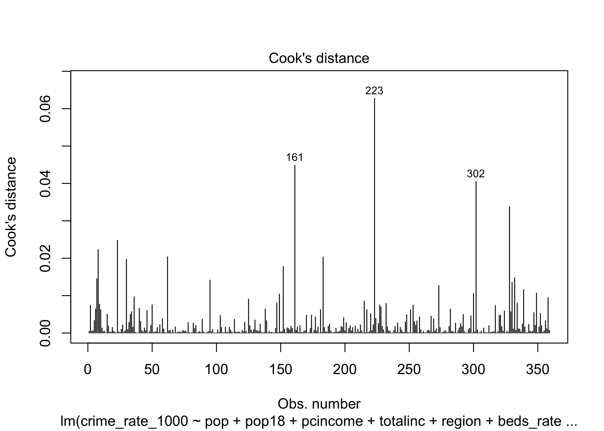
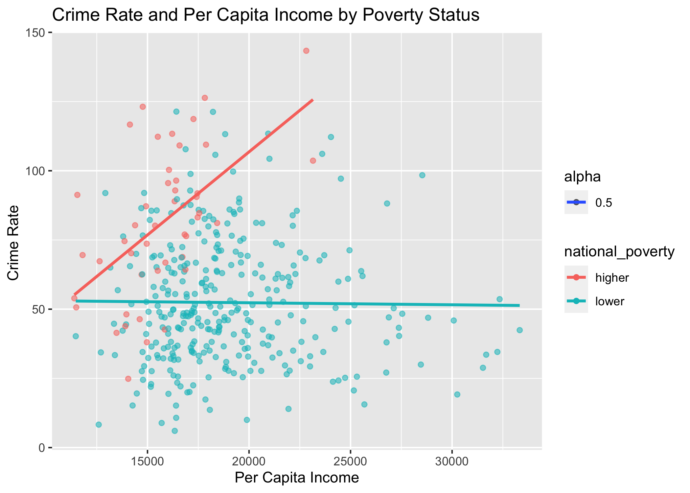
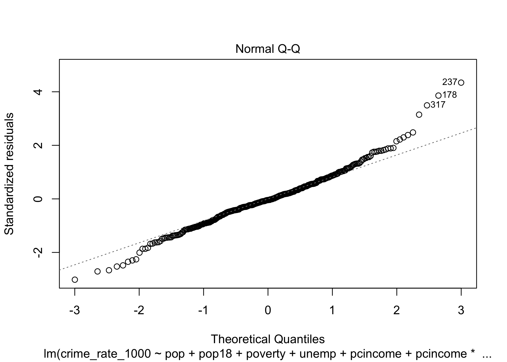
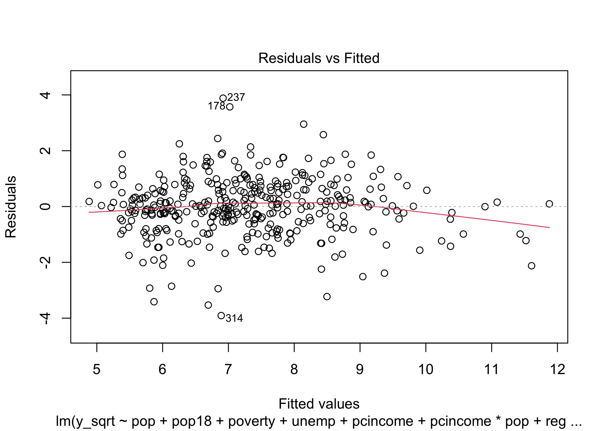
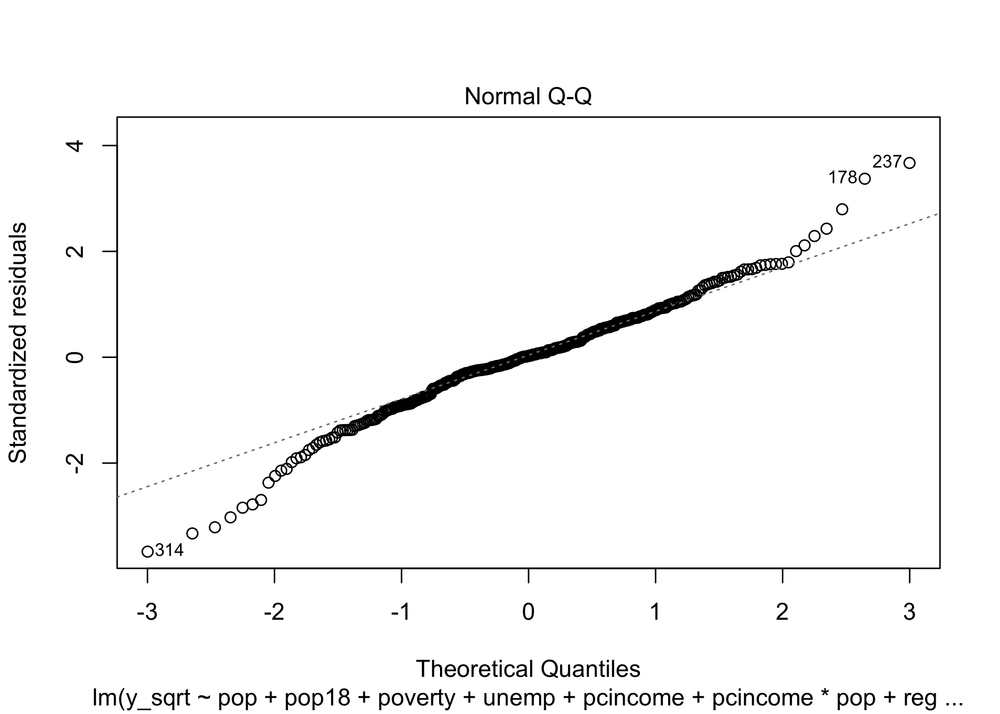
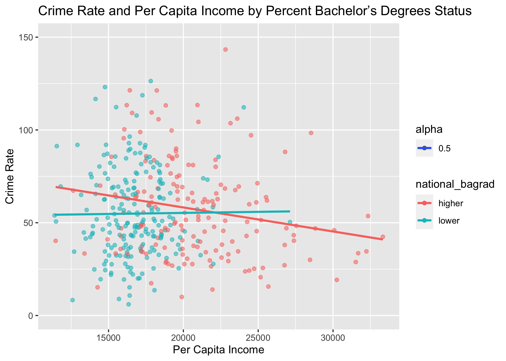
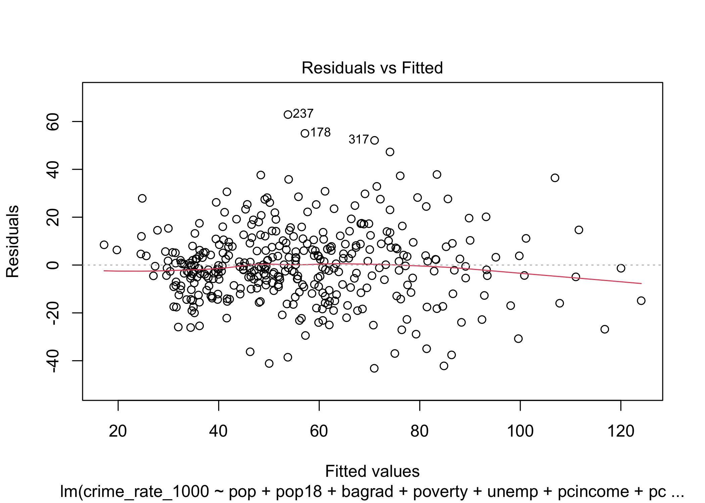
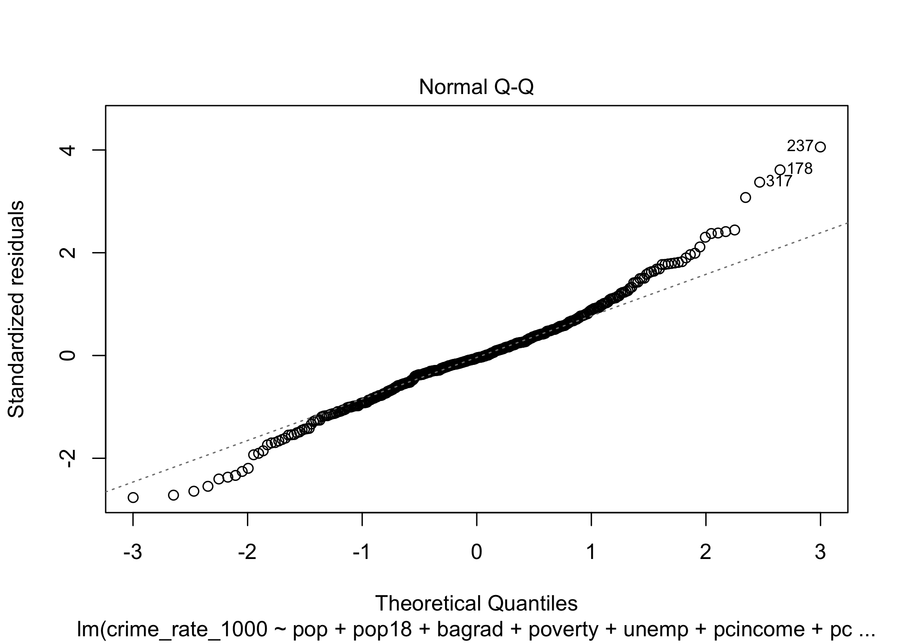
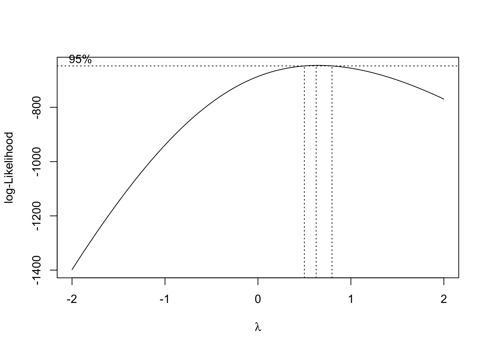
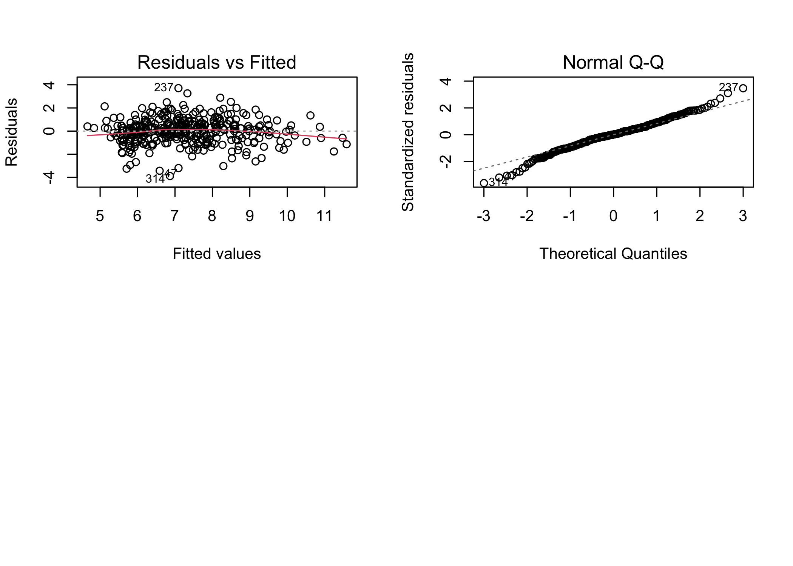

BIST8130 - Final Proejct Codings
================
11/22/2021

``` r
library(tidyverse)
library(corrplot)
library(leaps)
library(performance)
library(MASS)
library(caret)
```

## Step 1: Data Preprocessing

After importing the csv file containing the County Demographic
Information (CDI) data, we notice that crimes, physicians, and hospital
beds are given as numbers, while other info are given as proportions. We
therefore compute the number of crimes, physicians, and hospital beds
per 1000 people.

``` r
cdi_data = read_csv("./data/cdi.csv") %>%
  janitor::clean_names() %>%
  mutate(
    cty_state = str_c(cty,",",state),
    docs_rate_1000 = 1000 * docs/pop, # Compute number of doctors/hospital beds per 1000 people.
    beds_rate_1000 = 1000 * beds/pop,
    density = as.numeric(pop)/as.numeric(area),
    crime_rate_1000 = 1000 * crimes/pop) %>% # Compute number of crimes per 1000 people. 
  dplyr::select(-docs,-beds,-crimes) %>%
  relocate(id,cty_state,cty)
```

    ## Rows: 440 Columns: 17

    ## ── Column specification ────────────────────────────────────────────────────────
    ## Delimiter: ","
    ## chr  (2): cty, state
    ## dbl (15): id, area, pop, pop18, pop65, docs, beds, crimes, hsgrad, bagrad, p...

    ## 
    ## ℹ Use `spec()` to retrieve the full column specification for this data.
    ## ℹ Specify the column types or set `show_col_types = FALSE` to quiet this message.

``` r
knitr::kable(head(cdi_data))
```

|  id | cty\_state   | cty       | state | area |     pop | pop18 | pop65 | hsgrad | bagrad | poverty | unemp | pcincome | totalinc | region | docs\_rate\_1000 | beds\_rate\_1000 |    density | crime\_rate\_1000 |
|----:|:-------------|:----------|:------|-----:|--------:|------:|------:|-------:|-------:|--------:|------:|---------:|---------:|-------:|-----------------:|-----------------:|-----------:|------------------:|
|   1 | Los\_Ange,CA | Los\_Ange | CA    | 4060 | 8863164 |  32.1 |   9.7 |   70.0 |   22.3 |    11.6 |   8.0 |    20786 |   184230 |      4 |         2.671394 |         3.125295 |  2183.0453 |          77.73026 |
|   2 | Cook,IL      | Cook      | IL    |  946 | 5105067 |  29.2 |  12.4 |   73.4 |   22.8 |    11.1 |   7.2 |    21729 |   110928 |      2 |         2.968227 |         4.221296 |  5396.4767 |          85.58869 |
|   3 | Harris,TX    | Harris    | TX    | 1729 | 2818199 |  31.3 |   7.1 |   74.9 |   25.4 |    12.5 |   5.7 |    19517 |    55003 |      3 |         2.680080 |         4.417360 |  1629.9589 |          89.96029 |
|   4 | San\_Dieg,CA | San\_Dieg | CA    | 4205 | 2498016 |  33.5 |  10.9 |   81.9 |   25.3 |     8.1 |   6.1 |    19588 |    48931 |      4 |         2.363876 |         2.473563 |   594.0585 |          69.58362 |
|   5 | Orange,CA    | Orange    | CA    |  790 | 2410556 |  32.6 |   9.2 |   81.2 |   27.8 |     5.2 |   4.8 |    24400 |    58818 |      4 |         2.514772 |         2.642129 |  3051.3367 |          59.95463 |
|   6 | Kings,NY     | Kings     | NY    |   71 | 2300664 |  28.3 |  12.4 |   63.7 |   16.6 |    19.5 |   9.5 |    16803 |    38658 |      1 |         2.112868 |         3.886704 | 32403.7183 |         295.98672 |

## Step 2 - Exploratory Analysis

We then take a closer look of each variables, calculate the pairwise
correlations between variables, and list all the correlations between
the crime rate (our interest) and all other variables.

``` r
cdi_data_exp = cdi_data %>%
  dplyr::select(-id,-cty,-state, -cty_state) 

cdi_data_original = cdi_data_exp

cdi_data_exp = cdi_data_exp %>%
  mutate(
    area = ifelse(area %in% boxplot.stats(cdi_data_exp$area)$out,NA,area),
    pop = ifelse(pop %in% boxplot.stats(cdi_data_exp$pop)$out,NA,pop),
    crime_rate_1000 = ifelse(crime_rate_1000 %in% boxplot.stats(cdi_data_exp$crime_rate_1000)$out,NA,crime_rate_1000),
    poverty = ifelse(poverty %in% boxplot.stats(cdi_data_exp$poverty)$out,NA,poverty)
  ) %>%
  na.omit()


par(mfrow=c(2,3))
boxplot(cdi_data_exp$area,main="Area")
boxplot(cdi_data_exp$pop,main="Population")
boxplot(cdi_data_exp$pop18,main="Population 18-34")
boxplot(cdi_data_exp$pop65,main="Population 65+")
boxplot(cdi_data_exp$hsgrad,main="Highschool grads")
boxplot(cdi_data_exp$bagrad,main="Bachelor's grads")
```

<!-- -->

``` r
par(mfrow=c(2,3))
boxplot(cdi_data_exp$poverty,main="Poverty Rate")
boxplot(cdi_data_exp$unemp,main="Unemployment Rate")
boxplot(cdi_data_exp$pcincome,main="Income Per Capita")
boxplot(cdi_data_exp$totalinc,main="Income Total")
boxplot(cdi_data_exp$docs_rate_1000,main="Active Physicians")
boxplot(cdi_data_exp$beds_rate_1000,main="Hospital Beds")
```

<!-- -->

``` r
par(mfrow=c(1,1))

ggplot(cdi_data,aes(region)) + 
  geom_histogram(binwidth = 0.5) +
  theme_classic() +
  xlab("Region")+
  ylab("Count")
```

<!-- -->

``` r
boxplot(cdi_data_exp$crime_rate_1000,main="Crime Rate",horizontal = TRUE)
```

<!-- -->

``` r
# data exploratory
pairs(cdi_data_exp)
```

<!-- -->

``` r
# correlation plot
cdi_data_cor = cor(cdi_data_exp)
corrplot(cdi_data_cor, type = "upper", diag = FALSE)
```

<!-- -->

``` r
crime_1000_cor = data.frame(cdi_data_cor) %>% 
  dplyr::select("Crime Rate (Per 1000)" = crime_rate_1000) %>% 
  t()

knitr::kable(crime_1000_cor,digits = 2) 
```

|                       |  area |  pop | pop18 | pop65 | hsgrad | bagrad | poverty | unemp | pcincome | totalinc | region | docs\_rate\_1000 | beds\_rate\_1000 | density | crime\_rate\_1000 |
|:----------------------|------:|-----:|------:|------:|-------:|-------:|--------:|------:|---------:|---------:|-------:|-----------------:|-----------------:|--------:|------------------:|
| Crime Rate (Per 1000) | -0.04 | 0.29 |  0.24 | -0.08 |  -0.13 |   0.09 |    0.49 | -0.07 |    -0.08 |     0.19 |   0.46 |             0.32 |             0.39 |    0.29 |                 1 |

## Remove outliers and high leverage point

``` r
# Remove high leverage points

cdi_data_clean = cdi_data[cdi_data$area >= quantile(cdi_data$area,0.002) & cdi_data$area <= quantile(cdi_data$area,0.998),]
cdi_data_clean = cdi_data_clean[cdi_data_clean$pop >= quantile(cdi_data_clean$pop,0.002) & cdi_data_clean$pop <= quantile(cdi_data_clean$pop,0.998),]
cdi_data_clean = cdi_data_clean[cdi_data_clean$pop18 >= quantile(cdi_data_clean$pop18,0.002) & cdi_data_clean$pop18 <= quantile(cdi_data_clean$pop18,0.998),]
cdi_data_clean = cdi_data_clean[cdi_data_clean$pop65 >= quantile(cdi_data_clean$pop65,0.002) & cdi_data_clean$pop65 <= quantile(cdi_data_clean$pop65,0.998),]
cdi_data_clean = cdi_data_clean[cdi_data_clean$hsgrad >= quantile(cdi_data_clean$hsgrad,0.002) & cdi_data_clean$hsgrad <= quantile(cdi_data_clean$hsgrad,0.998),]
cdi_data_clean = cdi_data_clean[cdi_data_clean$bagrad >= quantile(cdi_data_clean$bagrad,0.002) & cdi_data_clean$bagrad <= quantile(cdi_data_clean$bagrad,0.998),]

cdi_data_clean = cdi_data_clean[cdi_data_clean$poverty >= quantile(cdi_data_clean$poverty,0.002) & cdi_data_clean$poverty <= quantile(cdi_data_clean$poverty,0.998),]
cdi_data_clean = cdi_data_clean[cdi_data_clean$unemp >= quantile(cdi_data_clean$unemp,0.002) & cdi_data_clean$unemp <= quantile(cdi_data_clean$unemp,0.998),]
cdi_data_clean = cdi_data_clean[cdi_data_clean$pcincome >= quantile(cdi_data_clean$pcincome,0.002) & cdi_data_clean$pcincome <= quantile(cdi_data_clean$pcincome,0.998),]
cdi_data_clean = cdi_data_clean[cdi_data_clean$totalinc >= quantile(cdi_data_clean$totalinc,0.002) & cdi_data_clean$totalinc <= quantile(cdi_data_clean$totalinc,0.998),]
cdi_data_clean = cdi_data_clean[cdi_data_clean$docs_rate_1000 >= quantile(cdi_data_clean$docs_rate_1000,0.002) & cdi_data_clean$docs_rate_1000 <= quantile(cdi_data_clean$docs_rate_1000,0.998),]
cdi_data_clean = cdi_data_clean[cdi_data_clean$beds_rate_1000 >= quantile(cdi_data_clean$beds_rate_1000,0.002) & cdi_data_clean$beds_rate_1000 <= quantile(cdi_data_clean$beds_rate_1000,0.998),]
cdi_data_clean = cdi_data_clean[cdi_data_clean$beds_rate_1000 >= quantile(cdi_data_clean$beds_rate_1000,0.002) & cdi_data_clean$beds_rate_1000 <= quantile(cdi_data_clean$beds_rate_1000,0.998),]
cdi_data_clean = cdi_data_clean[cdi_data_clean$density >= quantile(cdi_data_clean$density,0.002) & cdi_data_clean$density <= quantile(cdi_data_clean$density,0.998),]

cdi_data_clean = cdi_data_clean[cdi_data_clean$crime_rate_1000 >= quantile(cdi_data_clean$crime_rate_1000,0.002) & cdi_data_clean$beds_rate_1000 <= quantile(cdi_data_clean$crime_rate_1000,0.998),]
```

``` r
par(mfrow=c(3,4))
boxplot(cdi_data_clean$area,main="Area")
boxplot(cdi_data_clean$pop,main="Population")
boxplot(cdi_data_clean$pop18,main="Population 18-34")
boxplot(cdi_data_clean$pop65,main="Population 65+")
boxplot(cdi_data_clean$hsgrad,main="Highschool grads")
boxplot(cdi_data_clean$bagrad,main="Bachelor's grads")

boxplot(cdi_data_clean$poverty,main="Poverty Rate")
boxplot(cdi_data_clean$unemp,main="Unemployment Rate")
boxplot(cdi_data_clean$pcincome,main="Income Per Capita")
boxplot(cdi_data_clean$totalinc,main="Income Total")
boxplot(cdi_data_clean$docs_rate_1000,main="Active Physicians")
boxplot(cdi_data_clean$beds_rate_1000,main="Hospital Beds")
```

<!-- -->

## Training/Test set split

``` r
cdi_data_clean = cdi_data_clean %>% 
  dplyr::select(-id,-cty_state, -cty,-state) %>% 
  mutate(region = factor(region))

set.seed(1)
dt = sort(sample(nrow(cdi_data_clean), nrow(cdi_data_clean)*.9))
train_data = cdi_data_clean[dt,]
test_data = cdi_data_clean[-dt,]
```

## Model construction

Data used for building model:

``` r
cdi_model = train_data
```

### Stepwise regression

``` r
full.fit = lm(crime_rate_1000 ~ ., data = cdi_model)
summary(full.fit) %>% 
  broom::tidy() %>%
  mutate(p_rank = rank(p.value))
```

    ## # A tibble: 17 × 6
    ##    term               estimate  std.error statistic  p.value p_rank
    ##    <chr>                 <dbl>      <dbl>     <dbl>    <dbl>  <dbl>
    ##  1 (Intercept)    -107.        29.0          -3.71  2.42e- 4      8
    ##  2 area             -0.000471   0.000881     -0.535 5.93e- 1     16
    ##  3 pop               0.0000788  0.0000130     6.08  3.10e- 9      3
    ##  4 pop18             1.25       0.358         3.50  5.26e- 4      9
    ##  5 pop65             0.0779     0.318         0.245 8.07e- 1     17
    ##  6 hsgrad            0.354      0.276         1.28  2.00e- 1     13
    ##  7 bagrad           -0.687      0.320        -2.15  3.23e- 2     10
    ##  8 poverty           2.18       0.428         5.09  5.95e- 7      6
    ##  9 unemp             0.628      0.532         1.18  2.39e- 1     14
    ## 10 pcincome          0.00325    0.000608      5.35  1.62e- 7      4
    ## 11 totalinc         -0.00333    0.000638     -5.23  2.92e- 7      5
    ## 12 region2          10.6        2.61          4.08  5.63e- 5      7
    ## 13 region3          29.5        2.60         11.4   1.04e-25      1
    ## 14 region4          22.1        3.34          6.62  1.34e-10      2
    ## 15 docs_rate_1000    1.81       1.20          1.51  1.31e- 1     12
    ## 16 beds_rate_1000    1.75       0.834         2.10  3.67e- 2     11
    ## 17 density           0.000743   0.000691      1.07  2.83e- 1     15

``` r
backward = step(full.fit, direction='backward') %>%  broom::tidy() %>%  rename(backward = "term")
```

    ## Start:  AIC=2059.35
    ## crime_rate_1000 ~ area + pop + pop18 + pop65 + hsgrad + bagrad + 
    ##     poverty + unemp + pcincome + totalinc + region + docs_rate_1000 + 
    ##     beds_rate_1000 + density
    ## 
    ##                  Df Sum of Sq    RSS    AIC
    ## - pop65           1        15  89297 2057.4
    ## - area            1        73  89354 2057.7
    ## - density         1       293  89574 2058.6
    ## - unemp           1       353  89635 2058.8
    ## - hsgrad          1       418  89699 2059.1
    ## <none>                         89281 2059.3
    ## - docs_rate_1000  1       581  89863 2059.7
    ## - beds_rate_1000  1      1116  90397 2061.9
    ## - bagrad          1      1171  90452 2062.2
    ## - pop18           1      3107  92388 2070.0
    ## - poverty         1      6562  95844 2083.5
    ## - totalinc        1      6938  96219 2085.0
    ## - pcincome        1      7248  96529 2086.2
    ## - pop             1      9382  98663 2094.2
    ## - region          3     34907 124189 2175.1
    ## 
    ## Step:  AIC=2057.41
    ## crime_rate_1000 ~ area + pop + pop18 + hsgrad + bagrad + poverty + 
    ##     unemp + pcincome + totalinc + region + docs_rate_1000 + beds_rate_1000 + 
    ##     density
    ## 
    ##                  Df Sum of Sq    RSS    AIC
    ## - area            1        67  89364 2055.7
    ## - density         1       304  89601 2056.7
    ## - unemp           1       383  89680 2057.0
    ## - hsgrad          1       408  89705 2057.1
    ## <none>                         89297 2057.4
    ## - docs_rate_1000  1       592  89889 2057.8
    ## - bagrad          1      1169  90466 2060.2
    ## - beds_rate_1000  1      1277  90574 2060.7
    ## - pop18           1      3748  93044 2070.6
    ## - poverty         1      6706  96002 2082.1
    ## - totalinc        1      6926  96222 2083.0
    ## - pcincome        1      7255  96552 2084.2
    ## - pop             1      9371  98668 2092.2
    ## - region          3     34901 124197 2173.2
    ## 
    ## Step:  AIC=2055.69
    ## crime_rate_1000 ~ pop + pop18 + hsgrad + bagrad + poverty + unemp + 
    ##     pcincome + totalinc + region + docs_rate_1000 + beds_rate_1000 + 
    ##     density
    ## 
    ##                  Df Sum of Sq    RSS    AIC
    ## - unemp           1       356  89720 2055.2
    ## - density         1       429  89793 2055.5
    ## - hsgrad          1       431  89795 2055.5
    ## <none>                         89364 2055.7
    ## - docs_rate_1000  1       588  89952 2056.1
    ## - bagrad          1      1171  90535 2058.5
    ## - beds_rate_1000  1      1280  90644 2058.9
    ## - pop18           1      3723  93087 2068.8
    ## - poverty         1      6662  96027 2080.2
    ## - totalinc        1      6868  96232 2081.0
    ## - pcincome        1      7226  96590 2082.4
    ## - pop             1      9406  98770 2090.6
    ## - region          3     34833 124198 2171.2
    ## 
    ## Step:  AIC=2055.16
    ## crime_rate_1000 ~ pop + pop18 + hsgrad + bagrad + poverty + pcincome + 
    ##     totalinc + region + docs_rate_1000 + beds_rate_1000 + density
    ## 
    ##                  Df Sum of Sq    RSS    AIC
    ## - hsgrad          1       328  90049 2054.5
    ## - density         1       408  90129 2054.8
    ## <none>                         89720 2055.2
    ## - docs_rate_1000  1       590  90310 2055.6
    ## - beds_rate_1000  1      1043  90764 2057.4
    ## - bagrad          1      1505  91225 2059.3
    ## - pop18           1      3735  93455 2068.2
    ## - totalinc        1      7018  96738 2080.9
    ## - pcincome        1      7957  97677 2084.5
    ## - poverty         1      8464  98184 2086.4
    ## - pop             1      9555  99275 2090.5
    ## - region          3     36161 125881 2174.1
    ## 
    ## Step:  AIC=2054.51
    ## crime_rate_1000 ~ pop + pop18 + bagrad + poverty + pcincome + 
    ##     totalinc + region + docs_rate_1000 + beds_rate_1000 + density
    ## 
    ##                  Df Sum of Sq    RSS    AIC
    ## - density         1       336  90385 2053.9
    ## <none>                         90049 2054.5
    ## - docs_rate_1000  1       500  90549 2054.6
    ## - beds_rate_1000  1      1207  91255 2057.4
    ## - bagrad          1      1244  91292 2057.6
    ## - pop18           1      3512  93560 2066.6
    ## - totalinc        1      7116  97164 2080.6
    ## - pcincome        1      7638  97686 2082.6
    ## - poverty         1      8900  98948 2087.3
    ## - pop             1      9648  99697 2090.1
    ## - region          3     35889 125937 2172.3
    ## 
    ## Step:  AIC=2053.88
    ## crime_rate_1000 ~ pop + pop18 + bagrad + poverty + pcincome + 
    ##     totalinc + region + docs_rate_1000 + beds_rate_1000
    ## 
    ##                  Df Sum of Sq    RSS    AIC
    ## <none>                         90385 2053.9
    ## - docs_rate_1000  1       791  91175 2055.1
    ## - beds_rate_1000  1      1114  91498 2056.4
    ## - bagrad          1      1662  92046 2058.6
    ## - pop18           1      4171  94556 2068.5
    ## - totalinc        1      7177  97562 2080.1
    ## - pcincome        1      8992  99377 2086.9
    ## - pop             1      9887 100271 2090.2
    ## - poverty         1      9966 100351 2090.5
    ## - region          3     35598 125982 2170.4

``` r
both = step(full.fit, direction = "both") %>% broom::tidy() %>% rename(stepwise = "term")
```

    ## Start:  AIC=2059.35
    ## crime_rate_1000 ~ area + pop + pop18 + pop65 + hsgrad + bagrad + 
    ##     poverty + unemp + pcincome + totalinc + region + docs_rate_1000 + 
    ##     beds_rate_1000 + density
    ## 
    ##                  Df Sum of Sq    RSS    AIC
    ## - pop65           1        15  89297 2057.4
    ## - area            1        73  89354 2057.7
    ## - density         1       293  89574 2058.6
    ## - unemp           1       353  89635 2058.8
    ## - hsgrad          1       418  89699 2059.1
    ## <none>                         89281 2059.3
    ## - docs_rate_1000  1       581  89863 2059.7
    ## - beds_rate_1000  1      1116  90397 2061.9
    ## - bagrad          1      1171  90452 2062.2
    ## - pop18           1      3107  92388 2070.0
    ## - poverty         1      6562  95844 2083.5
    ## - totalinc        1      6938  96219 2085.0
    ## - pcincome        1      7248  96529 2086.2
    ## - pop             1      9382  98663 2094.2
    ## - region          3     34907 124189 2175.1
    ## 
    ## Step:  AIC=2057.41
    ## crime_rate_1000 ~ area + pop + pop18 + hsgrad + bagrad + poverty + 
    ##     unemp + pcincome + totalinc + region + docs_rate_1000 + beds_rate_1000 + 
    ##     density
    ## 
    ##                  Df Sum of Sq    RSS    AIC
    ## - area            1        67  89364 2055.7
    ## - density         1       304  89601 2056.7
    ## - unemp           1       383  89680 2057.0
    ## - hsgrad          1       408  89705 2057.1
    ## <none>                         89297 2057.4
    ## - docs_rate_1000  1       592  89889 2057.8
    ## + pop65           1        15  89281 2059.3
    ## - bagrad          1      1169  90466 2060.2
    ## - beds_rate_1000  1      1277  90574 2060.7
    ## - pop18           1      3748  93044 2070.6
    ## - poverty         1      6706  96002 2082.1
    ## - totalinc        1      6926  96222 2083.0
    ## - pcincome        1      7255  96552 2084.2
    ## - pop             1      9371  98668 2092.2
    ## - region          3     34901 124197 2173.2
    ## 
    ## Step:  AIC=2055.69
    ## crime_rate_1000 ~ pop + pop18 + hsgrad + bagrad + poverty + unemp + 
    ##     pcincome + totalinc + region + docs_rate_1000 + beds_rate_1000 + 
    ##     density
    ## 
    ##                  Df Sum of Sq    RSS    AIC
    ## - unemp           1       356  89720 2055.2
    ## - density         1       429  89793 2055.5
    ## - hsgrad          1       431  89795 2055.5
    ## <none>                         89364 2055.7
    ## - docs_rate_1000  1       588  89952 2056.1
    ## + area            1        67  89297 2057.4
    ## + pop65           1        10  89354 2057.7
    ## - bagrad          1      1171  90535 2058.5
    ## - beds_rate_1000  1      1280  90644 2058.9
    ## - pop18           1      3723  93087 2068.8
    ## - poverty         1      6662  96027 2080.2
    ## - totalinc        1      6868  96232 2081.0
    ## - pcincome        1      7226  96590 2082.4
    ## - pop             1      9406  98770 2090.6
    ## - region          3     34833 124198 2171.2
    ## 
    ## Step:  AIC=2055.16
    ## crime_rate_1000 ~ pop + pop18 + hsgrad + bagrad + poverty + pcincome + 
    ##     totalinc + region + docs_rate_1000 + beds_rate_1000 + density
    ## 
    ##                  Df Sum of Sq    RSS    AIC
    ## - hsgrad          1       328  90049 2054.5
    ## - density         1       408  90129 2054.8
    ## <none>                         89720 2055.2
    ## - docs_rate_1000  1       590  90310 2055.6
    ## + unemp           1       356  89364 2055.7
    ## + area            1        40  89680 2057.0
    ## + pop65           1        37  89683 2057.0
    ## - beds_rate_1000  1      1043  90764 2057.4
    ## - bagrad          1      1505  91225 2059.3
    ## - pop18           1      3735  93455 2068.2
    ## - totalinc        1      7018  96738 2080.9
    ## - pcincome        1      7957  97677 2084.5
    ## - poverty         1      8464  98184 2086.4
    ## - pop             1      9555  99275 2090.5
    ## - region          3     36161 125881 2174.1
    ## 
    ## Step:  AIC=2054.51
    ## crime_rate_1000 ~ pop + pop18 + bagrad + poverty + pcincome + 
    ##     totalinc + region + docs_rate_1000 + beds_rate_1000 + density
    ## 
    ##                  Df Sum of Sq    RSS    AIC
    ## - density         1       336  90385 2053.9
    ## <none>                         90049 2054.5
    ## - docs_rate_1000  1       500  90549 2054.6
    ## + hsgrad          1       328  89720 2055.2
    ## + unemp           1       253  89795 2055.5
    ## + area            1        60  89989 2056.3
    ## + pop65           1        18  90030 2056.4
    ## - beds_rate_1000  1      1207  91255 2057.4
    ## - bagrad          1      1244  91292 2057.6
    ## - pop18           1      3512  93560 2066.6
    ## - totalinc        1      7116  97164 2080.6
    ## - pcincome        1      7638  97686 2082.6
    ## - poverty         1      8900  98948 2087.3
    ## - pop             1      9648  99697 2090.1
    ## - region          3     35889 125937 2172.3
    ## 
    ## Step:  AIC=2053.88
    ## crime_rate_1000 ~ pop + pop18 + bagrad + poverty + pcincome + 
    ##     totalinc + region + docs_rate_1000 + beds_rate_1000
    ## 
    ##                  Df Sum of Sq    RSS    AIC
    ## <none>                         90385 2053.9
    ## + density         1       336  90049 2054.5
    ## + hsgrad          1       256  90129 2054.8
    ## + unemp           1       247  90138 2054.9
    ## - docs_rate_1000  1       791  91175 2055.1
    ## + area            1       159  90225 2055.2
    ## + pop65           1        28  90356 2055.8
    ## - beds_rate_1000  1      1114  91498 2056.4
    ## - bagrad          1      1662  92046 2058.6
    ## - pop18           1      4171  94556 2068.5
    ## - totalinc        1      7177  97562 2080.1
    ## - pcincome        1      8992  99377 2086.9
    ## - pop             1      9887 100271 2090.2
    ## - poverty         1      9966 100351 2090.5
    ## - region          3     35598 125982 2170.4

``` r
bind_cols(backward[-1,1],both[-1,1]) %>% knitr::kable()
```

| backward         | stepwise         |
|:-----------------|:-----------------|
| pop              | pop              |
| pop18            | pop18            |
| bagrad           | bagrad           |
| poverty          | poverty          |
| pcincome         | pcincome         |
| totalinc         | totalinc         |
| region2          | region2          |
| region3          | region3          |
| region4          | region4          |
| docs\_rate\_1000 | docs\_rate\_1000 |
| beds\_rate\_1000 | beds\_rate\_1000 |

### Criteria based selection

``` r
sb = regsubsets(crime_rate_1000 ~ ., data = cdi_model, nvmax = 14)
sumsb = summary(sb) # pop pop18 hsgrad bagrad poverty pcincome totalinc region beds_rate_1000 density
sumsb
```

    ## Subset selection object
    ## Call: regsubsets.formula(crime_rate_1000 ~ ., data = cdi_model, nvmax = 14)
    ## 16 Variables  (and intercept)
    ##                Forced in Forced out
    ## area               FALSE      FALSE
    ## pop                FALSE      FALSE
    ## pop18              FALSE      FALSE
    ## pop65              FALSE      FALSE
    ## hsgrad             FALSE      FALSE
    ## bagrad             FALSE      FALSE
    ## poverty            FALSE      FALSE
    ## unemp              FALSE      FALSE
    ## pcincome           FALSE      FALSE
    ## totalinc           FALSE      FALSE
    ## region2            FALSE      FALSE
    ## region3            FALSE      FALSE
    ## region4            FALSE      FALSE
    ## docs_rate_1000     FALSE      FALSE
    ## beds_rate_1000     FALSE      FALSE
    ## density            FALSE      FALSE
    ## 1 subsets of each size up to 14
    ## Selection Algorithm: exhaustive
    ##           area pop pop18 pop65 hsgrad bagrad poverty unemp pcincome totalinc
    ## 1  ( 1 )  " "  " " " "   " "   " "    " "    "*"     " "   " "      " "     
    ## 2  ( 1 )  " "  "*" " "   " "   " "    " "    "*"     " "   " "      " "     
    ## 3  ( 1 )  " "  "*" " "   " "   " "    " "    "*"     " "   " "      " "     
    ## 4  ( 1 )  " "  "*" " "   " "   " "    " "    "*"     " "   " "      " "     
    ## 5  ( 1 )  " "  "*" " "   " "   " "    " "    "*"     " "   " "      " "     
    ## 6  ( 1 )  " "  "*" " "   " "   " "    " "    "*"     " "   " "      " "     
    ## 7  ( 1 )  " "  "*" " "   " "   " "    " "    "*"     " "   "*"      "*"     
    ## 8  ( 1 )  " "  "*" " "   " "   " "    " "    "*"     " "   "*"      "*"     
    ## 9  ( 1 )  " "  "*" "*"   " "   " "    " "    "*"     " "   "*"      "*"     
    ## 10  ( 1 ) " "  "*" "*"   " "   " "    "*"    "*"     " "   "*"      "*"     
    ## 11  ( 1 ) " "  "*" "*"   " "   " "    "*"    "*"     " "   "*"      "*"     
    ## 12  ( 1 ) " "  "*" "*"   " "   " "    "*"    "*"     " "   "*"      "*"     
    ## 13  ( 1 ) " "  "*" "*"   " "   "*"    "*"    "*"     " "   "*"      "*"     
    ## 14  ( 1 ) " "  "*" "*"   " "   "*"    "*"    "*"     "*"   "*"      "*"     
    ##           region2 region3 region4 docs_rate_1000 beds_rate_1000 density
    ## 1  ( 1 )  " "     " "     " "     " "            " "            " "    
    ## 2  ( 1 )  " "     " "     " "     " "            " "            " "    
    ## 3  ( 1 )  " "     "*"     " "     " "            " "            " "    
    ## 4  ( 1 )  " "     "*"     " "     "*"            " "            " "    
    ## 5  ( 1 )  " "     "*"     "*"     "*"            " "            " "    
    ## 6  ( 1 )  "*"     "*"     "*"     "*"            " "            " "    
    ## 7  ( 1 )  "*"     "*"     "*"     " "            " "            " "    
    ## 8  ( 1 )  "*"     "*"     "*"     "*"            " "            " "    
    ## 9  ( 1 )  "*"     "*"     "*"     " "            "*"            " "    
    ## 10  ( 1 ) "*"     "*"     "*"     " "            "*"            " "    
    ## 11  ( 1 ) "*"     "*"     "*"     "*"            "*"            " "    
    ## 12  ( 1 ) "*"     "*"     "*"     "*"            "*"            "*"    
    ## 13  ( 1 ) "*"     "*"     "*"     "*"            "*"            "*"    
    ## 14  ( 1 ) "*"     "*"     "*"     "*"            "*"            "*"

``` r
# plot of Cp and Adj-R2 as functions of parameters
par(mfrow=c(1,2))
plot(2:15, sumsb$cp, xlab="No. of parameters", ylab="Cp Statistic") 
abline(0,1)

plot(2:15, sumsb$adjr2, xlab="No of parameters", ylab="Adj R2")
```

<!-- -->

According to the output, we determine that the number of variables
should be above 12 because *C*<sub>*p*</sub> ≤ *p*. Based on this
analysis, we find that `unemp` could also be selected.

### Discussion

We need to remove totalinc, because it can be replaced. totalinc =
pcincome \* pop.

## Model building from the vairables we selected

``` r
fit_nest = lm(crime_rate_1000 ~  
                  pop + pop18 + bagrad +
                  poverty + unemp + pcincome + pcincome*pop + region +
                  beds_rate_1000+ docs_rate_1000 + density, data = cdi_model)
summary(fit_nest)
```

    ## 
    ## Call:
    ## lm(formula = crime_rate_1000 ~ pop + pop18 + bagrad + poverty + 
    ##     unemp + pcincome + pcincome * pop + region + beds_rate_1000 + 
    ##     docs_rate_1000 + density, data = cdi_model)
    ## 
    ## Residuals:
    ##     Min      1Q  Median      3Q     Max 
    ## -44.017  -9.165  -0.698   8.026  59.949 
    ## 
    ## Coefficients:
    ##                  Estimate Std. Error t value Pr(>|t|)    
    ## (Intercept)    -7.658e+01  1.544e+01  -4.959 1.10e-06 ***
    ## pop             7.787e-05  1.268e-05   6.140 2.21e-09 ***
    ## pop18           1.154e+00  3.120e-01   3.700  0.00025 ***
    ## bagrad         -4.448e-01  2.600e-01  -1.711  0.08796 .  
    ## poverty         1.934e+00  3.853e-01   5.019 8.23e-07 ***
    ## unemp           5.171e-01  5.170e-01   1.000  0.31793    
    ## pcincome        3.117e-03  5.980e-04   5.213 3.16e-07 ***
    ## region2         1.143e+01  2.480e+00   4.607 5.69e-06 ***
    ## region3         2.926e+01  2.577e+00  11.354  < 2e-16 ***
    ## region4         2.227e+01  2.929e+00   7.602 2.63e-13 ***
    ## beds_rate_1000  1.890e+00  7.998e-01   2.363  0.01866 *  
    ## docs_rate_1000  1.643e+00  1.185e+00   1.386  0.16658    
    ## density         7.617e-04  6.549e-04   1.163  0.24555    
    ## pop:pcincome   -3.309e-09  6.290e-10  -5.262 2.48e-07 ***
    ## ---
    ## Signif. codes:  0 '***' 0.001 '**' 0.01 '*' 0.05 '.' 0.1 ' ' 1
    ## 
    ## Residual standard error: 15.9 on 355 degrees of freedom
    ## Multiple R-squared:  0.5968, Adjusted R-squared:  0.5821 
    ## F-statistic: 40.43 on 13 and 355 DF,  p-value: < 2.2e-16

``` r
# remove docs
fit_nest = lm(crime_rate_1000 ~  
                  pop + pop18 + bagrad +
                  poverty + unemp + pcincome + pcincome*pop + region +
                  beds_rate_1000 + density, data = cdi_model)
summary(fit_nest)
```

    ## 
    ## Call:
    ## lm(formula = crime_rate_1000 ~ pop + pop18 + bagrad + poverty + 
    ##     unemp + pcincome + pcincome * pop + region + beds_rate_1000 + 
    ##     density, data = cdi_model)
    ## 
    ## Residuals:
    ##     Min      1Q  Median      3Q     Max 
    ## -42.553  -9.838  -0.756   8.236  58.758 
    ## 
    ## Coefficients:
    ##                  Estimate Std. Error t value Pr(>|t|)    
    ## (Intercept)    -8.155e+01  1.504e+01  -5.424 1.08e-07 ***
    ## pop             7.754e-05  1.270e-05   6.107 2.65e-09 ***
    ## pop18           1.197e+00  3.109e-01   3.849  0.00014 ***
    ## bagrad         -3.414e-01  2.493e-01  -1.369  0.17184    
    ## poverty         1.976e+00  3.846e-01   5.139 4.56e-07 ***
    ## unemp           5.316e-01  5.176e-01   1.027  0.30509    
    ## pcincome        3.219e-03  5.942e-04   5.417 1.12e-07 ***
    ## region2         1.108e+01  2.470e+00   4.485 9.86e-06 ***
    ## region3         2.923e+01  2.581e+00  11.326  < 2e-16 ***
    ## region4         2.260e+01  2.923e+00   7.731 1.10e-13 ***
    ## beds_rate_1000  2.580e+00  6.268e-01   4.116 4.80e-05 ***
    ## density         9.984e-04  6.331e-04   1.577  0.11565    
    ## pop:pcincome   -3.288e-09  6.296e-10  -5.222 3.02e-07 ***
    ## ---
    ## Signif. codes:  0 '***' 0.001 '**' 0.01 '*' 0.05 '.' 0.1 ' ' 1
    ## 
    ## Residual standard error: 15.92 on 356 degrees of freedom
    ## Multiple R-squared:  0.5947, Adjusted R-squared:  0.581 
    ## F-statistic: 43.52 on 12 and 356 DF,  p-value: < 2.2e-16

Our first model: crime\_rate\_1000 \~  
pop + pop18 + bagrad + poverty + unemp + pcincome + pcincome\*pop +
region + beds\_rate\_1000 + density

## Add Interaction term: poverty+income

According to Census Bureau, the number of persons below the official
government poverty level was 33.6 million in 1990, representing 13.5
percent of the Nation’s population. Thus, we can use this criteria to
divide `poverty` into two category: higher than national poverty rate
and lower than national poverty rate.

``` r
poverty_status = cdi_model %>% 
  mutate(national_poverty = if_else(poverty > 13.5, "higher", "lower"))

ggplot(poverty_status, aes(x = pcincome, y = crime_rate_1000, color = national_poverty, alpha = .5)) + 
  geom_point() +
  geom_smooth(method = "lm", se = F, aes(group = national_poverty, color = national_poverty)) +
  labs(
    title = "Crime Rate and Per Capita Income by Poverty Status",
    x = "Per Capita Income",
    y = "Crime Rate "
  )
```

    ## `geom_smooth()` using formula 'y ~ x'

<!-- -->

``` r
fit_int1 = lm(crime_rate_1000 ~  
                   pop + pop18 + bagrad +
                  poverty + unemp + pcincome + pcincome*pop + region +
                  beds_rate_1000 + density +
                  poverty*pcincome, data = cdi_model)
summary(fit_int1)
```

    ## 
    ## Call:
    ## lm(formula = crime_rate_1000 ~ pop + pop18 + bagrad + poverty + 
    ##     unemp + pcincome + pcincome * pop + region + beds_rate_1000 + 
    ##     density + poverty * pcincome, data = cdi_model)
    ## 
    ## Residuals:
    ##     Min      1Q  Median      3Q     Max 
    ## -45.175  -7.997  -0.766   8.202  65.331 
    ## 
    ## Coefficients:
    ##                    Estimate Std. Error t value Pr(>|t|)    
    ## (Intercept)      -4.533e+01  1.653e+01  -2.742 0.006416 ** 
    ## pop               6.084e-05  1.284e-05   4.738 3.13e-06 ***
    ## pop18             1.047e+00  3.038e-01   3.446 0.000636 ***
    ## bagrad           -2.182e-01  2.437e-01  -0.895 0.371185    
    ## poverty          -2.709e+00  1.068e+00  -2.537 0.011602 *  
    ## unemp             5.861e-01  5.031e-01   1.165 0.244798    
    ## pcincome          1.326e-03  7.048e-04   1.881 0.060807 .  
    ## region2           1.014e+01  2.409e+00   4.209 3.25e-05 ***
    ## region3           2.787e+01  2.525e+00  11.040  < 2e-16 ***
    ## region4           1.982e+01  2.902e+00   6.829 3.71e-11 ***
    ## beds_rate_1000    1.465e+00  6.540e-01   2.240 0.025722 *  
    ## density           1.038e-04  6.442e-04   0.161 0.872052    
    ## pop:pcincome     -2.508e-09  6.340e-10  -3.956 9.21e-05 ***
    ## poverty:pcincome  3.117e-04  6.654e-05   4.685 4.00e-06 ***
    ## ---
    ## Signif. codes:  0 '***' 0.001 '**' 0.01 '*' 0.05 '.' 0.1 ' ' 1
    ## 
    ## Residual standard error: 15.48 on 355 degrees of freedom
    ## Multiple R-squared:  0.6183, Adjusted R-squared:  0.6043 
    ## F-statistic: 44.23 on 13 and 355 DF,  p-value: < 2.2e-16

``` r
check_collinearity(fit_int1)
```

    ## # Check for Multicollinearity
    ## 
    ## Low Correlation
    ## 
    ##              Term  VIF Increased SE Tolerance
    ##               pop 1.00         1.00      1.00
    ##             pop18 2.24         1.50      0.45
    ##            bagrad 2.77         1.66      0.36
    ##           poverty 1.17         1.08      0.85
    ##             unemp 1.68         1.30      0.59
    ##          pcincome 1.12         1.06      0.89
    ##            region 1.53         1.24      0.65
    ##    beds_rate_1000 1.34         1.16      0.75
    ##           density 1.02         1.01      0.98
    ##      pop:pcincome 1.00         1.00      1.00
    ##  poverty:pcincome 1.00         1.00      1.00

``` r
# remove density
fit_int1 = lm(crime_rate_1000 ~  
                   pop + pop18 + bagrad +
                  poverty + unemp + pcincome + pcincome*pop + region +
                  beds_rate_1000  +
                  poverty*pcincome, data = cdi_model)
summary(fit_int1)
```

    ## 
    ## Call:
    ## lm(formula = crime_rate_1000 ~ pop + pop18 + bagrad + poverty + 
    ##     unemp + pcincome + pcincome * pop + region + beds_rate_1000 + 
    ##     poverty * pcincome, data = cdi_model)
    ## 
    ## Residuals:
    ##     Min      1Q  Median      3Q     Max 
    ## -45.232  -7.999  -0.618   8.174  65.416 
    ## 
    ## Coefficients:
    ##                    Estimate Std. Error t value Pr(>|t|)    
    ## (Intercept)      -4.571e+01  1.634e+01  -2.797 0.005434 ** 
    ## pop               6.078e-05  1.282e-05   4.742 3.07e-06 ***
    ## pop18             1.057e+00  2.971e-01   3.558 0.000424 ***
    ## bagrad           -2.230e-01  2.416e-01  -0.923 0.356551    
    ## poverty          -2.744e+00  1.043e+00  -2.631 0.008882 ** 
    ## unemp             5.863e-01  5.024e-01   1.167 0.244043    
    ## pcincome          1.332e-03  7.028e-04   1.895 0.058862 .  
    ## region2           1.011e+01  2.397e+00   4.216 3.16e-05 ***
    ## region3           2.783e+01  2.510e+00  11.089  < 2e-16 ***
    ## region4           1.977e+01  2.884e+00   6.857 3.12e-11 ***
    ## beds_rate_1000    1.464e+00  6.531e-01   2.241 0.025630 *  
    ## pop:pcincome     -2.501e-09  6.318e-10  -3.959 9.09e-05 ***
    ## poverty:pcincome  3.149e-04  6.346e-05   4.962 1.08e-06 ***
    ## ---
    ## Signif. codes:  0 '***' 0.001 '**' 0.01 '*' 0.05 '.' 0.1 ' ' 1
    ## 
    ## Residual standard error: 15.45 on 356 degrees of freedom
    ## Multiple R-squared:  0.6182, Adjusted R-squared:  0.6054 
    ## F-statistic: 48.04 on 12 and 356 DF,  p-value: < 2.2e-16

``` r
check_collinearity(fit_int1)
```

    ## # Check for Multicollinearity
    ## 
    ## Low Correlation
    ## 
    ##              Term  VIF Increased SE Tolerance
    ##               pop 1.00         1.00      1.00
    ##             pop18 2.20         1.48      0.45
    ##            bagrad 2.73         1.65      0.37
    ##           poverty 1.18         1.09      0.85
    ##             unemp 1.68         1.30      0.59
    ##          pcincome 1.13         1.06      0.89
    ##            region 1.54         1.24      0.65
    ##    beds_rate_1000 1.34         1.16      0.74
    ##      pop:pcincome 1.00         1.00      1.00
    ##  poverty:pcincome 1.00         1.00      1.00

``` r
# remove bagrad
fit_int1 = lm(crime_rate_1000 ~  
                   pop + pop18 + 
                  poverty + unemp + pcincome + pcincome*pop + region +
                  beds_rate_1000  +
                  poverty*pcincome, data = cdi_model)
summary(fit_int1)
```

    ## 
    ## Call:
    ## lm(formula = crime_rate_1000 ~ pop + pop18 + poverty + unemp + 
    ##     pcincome + pcincome * pop + region + beds_rate_1000 + poverty * 
    ##     pcincome, data = cdi_model)
    ## 
    ## Residuals:
    ##     Min      1Q  Median      3Q     Max 
    ## -46.347  -8.473  -0.664   8.474  66.131 
    ## 
    ## Coefficients:
    ##                    Estimate Std. Error t value Pr(>|t|)    
    ## (Intercept)      -3.891e+01  1.458e+01  -2.668 0.007976 ** 
    ## pop               5.931e-05  1.272e-05   4.664 4.38e-06 ***
    ## pop18             8.676e-01  2.149e-01   4.037 6.62e-05 ***
    ## poverty          -2.902e+00  1.029e+00  -2.822 0.005041 ** 
    ## unemp             7.587e-01  4.663e-01   1.627 0.104593    
    ## pcincome          9.555e-04  5.722e-04   1.670 0.095839 .  
    ## region2           1.019e+01  2.395e+00   4.252 2.71e-05 ***
    ## region3           2.761e+01  2.497e+00  11.054  < 2e-16 ***
    ## region4           1.911e+01  2.791e+00   6.846 3.33e-11 ***
    ## beds_rate_1000    1.437e+00  6.523e-01   2.204 0.028193 *  
    ## pop:pcincome     -2.416e-09  6.249e-10  -3.866 0.000131 ***
    ## poverty:pcincome  3.238e-04  6.271e-05   5.163 4.04e-07 ***
    ## ---
    ## Signif. codes:  0 '***' 0.001 '**' 0.01 '*' 0.05 '.' 0.1 ' ' 1
    ## 
    ## Residual standard error: 15.45 on 357 degrees of freedom
    ## Multiple R-squared:  0.6173, Adjusted R-squared:  0.6055 
    ## F-statistic: 52.36 on 11 and 357 DF,  p-value: < 2.2e-16

``` r
check_collinearity(fit_int1)
```

    ## # Check for Multicollinearity
    ## 
    ## Low Correlation
    ## 
    ##              Term  VIF Increased SE Tolerance
    ##               pop 1.00         1.00      1.00
    ##             pop18 1.15         1.07      0.87
    ##           poverty 1.16         1.08      0.86
    ##             unemp 1.45         1.20      0.69
    ##          pcincome 1.08         1.04      0.92
    ##            region 1.41         1.19      0.71
    ##    beds_rate_1000 1.34         1.16      0.75
    ##      pop:pcincome 1.00         1.00      1.00
    ##  poverty:pcincome 1.00         1.00      1.00

### diagnose

``` r
plot(fit_int1, which = 1)
```

<!-- -->

``` r
plot(fit_int1, which = 2)
```

<!-- -->

``` r
boxcox(fit_int1)
```

<!-- -->

box close to 0.5\~1. Try y^0.5 transformation

### transformation

``` r
cdi_model_trans = cdi_model %>% 
  mutate(
    y_sqrt = sqrt(crime_rate_1000)
  )

fit_int1_trans = lm(y_sqrt ~  
                   pop + pop18 + 
                  poverty + unemp + pcincome + pcincome*pop + region +
                  beds_rate_1000  +
                  poverty*pcincome, data = cdi_model_trans)
summary(fit_int1_trans)
```

    ## 
    ## Call:
    ## lm(formula = y_sqrt ~ pop + pop18 + poverty + unemp + pcincome + 
    ##     pcincome * pop + region + beds_rate_1000 + poverty * pcincome, 
    ##     data = cdi_model_trans)
    ## 
    ## Residuals:
    ##     Min      1Q  Median      3Q     Max 
    ## -3.9081 -0.5460  0.0236  0.6370  3.8835 
    ## 
    ## Coefficients:
    ##                    Estimate Std. Error t value Pr(>|t|)    
    ## (Intercept)       1.119e+00  1.013e+00   1.105 0.270025    
    ## pop               3.617e-06  8.834e-07   4.094 5.24e-05 ***
    ## pop18             5.584e-02  1.493e-02   3.741 0.000214 ***
    ## poverty          -1.976e-01  7.145e-02  -2.765 0.005987 ** 
    ## unemp             5.875e-02  3.239e-02   1.814 0.070592 .  
    ## pcincome          5.599e-05  3.975e-05   1.409 0.159836    
    ## region2           7.617e-01  1.664e-01   4.577 6.51e-06 ***
    ## region3           1.967e+00  1.735e-01  11.340  < 2e-16 ***
    ## region4           1.514e+00  1.939e-01   7.811 6.40e-14 ***
    ## beds_rate_1000    1.139e-01  4.532e-02   2.513 0.012407 *  
    ## pop:pcincome     -1.439e-10  4.341e-11  -3.316 0.001007 ** 
    ## poverty:pcincome  2.064e-05  4.356e-06   4.738 3.12e-06 ***
    ## ---
    ## Signif. codes:  0 '***' 0.001 '**' 0.01 '*' 0.05 '.' 0.1 ' ' 1
    ## 
    ## Residual standard error: 1.073 on 357 degrees of freedom
    ## Multiple R-squared:  0.5956, Adjusted R-squared:  0.5832 
    ## F-statistic:  47.8 on 11 and 357 DF,  p-value: < 2.2e-16

``` r
# diagnose
plot(fit_int1_trans, which = 1) #worse
```

<!-- -->

``` r
plot(fit_int1_trans, which = 2) 
```

<!-- -->

Transformed is worse.

The second model: crime\_rate\_1000 \~  
pop + pop18 + poverty + unemp + pcincome + pcincome*pop + region +
beds\_rate\_1000 + poverty*pcincome

## Add interaction term: pcincome + bagrad

According to Census Bureau, national percent of persons 25 years old or
older with bachelor’s degrees is 20.8%. Thus, we can use this criteria
to divide `bagrad` into two category: higher than national `bagrad` and
lower than national `bargrad`.

``` r
bagrad_status = cdi_model %>% 
  mutate(national_bagrad = if_else(bagrad > 20.8, "higher", "lower"))

ggplot(bagrad_status, aes(x = pcincome, y = crime_rate_1000, color = national_bagrad, alpha = .5)) + 
  geom_point() +
  geom_smooth(method = "lm", se = F, aes(group = national_bagrad, color = national_bagrad)) +
  ylim(0,150) +
  labs(
    title = "Crime Rate and Per Capita Income by Percent Bachelor’s Degrees Status",
    x = "Per Capita Income",
    y = "Crime Rate"
  )
```

    ## `geom_smooth()` using formula 'y ~ x'

<!-- -->

``` r
fit_int2 = lm(crime_rate_1000 ~  
                  pop + pop18 + bagrad +
                  poverty + unemp + pcincome + pcincome*pop + region +
                  beds_rate_1000 + density +
                  pcincome*bagrad, data = cdi_model)
summary(fit_int2)
```

    ## 
    ## Call:
    ## lm(formula = crime_rate_1000 ~ pop + pop18 + bagrad + poverty + 
    ##     unemp + pcincome + pcincome * pop + region + beds_rate_1000 + 
    ##     density + pcincome * bagrad, data = cdi_model)
    ## 
    ## Residuals:
    ##     Min      1Q  Median      3Q     Max 
    ## -43.172  -9.081  -0.720   7.774  62.901 
    ## 
    ## Coefficients:
    ##                   Estimate Std. Error t value Pr(>|t|)    
    ## (Intercept)     -1.155e+02  1.878e+01  -6.149 2.11e-09 ***
    ## pop              6.096e-05  1.375e-05   4.433 1.24e-05 ***
    ## pop18            9.339e-01  3.201e-01   2.918 0.003750 ** 
    ## bagrad           1.519e+00  6.755e-01   2.249 0.025141 *  
    ## poverty          2.295e+00  3.954e-01   5.804 1.43e-08 ***
    ## unemp            6.891e-01  5.148e-01   1.339 0.181565    
    ## pcincome         5.249e-03  9.036e-04   5.809 1.40e-08 ***
    ## region2          1.141e+01  2.446e+00   4.662 4.44e-06 ***
    ## region3          2.910e+01  2.553e+00  11.396  < 2e-16 ***
    ## region4          2.184e+01  2.904e+00   7.520 4.52e-13 ***
    ## beds_rate_1000   2.116e+00  6.397e-01   3.307 0.001039 ** 
    ## density          1.139e-03  6.281e-04   1.813 0.070695 .  
    ## pop:pcincome    -2.501e-09  6.773e-10  -3.692 0.000257 ***
    ## bagrad:pcincome -9.115e-05  3.081e-05  -2.958 0.003299 ** 
    ## ---
    ## Signif. codes:  0 '***' 0.001 '**' 0.01 '*' 0.05 '.' 0.1 ' ' 1
    ## 
    ## Residual standard error: 15.75 on 355 degrees of freedom
    ## Multiple R-squared:  0.6044, Adjusted R-squared:  0.5899 
    ## F-statistic: 41.72 on 13 and 355 DF,  p-value: < 2.2e-16

``` r
check_collinearity(fit_int2)
```

    ## # Check for Multicollinearity
    ## 
    ## Low Correlation
    ## 
    ##             Term  VIF Increased SE Tolerance
    ##              pop 1.00         1.00      1.00
    ##            pop18 1.47         1.21      0.68
    ##           bagrad 1.74         1.32      0.58
    ##          poverty 2.02         1.42      0.49
    ##            unemp 1.44         1.20      0.70
    ##         pcincome 1.15         1.07      0.87
    ##           region 1.51         1.23      0.66
    ##   beds_rate_1000 1.80         1.34      0.55
    ##          density 1.02         1.01      0.98
    ##     pop:pcincome 1.00         1.00      1.00
    ##  bagrad:pcincome 1.00         1.00      1.00

### diagnose

``` r
plot(fit_int2, which = 1)
```

<!-- -->

``` r
plot(fit_int2, which = 2)
```

<!-- -->

``` r
boxcox(fit_int2)
```

<!-- -->

box close to 0.5\~1. Try y^0.5 transformation

### transformation

``` r
fit_int2_trans = lm(y_sqrt ~  
                  pop + pop18 + bagrad +
                  poverty + unemp + pcincome + pcincome*pop + region +
                  beds_rate_1000 + density +
                  pcincome*bagrad, data = cdi_model_trans)
summary(fit_int2_trans)
```

    ## 
    ## Call:
    ## lm(formula = y_sqrt ~ pop + pop18 + bagrad + poverty + unemp + 
    ##     pcincome + pcincome * pop + region + beds_rate_1000 + density + 
    ##     pcincome * bagrad, data = cdi_model_trans)
    ## 
    ## Residuals:
    ##     Min      1Q  Median      3Q     Max 
    ## -3.8851 -0.5999  0.0186  0.5943  3.7092 
    ## 
    ## Coefficients:
    ##                   Estimate Std. Error t value Pr(>|t|)    
    ## (Intercept)     -4.162e+00  1.295e+00  -3.213 0.001435 ** 
    ## pop              3.579e-06  9.487e-07   3.773 0.000189 ***
    ## pop18            6.036e-02  2.208e-02   2.734 0.006580 ** 
    ## bagrad           1.110e-01  4.660e-02   2.383 0.017712 *  
    ## poverty          1.370e-01  2.728e-02   5.022 8.13e-07 ***
    ## unemp            5.309e-02  3.551e-02   1.495 0.135827    
    ## pcincome         3.537e-04  6.233e-05   5.673 2.91e-08 ***
    ## region2          8.412e-01  1.688e-01   4.984 9.75e-07 ***
    ## region3          2.065e+00  1.761e-01  11.721  < 2e-16 ***
    ## region4          1.691e+00  2.003e-01   8.441 8.13e-16 ***
    ## beds_rate_1000   1.525e-01  4.413e-02   3.455 0.000616 ***
    ## density          7.487e-05  4.333e-05   1.728 0.084871 .  
    ## pop:pcincome    -1.429e-10  4.672e-11  -3.058 0.002399 ** 
    ## bagrad:pcincome -6.673e-06  2.126e-06  -3.139 0.001835 ** 
    ## ---
    ## Signif. codes:  0 '***' 0.001 '**' 0.01 '*' 0.05 '.' 0.1 ' ' 1
    ## 
    ## Residual standard error: 1.087 on 355 degrees of freedom
    ## Multiple R-squared:  0.5878, Adjusted R-squared:  0.5727 
    ## F-statistic: 38.94 on 13 and 355 DF,  p-value: < 2.2e-16

``` r
# diagnose
par(mfrow=c(2,2))
plot(fit_int2_trans, which = 1) # worse
plot(fit_int2_trans, which = 2) 
```

<!-- -->

Transformed is worse.

The third model: crime\_rate\_1000 \~  
pop + pop18 + bagrad + poverty + unemp + pcincome + pcincome*pop +
region + beds\_rate\_1000 + density + pcincome*bagrad

## Cross validation

### model 1

``` r
set.seed(1)
train = trainControl(method = "cv", number = 5)

model_train1 = train(crime_rate_1000 ~  
                  pop + pop18 + bagrad +
                  poverty + unemp + pcincome + pcincome*pop + region +
                  beds_rate_1000 + density,data = cdi_model,
                   trControl = train,
                   method = 'lm',
                   na.action = na.pass)
print(model_train1)
```

    ## Linear Regression 
    ## 
    ## 369 samples
    ##   9 predictor
    ## 
    ## No pre-processing
    ## Resampling: Cross-Validated (5 fold) 
    ## Summary of sample sizes: 295, 296, 296, 295, 294 
    ## Resampling results:
    ## 
    ##   RMSE     Rsquared   MAE     
    ##   16.0146  0.5760938  11.95215
    ## 
    ## Tuning parameter 'intercept' was held constant at a value of TRUE

### model 2

``` r
set.seed(1)
train = trainControl(method = "cv", number = 5)

model_train2 = train(crime_rate_1000 ~  
                   pop + pop18 + 
                  poverty + unemp + pcincome + pcincome*pop + region +
                  beds_rate_1000  +
                  poverty*pcincome, data = cdi_model,
                   trControl = train,
                   method = 'lm',
                   na.action = na.pass)

summary(model_train2)
```

    ## 
    ## Call:
    ## lm(formula = .outcome ~ ., data = dat)
    ## 
    ## Residuals:
    ##     Min      1Q  Median      3Q     Max 
    ## -46.347  -8.473  -0.664   8.474  66.131 
    ## 
    ## Coefficients:
    ##                      Estimate Std. Error t value Pr(>|t|)    
    ## (Intercept)        -3.891e+01  1.458e+01  -2.668 0.007976 ** 
    ## pop                 5.931e-05  1.272e-05   4.664 4.38e-06 ***
    ## pop18               8.676e-01  2.149e-01   4.037 6.62e-05 ***
    ## poverty            -2.902e+00  1.029e+00  -2.822 0.005041 ** 
    ## unemp               7.587e-01  4.663e-01   1.627 0.104593    
    ## pcincome            9.555e-04  5.722e-04   1.670 0.095839 .  
    ## region2             1.019e+01  2.395e+00   4.252 2.71e-05 ***
    ## region3             2.761e+01  2.497e+00  11.054  < 2e-16 ***
    ## region4             1.911e+01  2.791e+00   6.846 3.33e-11 ***
    ## beds_rate_1000      1.437e+00  6.523e-01   2.204 0.028193 *  
    ## `pop:pcincome`     -2.416e-09  6.249e-10  -3.866 0.000131 ***
    ## `poverty:pcincome`  3.238e-04  6.271e-05   5.163 4.04e-07 ***
    ## ---
    ## Signif. codes:  0 '***' 0.001 '**' 0.01 '*' 0.05 '.' 0.1 ' ' 1
    ## 
    ## Residual standard error: 15.45 on 357 degrees of freedom
    ## Multiple R-squared:  0.6173, Adjusted R-squared:  0.6055 
    ## F-statistic: 52.36 on 11 and 357 DF,  p-value: < 2.2e-16

### model 3

``` r
set.seed(1)
train = trainControl(method = "cv", number = 5)

model_train3 = train(crime_rate_1000 ~  
                  pop + pop18 + bagrad +
                  poverty + unemp + pcincome + pcincome*pop + region +
                  beds_rate_1000 + density +
                  pcincome*bagrad,  data = cdi_model,
                   trControl = train,
                   method = 'lm',
                   na.action = na.pass)
summary(model_train3)
```

    ## 
    ## Call:
    ## lm(formula = .outcome ~ ., data = dat)
    ## 
    ## Residuals:
    ##     Min      1Q  Median      3Q     Max 
    ## -43.172  -9.081  -0.720   7.774  62.901 
    ## 
    ## Coefficients:
    ##                     Estimate Std. Error t value Pr(>|t|)    
    ## (Intercept)       -1.155e+02  1.878e+01  -6.149 2.11e-09 ***
    ## pop                6.096e-05  1.375e-05   4.433 1.24e-05 ***
    ## pop18              9.339e-01  3.201e-01   2.918 0.003750 ** 
    ## bagrad             1.519e+00  6.755e-01   2.249 0.025141 *  
    ## poverty            2.295e+00  3.954e-01   5.804 1.43e-08 ***
    ## unemp              6.891e-01  5.148e-01   1.339 0.181565    
    ## pcincome           5.249e-03  9.036e-04   5.809 1.40e-08 ***
    ## region2            1.141e+01  2.446e+00   4.662 4.44e-06 ***
    ## region3            2.910e+01  2.553e+00  11.396  < 2e-16 ***
    ## region4            2.184e+01  2.904e+00   7.520 4.52e-13 ***
    ## beds_rate_1000     2.116e+00  6.397e-01   3.307 0.001039 ** 
    ## density            1.139e-03  6.281e-04   1.813 0.070695 .  
    ## `pop:pcincome`    -2.501e-09  6.773e-10  -3.692 0.000257 ***
    ## `bagrad:pcincome` -9.115e-05  3.081e-05  -2.958 0.003299 ** 
    ## ---
    ## Signif. codes:  0 '***' 0.001 '**' 0.01 '*' 0.05 '.' 0.1 ' ' 1
    ## 
    ## Residual standard error: 15.75 on 355 degrees of freedom
    ## Multiple R-squared:  0.6044, Adjusted R-squared:  0.5899 
    ## F-statistic: 41.72 on 13 and 355 DF,  p-value: < 2.2e-16

### Compare RMSE

``` r
model <- c("1", "2", "3")

RMSE <- c(round(model_train1$results$RMSE, 2),  round(model_train2$results$RMSE,2),
          round(model_train3$results$RMSE, 2))

R_sq <- c(round(model_train1$results$Rsquared, 3),
          round(model_train2$results$Rsquared, 3),
          round(model_train3$results$Rsquared, 3))

RMSE_table <- data.frame(model, RMSE, R_sq)

coefs_1 = model_train1$finalModel$coefficients
names_1 = model_train1$finalModel$xNames

knitr::kable(RMSE_table)
```

| model |  RMSE | R\_sq |
|:------|------:|------:|
| 1     | 16.01 | 0.576 |
| 2     | 15.48 | 0.603 |
| 3     | 15.92 | 0.582 |

The second model has the lowest RMSE.

### Model Assessment on testing set

``` r
test_data = test_data %>%
  mutate(
    y = crime_rate_1000,
    y_model_1 = predict(model_train1,test_data),
    y_model_2 = predict(model_train2,test_data),
    y_model_3 = predict(model_train3,test_data))

RMSPE_1 = sqrt(mean((test_data$y-test_data$y_model_1)^2))
RMSPE_2 = sqrt(mean((test_data$y-test_data$y_model_2)^2))
RMSPE_3 = sqrt(mean((test_data$y-test_data$y_model_3)^2))


model_assessment = 
  tibble(
    RMSPE_1 = round(RMSPE_1,2),
    RMSPE_2 = round(RMSPE_2,2),
    RMSPE_3 = round(RMSPE_3,2)) %>% 
  pivot_longer(RMSPE_1:RMSPE_3,
               names_to = "model", 
               names_prefix = "RMSPE_",
               values_to = "RMSPE") %>%
  left_join(RMSE_table,by="model") %>%
  dplyr::select(Model=model,R_square = R_sq,RMSE,RMSPE)

knitr::kable(model_assessment)
```

| Model | R\_square |  RMSE | RMSPE |
|:------|----------:|------:|------:|
| 1     |     0.576 | 16.01 | 14.79 |
| 2     |     0.603 | 15.48 | 15.04 |
| 3     |     0.582 | 15.92 | 14.94 |
