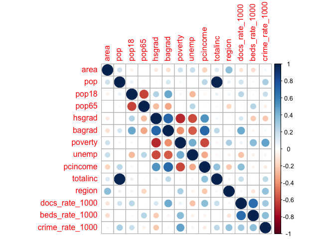
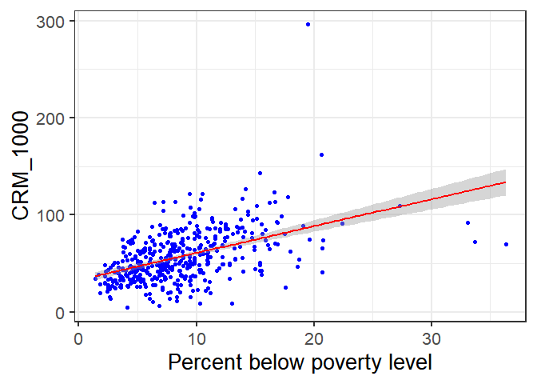

BIST8130 - Final Proejct Codings
================
11/22/2021

``` r
library(tidyverse)
library(corrplot)
```

### Step 1: Data Preprocessing

After importing the csv file containing the County Demographic
Information (CDI) data, we notice that crimes, physicians, and hospital
beds are given as numbers, while other info are given as proportions. We
therefore compute the number of crimes, physicians, and hospital beds
per 1000 people.

``` r
cdi_data = read_csv("./data/cdi.csv") %>%
  janitor::clean_names() %>%
  mutate(
    cty_state = str_c(cty,",",state),
    docs_rate_1000 = 1000 * docs/pop, # Compute number of doctors/hospital beds per 1000 people.
    beds_rate_1000 = 1000 * beds/pop,
    crime_rate_1000 = 1000 * crimes/pop) %>% # Compute number of crimes per 1000 people.) 
  select(-docs,-beds,-crimes) %>%
  relocate(id,cty_state,cty)
```

    ## Rows: 440 Columns: 17

    ## -- Column specification --------------------------------------------------------
    ## Delimiter: ","
    ## chr  (2): cty, state
    ## dbl (15): id, area, pop, pop18, pop65, docs, beds, crimes, hsgrad, bagrad, p...

    ## 
    ## i Use `spec()` to retrieve the full column specification for this data.
    ## i Specify the column types or set `show_col_types = FALSE` to quiet this message.

``` r
knitr::kable(head(cdi_data))
```

|  id | cty\_state   | cty       | state | area |     pop | pop18 | pop65 | hsgrad | bagrad | poverty | unemp | pcincome | totalinc | region | docs\_rate\_1000 | beds\_rate\_1000 | crime\_rate\_1000 |
|----:|:-------------|:----------|:------|-----:|--------:|------:|------:|-------:|-------:|--------:|------:|---------:|---------:|-------:|-----------------:|-----------------:|------------------:|
|   1 | Los\_Ange,CA | Los\_Ange | CA    | 4060 | 8863164 |  32.1 |   9.7 |   70.0 |   22.3 |    11.6 |   8.0 |    20786 |   184230 |      4 |         2.671394 |         3.125295 |          77.73026 |
|   2 | Cook,IL      | Cook      | IL    |  946 | 5105067 |  29.2 |  12.4 |   73.4 |   22.8 |    11.1 |   7.2 |    21729 |   110928 |      2 |         2.968227 |         4.221296 |          85.58869 |
|   3 | Harris,TX    | Harris    | TX    | 1729 | 2818199 |  31.3 |   7.1 |   74.9 |   25.4 |    12.5 |   5.7 |    19517 |    55003 |      3 |         2.680080 |         4.417360 |          89.96029 |
|   4 | San\_Dieg,CA | San\_Dieg | CA    | 4205 | 2498016 |  33.5 |  10.9 |   81.9 |   25.3 |     8.1 |   6.1 |    19588 |    48931 |      4 |         2.363876 |         2.473563 |          69.58362 |
|   5 | Orange,CA    | Orange    | CA    |  790 | 2410556 |  32.6 |   9.2 |   81.2 |   27.8 |     5.2 |   4.8 |    24400 |    58818 |      4 |         2.514772 |         2.642129 |          59.95463 |
|   6 | Kings,NY     | Kings     | NY    |   71 | 2300664 |  28.3 |  12.4 |   63.7 |   16.6 |    19.5 |   9.5 |    16803 |    38658 |      1 |         2.112868 |         3.886704 |         295.98672 |

### Step 2 - Correlation Heatmap

We then calculate the pairwise correlations between variables and list
all the correlations between the crime rate (our interest) and all other
variables.

``` r
cdi_cor = cdi_data %>%
  select(-id,-cty,-state, -cty_state) %>%
  cor() 

crime_1000_cor = data.frame(cdi_cor) %>% 
  select("Crime Rate (Per 1000)" = crime_rate_1000) %>% 
  t()
knitr::kable(crime_1000_cor) 
```

|                       |      area |       pop |     pop18 |      pop65 |     hsgrad |    bagrad |   poverty |     unemp |   pcincome |  totalinc |    region | docs\_rate\_1000 | beds\_rate\_1000 | crime\_rate\_1000 |
|:----------------------|----------:|----------:|----------:|-----------:|-----------:|----------:|----------:|----------:|-----------:|----------:|----------:|-----------------:|-----------------:|------------------:|
| Crime Rate (Per 1000) | 0.0429484 | 0.2800992 | 0.1905688 | -0.0665333 | -0.2264129 | 0.0383046 | 0.4718442 | 0.0418466 | -0.0802442 | 0.2281557 | 0.3427584 |        0.3070831 |        0.3644505 |                 1 |

We then draw the correlation heatmap between pairwise variables.

``` r
corrplot(cdi_cor)
```

<!-- -->

### Model construction

Data used for building model:

``` r
cdi_model = cdi_data %>% 
  select(-id,-cty_state, -cty,-state) %>% 
  mutate(region = factor(region))
```

``` r
# Scatter plot 
cdi_data %>% 
  ggplot(aes(poverty, crime_rate_1000)) + geom_point(color='blue') + theme_bw(base_size=20) +
  geom_smooth(method='lm', se=TRUE, color='red') +
  labs(x="Percent below poverty level", y="CRM_1000")
```

    ## `geom_smooth()` using formula 'y ~ x'

<!-- -->

``` r
# Simple linear regression: crm_1000 vs poverty
cdi_pov = lm(crime_rate_1000 ~ poverty, data = cdi_data)
summary(cdi_pov)
```

    ## 
    ## Call:
    ## lm(formula = crime_rate_1000 ~ poverty, data = cdi_data)
    ## 
    ## Residuals:
    ##     Min      1Q  Median      3Q     Max 
    ## -64.008 -14.578  -2.561  13.605 208.853 
    ## 
    ## Coefficients:
    ##             Estimate Std. Error t value Pr(>|t|)    
    ## (Intercept)  33.1390     2.4435   13.56   <2e-16 ***
    ## poverty       2.7690     0.2472   11.20   <2e-16 ***
    ## ---
    ## Signif. codes:  0 '***' 0.001 '**' 0.01 '*' 0.05 '.' 0.1 ' ' 1
    ## 
    ## Residual standard error: 24.12 on 438 degrees of freedom
    ## Multiple R-squared:  0.2226, Adjusted R-squared:  0.2209 
    ## F-statistic: 125.4 on 1 and 438 DF,  p-value: < 2.2e-16

``` r
cdi_pov = lm(crime_rate_1000 ~ poverty + beds_rate_1000, data = cdi_data)
summary(cdi_pov)
```

    ## 
    ## Call:
    ## lm(formula = crime_rate_1000 ~ poverty + beds_rate_1000, data = cdi_data)
    ## 
    ## Residuals:
    ##     Min      1Q  Median      3Q     Max 
    ## -61.283 -14.894  -0.986  13.537 213.298 
    ## 
    ## Coefficients:
    ##                Estimate Std. Error t value Pr(>|t|)    
    ## (Intercept)     26.3724     2.7425   9.616  < 2e-16 ***
    ## poverty          2.2906     0.2594   8.832  < 2e-16 ***
    ## beds_rate_1000   2.9973     0.6036   4.966 9.81e-07 ***
    ## ---
    ## Signif. codes:  0 '***' 0.001 '**' 0.01 '*' 0.05 '.' 0.1 ' ' 1
    ## 
    ## Residual standard error: 23.5 on 437 degrees of freedom
    ## Multiple R-squared:  0.2642, Adjusted R-squared:  0.2608 
    ## F-statistic: 78.44 on 2 and 437 DF,  p-value: < 2.2e-16

``` r
# this one is the best!
cdi_pov = lm(crime_rate_1000 ~ poverty + docs_rate_1000 , data = cdi_data)
summary(cdi_pov)
```

    ## 
    ## Call:
    ## lm(formula = crime_rate_1000 ~ poverty + docs_rate_1000, data = cdi_data)
    ## 
    ## Residuals:
    ##     Min      1Q  Median      3Q     Max 
    ## -79.514 -13.477  -1.452  12.310 210.024 
    ## 
    ## Coefficients:
    ##                Estimate Std. Error t value Pr(>|t|)    
    ## (Intercept)     23.5185     2.7048   8.695  < 2e-16 ***
    ## poverty          2.6650     0.2354  11.321  < 2e-16 ***
    ## docs_rate_1000   4.9587     0.7151   6.934 1.48e-11 ***
    ## ---
    ## Signif. codes:  0 '***' 0.001 '**' 0.01 '*' 0.05 '.' 0.1 ' ' 1
    ## 
    ## Residual standard error: 22.92 on 437 degrees of freedom
    ## Multiple R-squared:  0.2997, Adjusted R-squared:  0.2965 
    ## F-statistic: 93.51 on 2 and 437 DF,  p-value: < 2.2e-16

``` r
cdi_pov = lm(crime_rate_1000 ~ poverty + docs_rate_1000 + beds_rate_1000 , data = cdi_data)
summary(cdi_pov)
```

    ## 
    ## Call:
    ## lm(formula = crime_rate_1000 ~ poverty + docs_rate_1000 + beds_rate_1000, 
    ##     data = cdi_data)
    ## 
    ## Residuals:
    ##     Min      1Q  Median      3Q     Max 
    ## -78.843 -13.611  -1.605  12.313 210.430 
    ## 
    ## Coefficients:
    ##                Estimate Std. Error t value Pr(>|t|)    
    ## (Intercept)     23.3218     2.7550   8.465 3.93e-16 ***
    ## poverty          2.6201     0.2627   9.973  < 2e-16 ***
    ## docs_rate_1000   4.6922     0.9942   4.720 3.19e-06 ***
    ## beds_rate_1000   0.3162     0.8186   0.386      0.7    
    ## ---
    ## Signif. codes:  0 '***' 0.001 '**' 0.01 '*' 0.05 '.' 0.1 ' ' 1
    ## 
    ## Residual standard error: 22.94 on 436 degrees of freedom
    ## Multiple R-squared:  0.2999, Adjusted R-squared:  0.2951 
    ## F-statistic: 62.27 on 3 and 436 DF,  p-value: < 2.2e-16

``` r
cdi_region = lm(crime_rate_1000 ~ factor(region), data = cdi_data) # fit model with factoring 
summary(cdi_region)
```

    ## 
    ## Call:
    ## lm(formula = crime_rate_1000 ~ factor(region), data = cdi_data)
    ## 
    ## Residuals:
    ##     Min      1Q  Median      3Q     Max 
    ## -46.505 -15.578  -3.817  13.698 254.757 
    ## 
    ## Coefficients:
    ##                 Estimate Std. Error t value Pr(>|t|)    
    ## (Intercept)       41.229      2.446  16.856  < 2e-16 ***
    ## factor(region)2    9.877      3.419   2.889  0.00406 ** 
    ## factor(region)3   29.509      3.168   9.315  < 2e-16 ***
    ## factor(region)4   19.649      3.740   5.254 2.33e-07 ***
    ## ---
    ## Signif. codes:  0 '***' 0.001 '**' 0.01 '*' 0.05 '.' 0.1 ' ' 1
    ## 
    ## Residual standard error: 24.82 on 436 degrees of freedom
    ## Multiple R-squared:  0.1805, Adjusted R-squared:  0.1749 
    ## F-statistic: 32.01 on 3 and 436 DF,  p-value: < 2.2e-16
