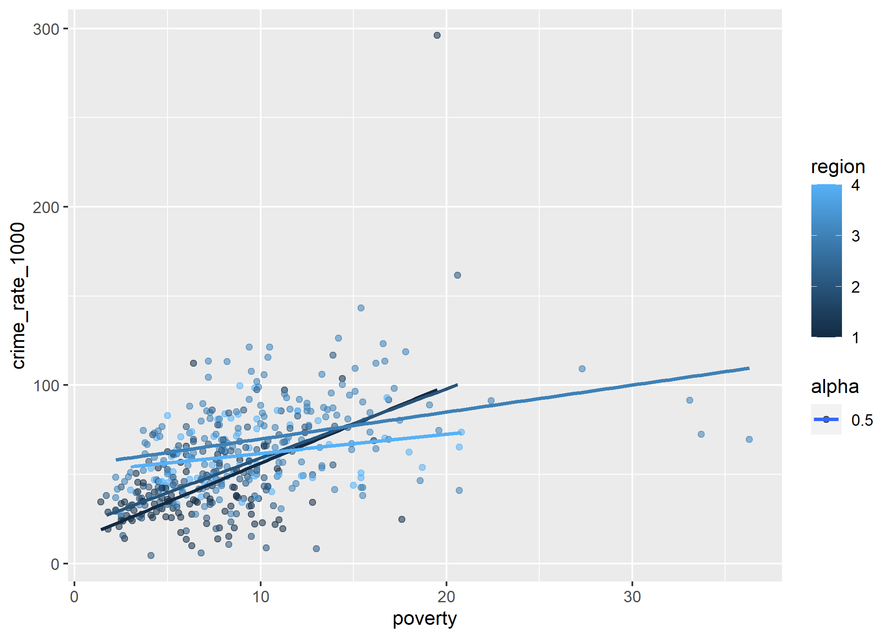
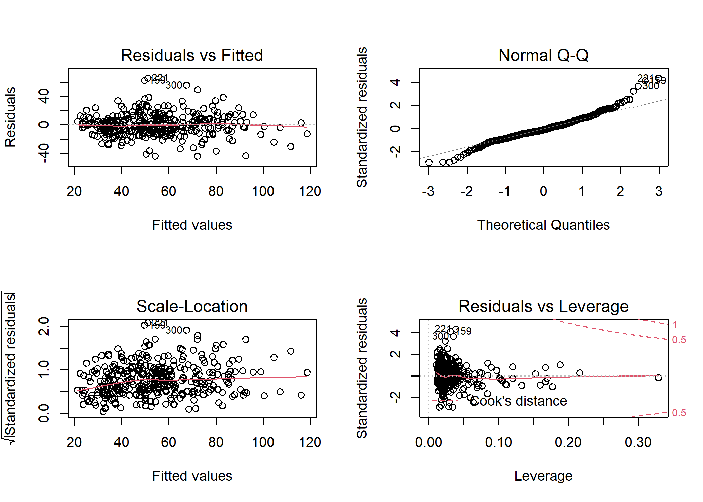
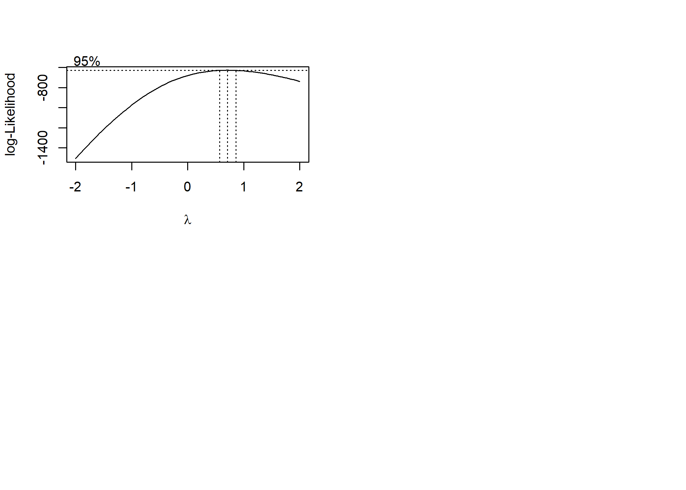

BIST8130 - Final Proejct Codings
================
11/22/2021

``` r
library(tidyverse)
library(corrplot)
library(leaps)
library(performance)
library(MASS)
```

### Step 1: Data Preprocessing

After importing the csv file containing the County Demographic
Information (CDI) data, we notice that crimes, physicians, and hospital
beds are given as numbers, while other info are given as proportions. We
therefore compute the number of crimes, physicians, and hospital beds
per 1000 people.

``` r
cdi_data = read_csv("./data/cdi.csv") %>%
  janitor::clean_names() %>%
  mutate(
    cty_state = str_c(cty,",",state),
    docs_rate_1000 = 1000 * docs/pop, # Compute number of doctors/hospital beds per 1000 people.
    beds_rate_1000 = 1000 * beds/pop,
    density = as.numeric(pop)/as.numeric(area),
    crime_rate_1000 = 1000 * crimes/pop) %>% # Compute number of crimes per 1000 people. 
  dplyr::select(-docs,-beds,-crimes) %>%
  relocate(id,cty_state,cty)
```

    ## Rows: 440 Columns: 17

    ## -- Column specification --------------------------------------------------------
    ## Delimiter: ","
    ## chr  (2): cty, state
    ## dbl (15): id, area, pop, pop18, pop65, docs, beds, crimes, hsgrad, bagrad, p...

    ## 
    ## i Use `spec()` to retrieve the full column specification for this data.
    ## i Specify the column types or set `show_col_types = FALSE` to quiet this message.

    ## Warning in FUN(X[[i]], ...): strings not representable in native encoding will
    ## be translated to UTF-8

    ## Warning in FUN(X[[i]], ...): unable to translate '<U+00C4>' to native encoding

    ## Warning in FUN(X[[i]], ...): unable to translate '<U+00D6>' to native encoding

    ## Warning in FUN(X[[i]], ...): unable to translate '<U+00E4>' to native encoding

    ## Warning in FUN(X[[i]], ...): unable to translate '<U+00F6>' to native encoding

    ## Warning in FUN(X[[i]], ...): unable to translate '<U+00DF>' to native encoding

    ## Warning in FUN(X[[i]], ...): unable to translate '<U+00C6>' to native encoding

    ## Warning in FUN(X[[i]], ...): unable to translate '<U+00E6>' to native encoding

    ## Warning in FUN(X[[i]], ...): unable to translate '<U+00D8>' to native encoding

    ## Warning in FUN(X[[i]], ...): unable to translate '<U+00F8>' to native encoding

    ## Warning in FUN(X[[i]], ...): unable to translate '<U+00C5>' to native encoding

    ## Warning in FUN(X[[i]], ...): unable to translate '<U+00E5>' to native encoding

``` r
knitr::kable(head(cdi_data))
```

|  id | cty\_state   | cty       | state | area |     pop | pop18 | pop65 | hsgrad | bagrad | poverty | unemp | pcincome | totalinc | region | docs\_rate\_1000 | beds\_rate\_1000 |    density | crime\_rate\_1000 |
|----:|:-------------|:----------|:------|-----:|--------:|------:|------:|-------:|-------:|--------:|------:|---------:|---------:|-------:|-----------------:|-----------------:|-----------:|------------------:|
|   1 | Los\_Ange,CA | Los\_Ange | CA    | 4060 | 8863164 |  32.1 |   9.7 |   70.0 |   22.3 |    11.6 |   8.0 |    20786 |   184230 |      4 |         2.671394 |         3.125295 |  2183.0453 |          77.73026 |
|   2 | Cook,IL      | Cook      | IL    |  946 | 5105067 |  29.2 |  12.4 |   73.4 |   22.8 |    11.1 |   7.2 |    21729 |   110928 |      2 |         2.968227 |         4.221296 |  5396.4767 |          85.58869 |
|   3 | Harris,TX    | Harris    | TX    | 1729 | 2818199 |  31.3 |   7.1 |   74.9 |   25.4 |    12.5 |   5.7 |    19517 |    55003 |      3 |         2.680080 |         4.417360 |  1629.9589 |          89.96029 |
|   4 | San\_Dieg,CA | San\_Dieg | CA    | 4205 | 2498016 |  33.5 |  10.9 |   81.9 |   25.3 |     8.1 |   6.1 |    19588 |    48931 |      4 |         2.363876 |         2.473563 |   594.0585 |          69.58362 |
|   5 | Orange,CA    | Orange    | CA    |  790 | 2410556 |  32.6 |   9.2 |   81.2 |   27.8 |     5.2 |   4.8 |    24400 |    58818 |      4 |         2.514772 |         2.642129 |  3051.3367 |          59.95463 |
|   6 | Kings,NY     | Kings     | NY    |   71 | 2300664 |  28.3 |  12.4 |   63.7 |   16.6 |    19.5 |   9.5 |    16803 |    38658 |      1 |         2.112868 |         3.886704 | 32403.7183 |         295.98672 |

### Step 2 - Exploratory Analysis

We then take a closer look of each variables, calculate the pairwise
correlations between variables, and list all the correlations between
the crime rate (our interest) and all other variables.

``` r
cdi_data_exp = cdi_data %>%
  dplyr::select(-id,-cty,-state, -cty_state) 

cdi_data_original = cdi_data_exp

cdi_data_exp = cdi_data_exp %>%
  mutate(
    area = ifelse(area %in% boxplot.stats(cdi_data_exp$area)$out,NA,area),
    pop = ifelse(pop %in% boxplot.stats(cdi_data_exp$pop)$out,NA,pop),
    crime_rate_1000 = ifelse(crime_rate_1000 %in% boxplot.stats(cdi_data_exp$crime_rate_1000)$out,NA,crime_rate_1000),
    poverty = ifelse(poverty %in% boxplot.stats(cdi_data_exp$poverty)$out,NA,poverty)
  ) %>%
  na.omit()


par(mfrow=c(2,3))
boxplot(cdi_data_exp$area,main="Area")
boxplot(cdi_data_exp$pop,main="Population")
boxplot(cdi_data_exp$pop18,main="Population 18-34")
boxplot(cdi_data_exp$pop65,main="Population 65+")
boxplot(cdi_data_exp$hsgrad,main="Highschool grads")
boxplot(cdi_data_exp$bagrad,main="Bachelor's grads")
```

<!-- -->

``` r
par(mfrow=c(2,3))
boxplot(cdi_data_exp$poverty,main="Poverty Rate")
boxplot(cdi_data_exp$unemp,main="Unemployment Rate")
boxplot(cdi_data_exp$pcincome,main="Income Per Capita")
boxplot(cdi_data_exp$totalinc,main="Income Total")
boxplot(cdi_data_exp$docs_rate_1000,main="Active Physicians")
boxplot(cdi_data_exp$beds_rate_1000,main="Hospital Beds")
```

<!-- -->

``` r
par(mfrow=c(1,1))

ggplot(cdi_data,aes(region)) + 
  geom_histogram(binwidth = 0.5) +
  theme_classic() +
  xlab("Region")+
  ylab("Count")
```

<!-- -->

``` r
boxplot(cdi_data_exp$crime_rate_1000,main="Crime Rate",horizontal = TRUE)
```

<!-- -->

``` r
# data exploratory
pairs(cdi_data_exp)
```

<!-- -->

``` r
# correlation plot
cdi_data_cor = cor(cdi_data_exp)
corrplot(cdi_data_cor, type = "upper", diag = FALSE)
```

<!-- -->

``` r
crime_1000_cor = data.frame(cdi_data_cor) %>% 
  dplyr::select("Crime Rate (Per 1000)" = crime_rate_1000) %>% 
  t()

knitr::kable(crime_1000_cor,digits = 2) 
```

|                       |  area |  pop | pop18 | pop65 | hsgrad | bagrad | poverty | unemp | pcincome | totalinc | region | docs\_rate\_1000 | beds\_rate\_1000 | density | crime\_rate\_1000 |
|:----------------------|------:|-----:|------:|------:|-------:|-------:|--------:|------:|---------:|---------:|-------:|-----------------:|-----------------:|--------:|------------------:|
| Crime Rate (Per 1000) | -0.04 | 0.29 |  0.24 | -0.08 |  -0.13 |   0.09 |    0.49 | -0.07 |    -0.08 |     0.19 |   0.46 |             0.32 |             0.39 |    0.29 |                 1 |

### Remove outliers and high leverage point

``` r
cdi_data_clean = cdi_data[cdi_data$area >= quantile(cdi_data$area,0.005) & cdi_data$area <= quantile(cdi_data$area,0.995),]
cdi_data_clean = cdi_data_clean[cdi_data_clean$pop >= quantile(cdi_data_clean$pop,0.005) & cdi_data_clean$pop <= quantile(cdi_data_clean$pop,0.995),]
cdi_data_clean = cdi_data_clean[cdi_data_clean$pop18 >= quantile(cdi_data_clean$pop18,0.005) & cdi_data_clean$pop18 <= quantile(cdi_data_clean$pop18,0.995),]
cdi_data_clean = cdi_data_clean[cdi_data_clean$pop65 >= quantile(cdi_data_clean$pop65,0.005) & cdi_data_clean$pop65 <= quantile(cdi_data_clean$pop65,0.995),]
cdi_data_clean = cdi_data_clean[cdi_data_clean$hsgrad >= quantile(cdi_data_clean$hsgrad,0.005) & cdi_data_clean$hsgrad <= quantile(cdi_data_clean$hsgrad,0.995),]
cdi_data_clean = cdi_data_clean[cdi_data_clean$bagrad >= quantile(cdi_data_clean$bagrad,0.005) & cdi_data_clean$bagrad <= quantile(cdi_data_clean$bagrad,0.995),]

cdi_data_clean = cdi_data_clean[cdi_data_clean$poverty >= quantile(cdi_data_clean$poverty,0.005) & cdi_data_clean$poverty <= quantile(cdi_data_clean$poverty,0.995),]
cdi_data_clean = cdi_data_clean[cdi_data_clean$unemp >= quantile(cdi_data_clean$unemp,0.005) & cdi_data_clean$unemp <= quantile(cdi_data_clean$unemp,0.995),]
cdi_data_clean = cdi_data_clean[cdi_data_clean$pcincome >= quantile(cdi_data_clean$pcincome,0.005) & cdi_data_clean$pcincome <= quantile(cdi_data_clean$pcincome,0.995),]
cdi_data_clean = cdi_data_clean[cdi_data_clean$totalinc >= quantile(cdi_data_clean$totalinc,0.005) & cdi_data_clean$totalinc <= quantile(cdi_data_clean$totalinc,0.995),]
cdi_data_clean = cdi_data_clean[cdi_data_clean$docs_rate_1000 >= quantile(cdi_data_clean$docs_rate_1000,0.005) & cdi_data_clean$docs_rate_1000 <= quantile(cdi_data_clean$docs_rate_1000,0.995),]
cdi_data_clean = cdi_data_clean[cdi_data_clean$beds_rate_1000 >= quantile(cdi_data_clean$beds_rate_1000,0.005) & cdi_data_clean$beds_rate_1000 <= quantile(cdi_data_clean$beds_rate_1000,0.995),]
cdi_data_clean = cdi_data_clean[cdi_data_clean$beds_rate_1000 >= quantile(cdi_data_clean$beds_rate_1000,0.005) & cdi_data_clean$beds_rate_1000 <= quantile(cdi_data_clean$beds_rate_1000,0.995),]
cdi_data_clean = cdi_data_clean[cdi_data_clean$density >= quantile(cdi_data_clean$density,0.005) & cdi_data_clean$density <= quantile(cdi_data_clean$density,0.995),]

cdi_data_clean = cdi_data_clean[cdi_data_clean$crime_rate_1000 >= quantile(cdi_data_clean$crime_rate_1000,0.005) & cdi_data_clean$beds_rate_1000 <= quantile(cdi_data_clean$crime_rate_1000,0.995),]
```

### Model construction

Data used for building model:

``` r
#cdi_model = cdi_data %>% 
#  dplyr::select(-id,-cty_state, -cty,-state) %>% 
#  mutate(region = factor(region))

cdi_model = cdi_data_exp %>% mutate(region = factor(region))
```

``` r
full.fit = lm(crime_rate_1000 ~ ., data = cdi_model)
summary(full.fit) %>% 
  broom::tidy() %>%
  mutate(p_rank = rank(p.value))
```

    ## # A tibble: 17 x 6
    ##    term             estimate  std.error statistic  p.value p_rank
    ##    <chr>               <dbl>      <dbl>     <dbl>    <dbl>  <dbl>
    ##  1 (Intercept)    -77.7      27.7         -2.81   5.32e- 3      9
    ##  2 area            -0.00286   0.00334     -0.857  3.92e- 1     12
    ##  3 pop              0.000121  0.0000199    6.10   2.94e- 9      2
    ##  4 pop18            1.05      0.331        3.16   1.74e- 3      8
    ##  5 pop65            0.0111    0.299        0.0371 9.70e- 1     17
    ##  6 hsgrad           0.147     0.277        0.533  5.95e- 1     15
    ##  7 bagrad          -0.309     0.304       -1.01   3.11e- 1     11
    ##  8 poverty          2.20      0.437        5.05   7.34e- 7      4
    ##  9 unemp            0.506     0.607        0.833  4.05e- 1     13
    ## 10 pcincome         0.00243   0.000609     3.99   7.99e- 5      6
    ## 11 totalinc        -0.00428   0.000926    -4.62   5.48e- 6      5
    ## 12 region2         10.1       2.66         3.81   1.68e- 4      7
    ## 13 region3         25.0       2.63         9.51   3.43e-19      1
    ## 14 region4         21.9       3.75         5.83   1.30e- 8      3
    ## 15 docs_rate_1000  -0.0663    0.947       -0.0700 9.44e- 1     16
    ## 16 beds_rate_1000   2.19      0.836        2.62   9.30e- 3     10
    ## 17 density          0.000639  0.000777     0.823  4.11e- 1     14

``` r
backward = step(full.fit, direction='backward') %>%  broom::tidy() %>%  rename(backward = "term")
```

    ## Start:  AIC=2000.92
    ## crime_rate_1000 ~ area + pop + pop18 + pop65 + hsgrad + bagrad + 
    ##     poverty + unemp + pcincome + totalinc + region + docs_rate_1000 + 
    ##     beds_rate_1000 + density
    ## 
    ##                  Df Sum of Sq    RSS    AIC
    ## - pop65           1       0.3  86009 1998.9
    ## - docs_rate_1000  1       1.2  86010 1998.9
    ## - hsgrad          1      71.4  86080 1999.2
    ## - density         1     170.2  86179 1999.6
    ## - unemp           1     174.5  86183 1999.7
    ## - area            1     184.7  86193 1999.7
    ## - bagrad          1     258.9  86268 2000.0
    ## <none>                         86009 2000.9
    ## - beds_rate_1000  1    1720.6  87729 2006.0
    ## - pop18           1    2506.7  88515 2009.2
    ## - pcincome        1    4009.9  90019 2015.3
    ## - totalinc        1    5363.9  91373 2020.6
    ## - poverty         1    6403.7  92412 2024.7
    ## - pop             1    9345.5  95354 2036.0
    ## - region          3   24585.7 110594 2085.2
    ## 
    ## Step:  AIC=1998.92
    ## crime_rate_1000 ~ area + pop + pop18 + hsgrad + bagrad + poverty + 
    ##     unemp + pcincome + totalinc + region + docs_rate_1000 + beds_rate_1000 + 
    ##     density
    ## 
    ##                  Df Sum of Sq    RSS    AIC
    ## - docs_rate_1000  1       1.3  86010 1996.9
    ## - hsgrad          1      71.1  86080 1997.2
    ## - density         1     174.5  86184 1997.7
    ## - unemp           1     181.8  86191 1997.7
    ## - area            1     184.5  86194 1997.7
    ## - bagrad          1     258.6  86268 1998.0
    ## <none>                         86009 1998.9
    ## - beds_rate_1000  1    1901.5  87911 2004.8
    ## - pop18           1    3214.6  89224 2010.1
    ## - pcincome        1    4053.2  90062 2013.5
    ## - totalinc        1    5383.6  91393 2018.7
    ## - poverty         1    6636.3  92645 2023.6
    ## - pop             1    9373.9  95383 2034.1
    ## - region          3   24624.0 110633 2083.3
    ## 
    ## Step:  AIC=1996.93
    ## crime_rate_1000 ~ area + pop + pop18 + hsgrad + bagrad + poverty + 
    ##     unemp + pcincome + totalinc + region + beds_rate_1000 + density
    ## 
    ##                  Df Sum of Sq    RSS    AIC
    ## - hsgrad          1      71.8  86082 1995.2
    ## - density         1     173.2  86184 1995.7
    ## - unemp           1     181.6  86192 1995.7
    ## - area            1     184.4  86195 1995.7
    ## - bagrad          1     277.0  86287 1996.1
    ## <none>                         86010 1996.9
    ## - pop18           1    3238.3  89249 2008.2
    ## - beds_rate_1000  1    3385.2  89396 2008.8
    ## - pcincome        1    4052.4  90063 2011.5
    ## - totalinc        1    5408.3  91419 2016.8
    ## - poverty         1    6708.8  92719 2021.9
    ## - pop             1    9388.6  95399 2032.1
    ## - region          3   24670.8 110681 2081.5
    ## 
    ## Step:  AIC=1995.22
    ## crime_rate_1000 ~ area + pop + pop18 + bagrad + poverty + unemp + 
    ##     pcincome + totalinc + region + beds_rate_1000 + density
    ## 
    ##                  Df Sum of Sq    RSS    AIC
    ## - density         1     137.8  86220 1993.8
    ## - unemp           1     179.1  86261 1994.0
    ## - area            1     192.9  86275 1994.0
    ## - bagrad          1     208.4  86291 1994.1
    ## <none>                         86082 1995.2
    ## - pop18           1    3191.8  89274 2006.3
    ## - beds_rate_1000  1    3327.2  89409 2006.8
    ## - pcincome        1    3981.4  90064 2009.5
    ## - totalinc        1    5561.6  91644 2015.7
    ## - poverty         1    6984.8  93067 2021.2
    ## - pop             1    9635.9  95718 2031.3
    ## - region          3   24605.0 110687 2079.5
    ## 
    ## Step:  AIC=1993.8
    ## crime_rate_1000 ~ area + pop + pop18 + bagrad + poverty + unemp + 
    ##     pcincome + totalinc + region + beds_rate_1000
    ## 
    ##                  Df Sum of Sq    RSS    AIC
    ## - unemp           1     236.7  86457 1992.8
    ## - bagrad          1     241.6  86462 1992.8
    ## - area            1     443.6  86664 1993.6
    ## <none>                         86220 1993.8
    ## - beds_rate_1000  1    3526.6  89747 2006.2
    ## - pop18           1    3769.1  89989 2007.2
    ## - pcincome        1    4414.1  90634 2009.7
    ## - totalinc        1    5545.3  91765 2014.2
    ## - poverty         1    7438.7  93659 2021.5
    ## - pop             1    9850.1  96070 2030.6
    ## - region          3   25148.1 111368 2079.7
    ## 
    ## Step:  AIC=1992.78
    ## crime_rate_1000 ~ area + pop + pop18 + bagrad + poverty + pcincome + 
    ##     totalinc + region + beds_rate_1000
    ## 
    ##                  Df Sum of Sq    RSS    AIC
    ## - area            1     398.8  86855 1992.4
    ## <none>                         86457 1992.8
    ## - bagrad          1     506.1  86963 1992.9
    ## - beds_rate_1000  1    3290.9  89747 2004.2
    ## - pop18           1    3726.7  90183 2005.9
    ## - pcincome        1    5014.2  91471 2011.0
    ## - totalinc        1    5787.6  92244 2014.0
    ## - poverty         1    9674.1  96131 2028.9
    ## - pop             1   10183.8  96640 2030.8
    ## - region          3   26707.8 113164 2083.4
    ## 
    ## Step:  AIC=1992.44
    ## crime_rate_1000 ~ pop + pop18 + bagrad + poverty + pcincome + 
    ##     totalinc + region + beds_rate_1000
    ## 
    ##                  Df Sum of Sq    RSS    AIC
    ## <none>                         86855 1992.4
    ## - bagrad          1     608.7  87464 1992.9
    ## - beds_rate_1000  1    3521.2  90377 2004.7
    ## - pop18           1    4119.7  90975 2007.1
    ## - totalinc        1    5693.3  92549 2013.2
    ## - pcincome        1    5776.5  92632 2013.5
    ## - poverty         1    9604.4  96460 2028.1
    ## - pop             1   10041.8  96897 2029.7
    ## - region          3   26730.0 113585 2082.8

``` r
both = step(full.fit, direction = "both") %>% broom::tidy() %>% rename(stepwise = "term")
```

    ## Start:  AIC=2000.92
    ## crime_rate_1000 ~ area + pop + pop18 + pop65 + hsgrad + bagrad + 
    ##     poverty + unemp + pcincome + totalinc + region + docs_rate_1000 + 
    ##     beds_rate_1000 + density
    ## 
    ##                  Df Sum of Sq    RSS    AIC
    ## - pop65           1       0.3  86009 1998.9
    ## - docs_rate_1000  1       1.2  86010 1998.9
    ## - hsgrad          1      71.4  86080 1999.2
    ## - density         1     170.2  86179 1999.6
    ## - unemp           1     174.5  86183 1999.7
    ## - area            1     184.7  86193 1999.7
    ## - bagrad          1     258.9  86268 2000.0
    ## <none>                         86009 2000.9
    ## - beds_rate_1000  1    1720.6  87729 2006.0
    ## - pop18           1    2506.7  88515 2009.2
    ## - pcincome        1    4009.9  90019 2015.3
    ## - totalinc        1    5363.9  91373 2020.6
    ## - poverty         1    6403.7  92412 2024.7
    ## - pop             1    9345.5  95354 2036.0
    ## - region          3   24585.7 110594 2085.2
    ## 
    ## Step:  AIC=1998.92
    ## crime_rate_1000 ~ area + pop + pop18 + hsgrad + bagrad + poverty + 
    ##     unemp + pcincome + totalinc + region + docs_rate_1000 + beds_rate_1000 + 
    ##     density
    ## 
    ##                  Df Sum of Sq    RSS    AIC
    ## - docs_rate_1000  1       1.3  86010 1996.9
    ## - hsgrad          1      71.1  86080 1997.2
    ## - density         1     174.5  86184 1997.7
    ## - unemp           1     181.8  86191 1997.7
    ## - area            1     184.5  86194 1997.7
    ## - bagrad          1     258.6  86268 1998.0
    ## <none>                         86009 1998.9
    ## + pop65           1       0.3  86009 2000.9
    ## - beds_rate_1000  1    1901.5  87911 2004.8
    ## - pop18           1    3214.6  89224 2010.1
    ## - pcincome        1    4053.2  90062 2013.5
    ## - totalinc        1    5383.6  91393 2018.7
    ## - poverty         1    6636.3  92645 2023.6
    ## - pop             1    9373.9  95383 2034.1
    ## - region          3   24624.0 110633 2083.3
    ## 
    ## Step:  AIC=1996.93
    ## crime_rate_1000 ~ area + pop + pop18 + hsgrad + bagrad + poverty + 
    ##     unemp + pcincome + totalinc + region + beds_rate_1000 + density
    ## 
    ##                  Df Sum of Sq    RSS    AIC
    ## - hsgrad          1      71.8  86082 1995.2
    ## - density         1     173.2  86184 1995.7
    ## - unemp           1     181.6  86192 1995.7
    ## - area            1     184.4  86195 1995.7
    ## - bagrad          1     277.0  86287 1996.1
    ## <none>                         86010 1996.9
    ## + docs_rate_1000  1       1.3  86009 1998.9
    ## + pop65           1       0.4  86010 1998.9
    ## - pop18           1    3238.3  89249 2008.2
    ## - beds_rate_1000  1    3385.2  89396 2008.8
    ## - pcincome        1    4052.4  90063 2011.5
    ## - totalinc        1    5408.3  91419 2016.8
    ## - poverty         1    6708.8  92719 2021.9
    ## - pop             1    9388.6  95399 2032.1
    ## - region          3   24670.8 110681 2081.5
    ## 
    ## Step:  AIC=1995.22
    ## crime_rate_1000 ~ area + pop + pop18 + bagrad + poverty + unemp + 
    ##     pcincome + totalinc + region + beds_rate_1000 + density
    ## 
    ##                  Df Sum of Sq    RSS    AIC
    ## - density         1     137.8  86220 1993.8
    ## - unemp           1     179.1  86261 1994.0
    ## - area            1     192.9  86275 1994.0
    ## - bagrad          1     208.4  86291 1994.1
    ## <none>                         86082 1995.2
    ## + hsgrad          1      71.8  86010 1996.9
    ## + docs_rate_1000  1       2.0  86080 1997.2
    ## + pop65           1       0.0  86082 1997.2
    ## - pop18           1    3191.8  89274 2006.3
    ## - beds_rate_1000  1    3327.2  89409 2006.8
    ## - pcincome        1    3981.4  90064 2009.5
    ## - totalinc        1    5561.6  91644 2015.7
    ## - poverty         1    6984.8  93067 2021.2
    ## - pop             1    9635.9  95718 2031.3
    ## - region          3   24605.0 110687 2079.5
    ## 
    ## Step:  AIC=1993.8
    ## crime_rate_1000 ~ area + pop + pop18 + bagrad + poverty + unemp + 
    ##     pcincome + totalinc + region + beds_rate_1000
    ## 
    ##                  Df Sum of Sq    RSS    AIC
    ## - unemp           1     236.7  86457 1992.8
    ## - bagrad          1     241.6  86462 1992.8
    ## - area            1     443.6  86664 1993.6
    ## <none>                         86220 1993.8
    ## + density         1     137.8  86082 1995.2
    ## + hsgrad          1      36.4  86184 1995.7
    ## + pop65           1       2.1  86218 1995.8
    ## + docs_rate_1000  1       0.0  86220 1995.8
    ## - beds_rate_1000  1    3526.6  89747 2006.2
    ## - pop18           1    3769.1  89989 2007.2
    ## - pcincome        1    4414.1  90634 2009.7
    ## - totalinc        1    5545.3  91765 2014.2
    ## - poverty         1    7438.7  93659 2021.5
    ## - pop             1    9850.1  96070 2030.6
    ## - region          3   25148.1 111368 2079.7
    ## 
    ## Step:  AIC=1992.78
    ## crime_rate_1000 ~ area + pop + pop18 + bagrad + poverty + pcincome + 
    ##     totalinc + region + beds_rate_1000
    ## 
    ##                  Df Sum of Sq    RSS    AIC
    ## - area            1     398.8  86855 1992.4
    ## <none>                         86457 1992.8
    ## - bagrad          1     506.1  86963 1992.9
    ## + unemp           1     236.7  86220 1993.8
    ## + density         1     195.4  86261 1994.0
    ## + hsgrad          1      29.0  86428 1994.7
    ## + pop65           1      17.8  86439 1994.7
    ## + docs_rate_1000  1       0.1  86457 1994.8
    ## - beds_rate_1000  1    3290.9  89747 2004.2
    ## - pop18           1    3726.7  90183 2005.9
    ## - pcincome        1    5014.2  91471 2011.0
    ## - totalinc        1    5787.6  92244 2014.0
    ## - poverty         1    9674.1  96131 2028.9
    ## - pop             1   10183.8  96640 2030.8
    ## - region          3   26707.8 113164 2083.4
    ## 
    ## Step:  AIC=1992.44
    ## crime_rate_1000 ~ pop + pop18 + bagrad + poverty + pcincome + 
    ##     totalinc + region + beds_rate_1000
    ## 
    ##                  Df Sum of Sq    RSS    AIC
    ## <none>                         86855 1992.4
    ## + density         1     445.0  86410 1992.6
    ## + area            1     398.8  86457 1992.8
    ## - bagrad          1     608.7  87464 1992.9
    ## + unemp           1     191.9  86664 1993.6
    ## + hsgrad          1      18.9  86836 1994.4
    ## + pop65           1      12.4  86843 1994.4
    ## + docs_rate_1000  1       2.0  86853 1994.4
    ## - beds_rate_1000  1    3521.2  90377 2004.7
    ## - pop18           1    4119.7  90975 2007.1
    ## - totalinc        1    5693.3  92549 2013.2
    ## - pcincome        1    5776.5  92632 2013.5
    ## - poverty         1    9604.4  96460 2028.1
    ## - pop             1   10041.8  96897 2029.7
    ## - region          3   26730.0 113585 2082.8

``` r
bind_cols(backward[-1,1],both[-1,1]) %>% knitr::kable()
```

| backward         | stepwise         |
|:-----------------|:-----------------|
| pop              | pop              |
| pop18            | pop18            |
| bagrad           | bagrad           |
| poverty          | poverty          |
| pcincome         | pcincome         |
| totalinc         | totalinc         |
| region2          | region2          |
| region3          | region3          |
| region4          | region4          |
| beds\_rate\_1000 | beds\_rate\_1000 |

## Criteria based selection

pop pop18 hsgrad bagrad poverty pcincome totalinc region
beds\_rate\_1000 density

``` r
sb = regsubsets(crime_rate_1000 ~ ., data = cdi_model, nvmax = 14)
sumsb = summary(sb) # pop pop18 hsgrad bagrad poverty pcincome totalinc region beds_rate_1000 density
sumsb
```

    ## Subset selection object
    ## Call: regsubsets.formula(crime_rate_1000 ~ ., data = cdi_model, nvmax = 14)
    ## 16 Variables  (and intercept)
    ##                Forced in Forced out
    ## area               FALSE      FALSE
    ## pop                FALSE      FALSE
    ## pop18              FALSE      FALSE
    ## pop65              FALSE      FALSE
    ## hsgrad             FALSE      FALSE
    ## bagrad             FALSE      FALSE
    ## poverty            FALSE      FALSE
    ## unemp              FALSE      FALSE
    ## pcincome           FALSE      FALSE
    ## totalinc           FALSE      FALSE
    ## region2            FALSE      FALSE
    ## region3            FALSE      FALSE
    ## region4            FALSE      FALSE
    ## docs_rate_1000     FALSE      FALSE
    ## beds_rate_1000     FALSE      FALSE
    ## density            FALSE      FALSE
    ## 1 subsets of each size up to 14
    ## Selection Algorithm: exhaustive
    ##           area pop pop18 pop65 hsgrad bagrad poverty unemp pcincome totalinc
    ## 1  ( 1 )  " "  " " " "   " "   " "    " "    "*"     " "   " "      " "     
    ## 2  ( 1 )  " "  "*" " "   " "   " "    " "    "*"     " "   " "      " "     
    ## 3  ( 1 )  " "  "*" " "   " "   " "    " "    "*"     " "   " "      " "     
    ## 4  ( 1 )  " "  "*" " "   " "   " "    " "    "*"     " "   " "      " "     
    ## 5  ( 1 )  " "  "*" " "   " "   " "    " "    "*"     " "   " "      " "     
    ## 6  ( 1 )  " "  "*" "*"   " "   " "    " "    "*"     " "   " "      " "     
    ## 7  ( 1 )  " "  "*" "*"   " "   " "    " "    "*"     " "   " "      " "     
    ## 8  ( 1 )  " "  "*" "*"   " "   " "    " "    "*"     " "   "*"      "*"     
    ## 9  ( 1 )  " "  "*" "*"   " "   " "    " "    "*"     " "   "*"      "*"     
    ## 10  ( 1 ) " "  "*" "*"   " "   " "    " "    "*"     " "   "*"      "*"     
    ## 11  ( 1 ) " "  "*" "*"   " "   " "    "*"    "*"     " "   "*"      "*"     
    ## 12  ( 1 ) "*"  "*" "*"   " "   " "    "*"    "*"     "*"   "*"      "*"     
    ## 13  ( 1 ) "*"  "*" "*"   " "   " "    "*"    "*"     "*"   "*"      "*"     
    ## 14  ( 1 ) "*"  "*" "*"   " "   "*"    "*"    "*"     "*"   "*"      "*"     
    ##           region2 region3 region4 docs_rate_1000 beds_rate_1000 density
    ## 1  ( 1 )  " "     " "     " "     " "            " "            " "    
    ## 2  ( 1 )  " "     " "     " "     " "            " "            " "    
    ## 3  ( 1 )  " "     "*"     " "     " "            " "            " "    
    ## 4  ( 1 )  " "     "*"     " "     "*"            " "            " "    
    ## 5  ( 1 )  " "     "*"     "*"     " "            "*"            " "    
    ## 6  ( 1 )  " "     "*"     "*"     " "            "*"            " "    
    ## 7  ( 1 )  "*"     "*"     "*"     " "            "*"            " "    
    ## 8  ( 1 )  "*"     "*"     "*"     " "            " "            " "    
    ## 9  ( 1 )  "*"     "*"     "*"     " "            "*"            " "    
    ## 10  ( 1 ) "*"     "*"     "*"     " "            "*"            "*"    
    ## 11  ( 1 ) "*"     "*"     "*"     " "            "*"            "*"    
    ## 12  ( 1 ) "*"     "*"     "*"     " "            "*"            " "    
    ## 13  ( 1 ) "*"     "*"     "*"     " "            "*"            "*"    
    ## 14  ( 1 ) "*"     "*"     "*"     " "            "*"            "*"

``` r
# plot of Cp and Adj-R2 as functions of parameters
par(mfrow=c(1,2))
plot(2:15, sumsb$cp, xlab="No. of parameters", ylab="Cp Statistic") 
abline(0,1)

plot(2:15, sumsb$adjr2, xlab="No of parameters", ylab="Adj R2")
```

<!-- -->

## Interaction

Does the relationship between the crime\_rate\_1000 and poverty vary by
region status?

``` r
ggplot(cdi_data, aes(x = poverty, y = crime_rate_1000, color = region, alpha = .5)) + 
  geom_point() +
  geom_smooth(method = "lm", se = F, aes(group = region, color = region)) 
```

    ## `geom_smooth()` using formula 'y ~ x'

<!-- -->

``` r
# fit model with interaction
interact = lm(crime_rate_1000 ~ poverty*region, data = cdi_data)
summary(interact)
```

    ## 
    ## Call:
    ## lm(formula = crime_rate_1000 ~ poverty * region, data = cdi_data)
    ## 
    ## Residuals:
    ##     Min      1Q  Median      3Q     Max 
    ## -68.988 -14.192  -0.386  11.921 193.219 
    ## 
    ## Coefficients:
    ##                Estimate Std. Error t value Pr(>|t|)    
    ## (Intercept)     -5.3110     6.3170  -0.841    0.401    
    ## poverty          6.0407     0.7897   7.650 1.30e-13 ***
    ## region          16.4326     2.3909   6.873 2.19e-11 ***
    ## poverty:region  -1.3409     0.2768  -4.844 1.77e-06 ***
    ## ---
    ## Signif. codes:  0 '***' 0.001 '**' 0.01 '*' 0.05 '.' 0.1 ' ' 1
    ## 
    ## Residual standard error: 22.78 on 436 degrees of freedom
    ## Multiple R-squared:  0.3096, Adjusted R-squared:  0.3049 
    ## F-statistic: 65.18 on 3 and 436 DF,  p-value: < 2.2e-16

## test

``` r
fit_test = lm(crime_rate_1000 ~  
                  pop + pop18   
                  + pcincome + totalinc + region +
                  beds_rate_1000 + density + 
                  poverty*pcincome, data = cdi_model)
summary(fit_test)
```

    ## 
    ## Call:
    ## lm(formula = crime_rate_1000 ~ pop + pop18 + pcincome + totalinc + 
    ##     region + beds_rate_1000 + density + poverty * pcincome, data = cdi_model)
    ## 
    ## Residuals:
    ##     Min      1Q  Median      3Q     Max 
    ## -44.698  -8.303  -1.251   8.018  65.674 
    ## 
    ## Coefficients:
    ##                    Estimate Std. Error t value Pr(>|t|)    
    ## (Intercept)      -2.849e+01  1.267e+01  -2.249 0.025162 *  
    ## pop               9.946e-05  1.969e-05   5.052 7.09e-07 ***
    ## pop18             8.067e-01  1.931e-01   4.176 3.75e-05 ***
    ## pcincome          5.547e-04  5.621e-04   0.987 0.324427    
    ## totalinc         -3.458e-03  9.073e-04  -3.811 0.000164 ***
    ## region2           9.737e+00  2.317e+00   4.203 3.35e-05 ***
    ## region3           2.371e+01  2.265e+00  10.468  < 2e-16 ***
    ## region4           1.846e+01  3.227e+00   5.720 2.31e-08 ***
    ## beds_rate_1000    1.166e+00  5.726e-01   2.037 0.042425 *  
    ## density          -1.574e-04  6.997e-04  -0.225 0.822195    
    ## poverty          -2.994e+00  1.242e+00  -2.409 0.016503 *  
    ## pcincome:poverty  3.363e-04  7.598e-05   4.426 1.29e-05 ***
    ## ---
    ## Signif. codes:  0 '***' 0.001 '**' 0.01 '*' 0.05 '.' 0.1 ' ' 1
    ## 
    ## Residual standard error: 15.39 on 347 degrees of freedom
    ## Multiple R-squared:  0.6029, Adjusted R-squared:  0.5903 
    ## F-statistic:  47.9 on 11 and 347 DF,  p-value: < 2.2e-16

``` r
anova(fit_test)
```

    ## Analysis of Variance Table
    ## 
    ## Response: crime_rate_1000
    ##                   Df Sum Sq Mean Sq F value    Pr(>F)    
    ## pop                1  17747 17747.2 74.9278 < 2.2e-16 ***
    ## pop18              1  10828 10827.8 45.7145 5.812e-11 ***
    ## pcincome           1  10869 10869.4 45.8900 5.370e-11 ***
    ## totalinc           1   6352  6352.0 26.8179 3.796e-07 ***
    ## region             3  42985 14328.4 60.4938 < 2.2e-16 ***
    ## beds_rate_1000     1  20278 20278.3 85.6138 < 2.2e-16 ***
    ## density            1   2110  2110.1  8.9087  0.003039 ** 
    ## poverty            1   8991  8991.2 37.9602 2.001e-09 ***
    ## pcincome:poverty   1   4639  4639.5 19.5876 1.289e-05 ***
    ## Residuals        347  82190   236.9                      
    ## ---
    ## Signif. codes:  0 '***' 0.001 '**' 0.01 '*' 0.05 '.' 0.1 ' ' 1

``` r
check_collinearity(fit_test)
```

    ## # Check for Multicollinearity
    ## 
    ## Low Correlation
    ## 
    ##              Term  VIF Increased SE Tolerance
    ##               pop 1.00         1.00      1.00
    ##             pop18 1.03         1.02      0.97
    ##          pcincome 1.11         1.05      0.90
    ##          totalinc 1.05         1.03      0.95
    ##            region 1.14         1.07      0.87
    ##    beds_rate_1000 1.11         1.06      0.90
    ##           density 1.05         1.02      0.95
    ##           poverty 1.22         1.10      0.82
    ##  pcincome:poverty 1.00         1.00      1.00

pcincome*bagrad significant poverty*income significnat, hsgrad, bagrad,
poverty insignificant

## find outlier

``` r
plot(fit_test, which = 4) 
```

<!-- -->

``` r
cdiOut = cdi_model[-c(1,6),]

# fit model with and without influential points
with = fit_test 

without = lm(crime_rate_1000 ~  
                  pop + pop18   
                  + pcincome + totalinc + region +
                  beds_rate_1000 + density + 
                  poverty*pcincome, data = cdiOut)

summary(with); summary(without) 
```

    ## 
    ## Call:
    ## lm(formula = crime_rate_1000 ~ pop + pop18 + pcincome + totalinc + 
    ##     region + beds_rate_1000 + density + poverty * pcincome, data = cdi_model)
    ## 
    ## Residuals:
    ##     Min      1Q  Median      3Q     Max 
    ## -44.698  -8.303  -1.251   8.018  65.674 
    ## 
    ## Coefficients:
    ##                    Estimate Std. Error t value Pr(>|t|)    
    ## (Intercept)      -2.849e+01  1.267e+01  -2.249 0.025162 *  
    ## pop               9.946e-05  1.969e-05   5.052 7.09e-07 ***
    ## pop18             8.067e-01  1.931e-01   4.176 3.75e-05 ***
    ## pcincome          5.547e-04  5.621e-04   0.987 0.324427    
    ## totalinc         -3.458e-03  9.073e-04  -3.811 0.000164 ***
    ## region2           9.737e+00  2.317e+00   4.203 3.35e-05 ***
    ## region3           2.371e+01  2.265e+00  10.468  < 2e-16 ***
    ## region4           1.846e+01  3.227e+00   5.720 2.31e-08 ***
    ## beds_rate_1000    1.166e+00  5.726e-01   2.037 0.042425 *  
    ## density          -1.574e-04  6.997e-04  -0.225 0.822195    
    ## poverty          -2.994e+00  1.242e+00  -2.409 0.016503 *  
    ## pcincome:poverty  3.363e-04  7.598e-05   4.426 1.29e-05 ***
    ## ---
    ## Signif. codes:  0 '***' 0.001 '**' 0.01 '*' 0.05 '.' 0.1 ' ' 1
    ## 
    ## Residual standard error: 15.39 on 347 degrees of freedom
    ## Multiple R-squared:  0.6029, Adjusted R-squared:  0.5903 
    ## F-statistic:  47.9 on 11 and 347 DF,  p-value: < 2.2e-16

    ## 
    ## Call:
    ## lm(formula = crime_rate_1000 ~ pop + pop18 + pcincome + totalinc + 
    ##     region + beds_rate_1000 + density + poverty * pcincome, data = cdiOut)
    ## 
    ## Residuals:
    ##     Min      1Q  Median      3Q     Max 
    ## -44.317  -8.315  -1.383   7.952  65.618 
    ## 
    ## Coefficients:
    ##                    Estimate Std. Error t value Pr(>|t|)    
    ## (Intercept)      -2.783e+01  1.282e+01  -2.170 0.030696 *  
    ## pop               9.612e-05  2.146e-05   4.479 1.02e-05 ***
    ## pop18             8.075e-01  1.934e-01   4.175 3.77e-05 ***
    ## pcincome          5.293e-04  5.725e-04   0.925 0.355861    
    ## totalinc         -3.351e-03  9.937e-04  -3.373 0.000829 ***
    ## region2           9.728e+00  2.320e+00   4.193 3.50e-05 ***
    ## region3           2.361e+01  2.271e+00  10.393  < 2e-16 ***
    ## region4           1.854e+01  3.233e+00   5.736 2.12e-08 ***
    ## beds_rate_1000    1.170e+00  5.734e-01   2.040 0.042108 *  
    ## density          -1.339e-04  7.064e-04  -0.190 0.849723    
    ## poverty          -3.037e+00  1.249e+00  -2.431 0.015565 *  
    ## pcincome:poverty  3.393e-04  7.655e-05   4.433 1.25e-05 ***
    ## ---
    ## Signif. codes:  0 '***' 0.001 '**' 0.01 '*' 0.05 '.' 0.1 ' ' 1
    ## 
    ## Residual standard error: 15.41 on 345 degrees of freedom
    ## Multiple R-squared:  0.5984, Adjusted R-squared:  0.5856 
    ## F-statistic: 46.73 on 11 and 345 DF,  p-value: < 2.2e-16

``` r
par(mfrow = c(2,2))
plot(without)
```

<!-- -->

``` r
boxcox(without)
```

<!-- -->
