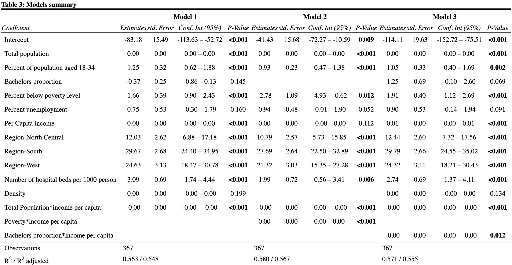

```{r setup, include=FALSE}
knitr::opts_chunk$set(
  fig.width = 8,
  fig.asp = .6,
  out.width = "90%",
  echo = FALSE, warning = FALSE, message = FALSE,
  dpi=300
  
)
```

```{r library,warning=FALSE,message=FALSE,echo = FALSE}
library(tidyverse)
library(corrplot)
library(leaps)
library(performance)
library(MASS)
library(caret)
library(sjPlot)


```

```{r preprocess, messgae = FALSE, echo = FALSE}
cdi_data = read_csv("./data/cdi.csv") %>%
  janitor::clean_names() %>%
  mutate(
    cty_state = str_c(cty,",",state),
    docs_rate_1000 = 1000 * docs/pop, 
    # Compute number of doctors/hospital beds per 1000 people.
    beds_rate_1000 = 1000 * beds/pop,
    density = as.numeric(pop)/as.numeric(area),
    crime_rate_1000 = 1000 * crimes/pop) %>% 
  # Compute number of crimes per 1000 people. 
  dplyr::select(-docs,-beds,-crimes) %>%
  relocate(id,cty_state,cty)


cdi_data_exp = cdi_data %>%
  dplyr::select(-id,-cty,-state, -cty_state) 


```

# Abstract

In this project, we aim to build regression models based on a set of demographic variables to estimate county-level crime rates. After an exploratory analysis of the variables on their distributions and correlations, we derived more meaningful variables by manipulating the existing ones, removed outlier values, and implemented several variable selection methods. Using the selected variables, we trained a linear regression model, elaborated on the model by adding several interactive terms, and did cross-validations. All 3 resulting models have achieved a good estimation of the training set. We selected the third model (adjusted R-square: 0.542, RMSE: 16.46, RMSPE: 11.90) as the final model, as it has the best prediction on testing set. Further studies can be done on correcting the dataset using external data sources, as well as using more sophisticated non-linear models.


 
# Introduction

Over the last three decades, crime has become a major public concern in the US arousing massive political discussion and public expenditure[1]. Crime rates in major cities experienced a general rise from the 1960s to 1990s, with two peaks observed in 1980 and in early 1990s[2]. Despite extensive attention across the nation, factors influencing crime trends were not yet made clear[1]. In this project, we examined crime rate and potential factors that affect the crime rate in "County Demoraphic Information" (CDI), and constructed multiple linear regression model to predict crime rate.


# Methods

## Data Description

We analyzed data from the “County Demographic Information” (CDI) data set, which contains characteristics of 440 counties in the United States collected from 1990-1992. The primary goal of this investigation is to develop insight relevant to predicting the crime rate in counties. 

**Data Preprocessing** Transform vairables in order to extract interpretable information. 

**Exploratory Analysis** Calculate the pairwise correlations between variables and ist all correlations between the crime rate (our interest) and other variables.

## Statistical Methods

**Training/Testing Set Split:** Randomly split the dataset into training (90%) and testing sets (10%) to avoid overfitting. 

**Remove Outliers and High Leverage Points:** Use percentile to detect potential outliers and high leverage points. Remove rows containing the smallest and largest 0.2% for each variable given the size of the dataset.

**Variable Selection:** Select key variables using stepwise regression and criteria based procedure and conduct interaction analysis,

**Model Construction:** Build linear regression models using selected variables, interaction terms (p-value < 0.2). Attempt model transformations.

**Cross Validation:** Use 5-fold cross validation on each model to estimate model performances.

**Model Assessment:** Assess the models and choose a final model used for future prediction. Compare the models based on three criteria: the R-square values, the root mean square error (RMSE), and the root mean square prediction error (RMSPE).  

- R-square value represents the proportion of the variance that can be explained by the regression model.
- RMSE measures the differences between the actual values and the predicted values in the training dataset.
- RMSPE estimates the prediction errors on new data outside the training dataset.


# Results


## Descriptive Analysis

After importing the csv file containing the County Demographic Information (CDI) data, we noticed that crimes, physicians, and hospital beds are given as numbers, while other info are given as proportions. We therefore computed the number of crimes, physicians, and hospital beds per 1000 people. Population density could be a key factor to crime rate. Thus, we also derived a new variable, `density`, which is population divided by area. 


```{r, fig.width=12,fig.height= 16}
par(mfrow = c(2,3))
boxplot(cdi_data_exp$area,main = "Area")
boxplot(cdi_data_exp$pop,main = "Population")
boxplot(cdi_data_exp$pop18,main = "Population 18-34")
boxplot(cdi_data_exp$pop65,main = "Population 65+")
boxplot(cdi_data_exp$hsgrad,main = "Highschool grads")
boxplot(cdi_data_exp$bagrad,main = "Bachelor's grads")
```


```{r, fig.width=12,fig.height= 16,fig.cap="\\label{fig:figs}boxplot of continuous variables distribution"}

par(mfrow = c(2,3))
boxplot(cdi_data_exp$poverty,main = "Poverty Rate")
boxplot(cdi_data_exp$unemp,main = "Unemployment Rate")
boxplot(cdi_data_exp$pcincome,main = "Income Per Capita")
boxplot(cdi_data_exp$totalinc,main = "Income Total")
boxplot(cdi_data_exp$docs_rate_1000,main = "Active Physicians")
boxplot(cdi_data_exp$beds_rate_1000,main = "Hospital Beds")
```

```{r,fig.cap="\\label{fig:figs}Histogram of catagorical variable:region distribution"}
par(mfrow=c(1,1))

ggplot(cdi_data,aes(region)) + 
  geom_histogram(binwidth = 0.5) +
  theme_classic() +
  xlab("Region")+
  ylab("Count") +
  labs(title = "Histogram: Counts of four regions")
```

After drawing boxplots to show the distribution of the variables, we identified several extreme values in each of the variables. These values can be treated as potential outliers to be removed in further analysis. For example, the distribution of crime rate:

```{r, fig.cap="\\label{fig:figs}boxplot of dependent variable: crime rate"}
boxplot(cdi_data_exp$crime_rate_1000,main="Crime Rate",horizontal = TRUE)
```
From the pairwise plots, we did not recognize any relationship between each variable. After taking  a closer look of each variable, we calculated pairwise correlations and listed all the correlations between the crime rate (our interest) and other variables. Correlation analysis suggested that the derived variable, density, is a more meaningful variable compared to area and population, with a stronger association to the crime rate.

```{r, fig.cap="\\label{fig:figs}Correlation heatmap"}
# correlation plot
cdi_data_cor = cor(cdi_data_exp)
corrplot(cdi_data_cor, type = "upper", diag = FALSE)
```


After a preliminary analysis of the data, we identified several variables that might be relevant to the crime rate as listed:

```{r, echo = FALSE}
Variable <- c("area","density",	"pop", "pop18",	"pop65",	"docs_rate_1000",	"beds_rate_1000",	"crime_rate_1000",	"hsgrad",	"bagrad",	"poverty",	"unemp",	"pcincome",	"totalinc",	"region")

Meaning <- c("Land area","Population Density" ,"Esimate 1990 population", "Percent of population aged 18-34", "Percent of population aged 65+", "Number of active physicians per 1000 people", "Number of hospital beds per 1000 people", "Number of serious crimes per 1000 people", "Percent high school graduates", "Percent bachelor’s degrees", "Percent below poverty level", "Percent unemployment", "Per capita income", "Total personal income", "Geographic region (1=Northeast, 2=North Central, 3=South, 4=West)")

var_info <- data.frame(Variable, Meaning)

knitr::kable(var_info, caption = "Potential Variables Relevant to the Crime Rate")
```

## Traning/Testing Split

We randomly sampled 10% from the dataset as a testing set (n = 44) and put the rest into a training set (n = 396).

```{r echo = FALSE}
cdi_data = cdi_data %>% 
  dplyr::select(-id,-cty_state, -cty,-state) %>% 
  mutate(region = factor(region))

set.seed(1)
dt = sort(sample(nrow(cdi_data), nrow(cdi_data)*.9))
train_data = cdi_data[dt,]
test_data = cdi_data[-dt,]

```

## Data Cleaning

We removed 19 rows with outliers and high leverage points from a total of 396 training data. 

```{r echo=FALSE}
# Remove high leverage points

cdi_data_clean = train_data[train_data$area >= quantile(train_data$area,0.002) & train_data$area <= quantile(train_data$area,0.998),]
cdi_data_clean = cdi_data_clean[cdi_data_clean$pop >= quantile(cdi_data_clean$pop,0.002) & cdi_data_clean$pop <= quantile(cdi_data_clean$pop,0.998),]
cdi_data_clean = cdi_data_clean[cdi_data_clean$pop18 >= quantile(cdi_data_clean$pop18,0.002) & cdi_data_clean$pop18 <= quantile(cdi_data_clean$pop18,0.998),]
cdi_data_clean = cdi_data_clean[cdi_data_clean$pop65 >= quantile(cdi_data_clean$pop65,0.002) & cdi_data_clean$pop65 <= quantile(cdi_data_clean$pop65,0.998),]
cdi_data_clean = cdi_data_clean[cdi_data_clean$hsgrad >= quantile(cdi_data_clean$hsgrad,0.002) & cdi_data_clean$hsgrad <= quantile(cdi_data_clean$hsgrad,0.998),]
cdi_data_clean = cdi_data_clean[cdi_data_clean$bagrad >= quantile(cdi_data_clean$bagrad,0.002) & cdi_data_clean$bagrad <= quantile(cdi_data_clean$bagrad,0.998),]

cdi_data_clean = cdi_data_clean[cdi_data_clean$poverty >= quantile(cdi_data_clean$poverty,0.002) & cdi_data_clean$poverty <= quantile(cdi_data_clean$poverty,0.998),]
cdi_data_clean = cdi_data_clean[cdi_data_clean$unemp >= quantile(cdi_data_clean$unemp,0.002) & cdi_data_clean$unemp <= quantile(cdi_data_clean$unemp,0.998),]
cdi_data_clean = cdi_data_clean[cdi_data_clean$pcincome >= quantile(cdi_data_clean$pcincome,0.002) & cdi_data_clean$pcincome <= quantile(cdi_data_clean$pcincome,0.998),]
cdi_data_clean = cdi_data_clean[cdi_data_clean$totalinc >= quantile(cdi_data_clean$totalinc,0.002) & cdi_data_clean$totalinc <= quantile(cdi_data_clean$totalinc,0.998),]
cdi_data_clean = cdi_data_clean[cdi_data_clean$docs_rate_1000 >= quantile(cdi_data_clean$docs_rate_1000,0.002) & cdi_data_clean$docs_rate_1000 <= quantile(cdi_data_clean$docs_rate_1000,0.998),]
cdi_data_clean = cdi_data_clean[cdi_data_clean$beds_rate_1000 >= quantile(cdi_data_clean$beds_rate_1000,0.002) & cdi_data_clean$beds_rate_1000 <= quantile(cdi_data_clean$beds_rate_1000,0.998),]
cdi_data_clean = cdi_data_clean[cdi_data_clean$beds_rate_1000 >= quantile(cdi_data_clean$beds_rate_1000,0.002) & cdi_data_clean$beds_rate_1000 <= quantile(cdi_data_clean$beds_rate_1000,0.998),]
cdi_data_clean = cdi_data_clean[cdi_data_clean$density >= quantile(cdi_data_clean$density,0.002) & cdi_data_clean$density <= quantile(cdi_data_clean$density,0.998),]

cdi_data_clean = cdi_data_clean[cdi_data_clean$crime_rate_1000 >= quantile(cdi_data_clean$crime_rate_1000,0.002) & cdi_data_clean$beds_rate_1000 <= quantile(cdi_data_clean$crime_rate_1000,0.998),]


```


## Variables Selection

```{r}

cdi_model = cdi_data_clean

```


```{r result = "hide",echo = FALSE, include = FALSE}

full.fit = lm(crime_rate_1000 ~ ., data = cdi_model)
summary(full.fit) %>% 
  broom::tidy() %>%
  mutate(p_rank = rank(p.value))

backward = step(full.fit, direction='backward') %>%  broom::tidy() %>%  rename(backward = "term")


both = step(full.fit, direction = "both") %>% broom::tidy() %>% rename(stepwise = "term")


```

Based on stepwise procedure, we selected the following variables:

```{r}
bind_cols(backward[-1,1],both[-1,1]) %>% knitr::kable(caption = "Vairable selected from stepwise regression")

```


```{r}
sb = regsubsets(crime_rate_1000 ~ ., data = cdi_model, nvmax = 14)
sumsb = summary(sb) # pop pop18 hsgrad bagrad poverty pcincome totalinc region beds_rate_1000 density
```

```{r result = "hide", echo = FALSE, include = FALSE}
coef(sb, id = 12)

```


```{r, fig.cap="\\label{fig:figs}Subset selection for best parameter numbers"}
par(mfrow=c(1,2))
plot(2:15, sumsb$cp, xlab="No. of parameters", ylab="Cp Statistic") 
abline(0,1)

plot(2:15, sumsb$adjr2, xlab="No of parameters", ylab="Adj R2")
```

According to the output of criteria based procedure, we determined that the number of variables should be above 12 because $C_p \leq p$. Based on this analysis, we found that `unemp` and `density` could also be selected.

In addition, We removed `totalinc`, because it can be replaced with totalinc = pcincome * pop.

## Interaction Analysis

Interaction term 1: `poverty` + `income`

According to the Census Bureau, the number of people below the official government poverty level was 33.6 million in 1990, representing 13.5 percent of the national population [4]. Thus, we used this criteria to divide `poverty` into two categories: higher than national poverty rate and lower than national poverty rate. In figure 6, we observed an intersection of the two lines, suggesting that the association between crime rate and per capita income is modified by poverty status.  

```{r, fig.cap="\\label{fig:figs}Interaction plot of Income Per Capita and Poverty"}
poverty_status = cdi_model %>% 
  mutate(national_poverty = if_else(poverty > 13.5, "higher", "lower"))

ggplot(poverty_status, aes(x = pcincome, y = crime_rate_1000, color = national_poverty)) + 
  geom_point(alpha = .5) +
  geom_smooth(method = "lm", se = F, aes(group = national_poverty, color = national_poverty)) +
  labs(
    title = "Crime Rate and Per Capita Income by Poverty Status",
    x = "Per Capita Income",
    y = "Crime Rate ",
    color = "Comparison with national avergae"
  ) +
  theme_classic()
```


Interaction term 2: `pcincome` + `bagrad`

According to the Census Bureau, the percentage of people 25 years old or older with bachelor’s degrees was 20.8% in 1990 [4]. Thus, we used this criteria to divide `bagrad` into two categories: higher than national `bagrad` and lower than national `bargrad`. In figure 7, we observed that the association between crime rate and per capita income is modified by percent bachelor's degrees status.

```{r, fig.cap="\\label{fig:figs}Interaction plot of Income Per Capita and Bachelor's Degree Status"}
bagrad_status = cdi_model %>% 
  mutate(national_bagrad = if_else(bagrad > 20.8, "higher", "lower"))

ggplot(bagrad_status, aes(x = pcincome, y = crime_rate_1000, color = national_bagrad)) + 
  geom_point(alpha = .5) +
  geom_smooth(method = "lm", se = F, aes(group = national_bagrad, color = national_bagrad)) +
  ylim(0,150) +
  labs(
    title = "Crime Rate and Per Capita Income by Percent Bachelor's Degrees Status",
    x = "Per Capita Income",
    y = "Crime Rate",
    color = "Comparison with national avergae"
  )+
  theme_classic()

```


## Model Construction

By adding interative terms to the model built with selected variables, we resulted in the following three models:

```{r result = "hide"}
fit_nest = lm(crime_rate_1000 ~  
                  pop + pop18 + bagrad +
                  poverty + unemp + pcincome + pcincome*pop + region +
                  beds_rate_1000 + density, data = cdi_model)
```

Model 1 was built using the following terms: pop, pop18, bagrad, poverty, unemp, pcincome, pcincome*pop, region, beds_rate_1000, density.

```{r result = "hide"}
fit_int1 = lm(crime_rate_1000 ~  
                   pop + pop18 + 
                  poverty + unemp + pcincome + pcincome*pop + region +
                  beds_rate_1000  +
                  poverty*pcincome, data = cdi_model)
```

                  
Model 2 was built using the following terms: pop, pop18, bagrad, poverty, unemp, pcincome, pcincome\*pop, region, beds_rate_1000, poverty\*pcincome

```{r result = "hide"}
fit_int2 = lm(crime_rate_1000 ~  
                  pop + pop18 + bagrad +
                  poverty + unemp + pcincome + pcincome*pop + region +
                  beds_rate_1000 + density +
                  pcincome*bagrad, data = cdi_model)

```

Model 3 was built using the following terms: pop, pop18, bagrad, poverty, unemp, pcincome, pcincome\*pop, region, beds_rate_1000, density, pcincome\*bagrad                

## Model Diagnosis and Transformation

Using Variable Inflation Factor(VIF), we determined if each model had a high collinearity. The above 3 models all have passed the collinearity test.

We then drew diagnostic plots for each model to see how the residuals behaved. In all three models, residuals followed a normal distribution ($\mu=0$) with no influential points.

In addition, we drew boxcox plots to see if each model needed transformation. The peak of all three boxcox plots fell between 0.5 and 1. As such, we tried $\sqrt{y}$ transformation for each model. Since the residuals were more unevenly distributed in all three transformed models, we kept the untransformed model. Detailed plots can be seen in main.Rmd.

Here is a summary table of for our three models:



## Cross Validation

We performed cross validation on each model and got the RMSE average. The results were shown in the table below:


```{r}
set.seed(1)
train = trainControl(method = "cv", number = 5)

model_train1 = train(crime_rate_1000 ~  
                  pop + pop18 + bagrad +
                  poverty + unemp + pcincome + pcincome*pop + region +
                  beds_rate_1000 + density,data = cdi_model,
                   trControl = train,
                   method = 'lm',
                   na.action = na.pass)

```


```{r}
set.seed(1)
train = trainControl(method = "cv", number = 5)

model_train2 = train(crime_rate_1000 ~  
                   pop + pop18 + 
                  poverty + unemp + pcincome + pcincome*pop + region +
                  beds_rate_1000  +
                  poverty*pcincome, data = cdi_model,
                   trControl = train,
                   method = 'lm',
                   na.action = na.pass)


```


```{r}
set.seed(1)
train = trainControl(method = "cv", number = 5)

model_train3 = train(crime_rate_1000 ~  
                  pop + pop18 + bagrad +
                  poverty + unemp + pcincome + pcincome*pop + region +
                  beds_rate_1000 + density +
                  pcincome*bagrad,  data = cdi_model,
                   trControl = train,
                   method = 'lm',
                   na.action = na.pass)

```

```{r, results='hide'}

model <- c("1", "2", "3")

RMSE <- c(round(model_train1$results$RMSE, 2),  round(model_train2$results$RMSE,2),
          round(model_train3$results$RMSE, 2))

R_sq <- c(round(model_train1$results$Rsquared, 3),
          round(model_train2$results$Rsquared, 3),
          round(model_train3$results$Rsquared, 3))

RMSE_table <- data.frame(model, RMSE, R_sq) %>%
  dplyr::rename("R Square"=R_sq)

coefs_1 = model_train1$finalModel$coefficients
names_1 = model_train1$finalModel$xNames

knitr::kable(RMSE_table, caption = "RMSE table for three models")
```


## Model Assessment

We assessed the models we built in the testing set and evaluated them by $R^2$,$RMSE$ and $RMSPE$. The results were shown in the table below:

```{r}

test_data = test_data %>%
  mutate(
    y = crime_rate_1000,
    y_model_1 = predict(model_train1,test_data),
    y_model_2 = predict(model_train2,test_data),
    y_model_3 = predict(model_train3,test_data))

RMSPE_1 = sqrt(mean((test_data$y-test_data$y_model_1)^2))
RMSPE_2 = sqrt(mean((test_data$y-test_data$y_model_2)^2))
RMSPE_3 = sqrt(mean((test_data$y-test_data$y_model_3)^2))


model_assessment = 
  tibble(
    RMSPE_1 = round(RMSPE_1,2),
    RMSPE_2 = round(RMSPE_2,2),
    RMSPE_3 = round(RMSPE_3,2)) %>% 
  pivot_longer(RMSPE_1:RMSPE_3,
               names_to = "model", 
               names_prefix = "RMSPE_",
               values_to = "RMSPE") %>%
  left_join(RMSE_table,by="model") %>%
  dplyr::select(Model=model,`R Square`,RMSE,RMSPE)

knitr::kable(model_assessment, caption = "Model assessment table", booktabs = TRUE)
```


# Conclusion and Discussion

According to table 5, evaluated in terms of accuracy in estimating the training set, model 2 has the best performance with its leading R square and the smallest RMSE, followed by model 3 and model 1. In terms of predicting values outside the training set, model 3 has the best performance with the smallest RMSPE on the testing set. Such an inconsistency of model performance may be explained by model overfitting of the training data. Above all, although model 2 have achieved a good estimation of the training set, we will choose model 3 as the final model, given its fair RMSE and R-square values, plus excellent testing set performance. By using model 3, we can predict the crime rate by the following parameters.

```{r, echo = FALSE}
Parameters <- c("pop", "pop18","beds_rate_1000","bagrad",	"poverty",	"unemp",	"pcincome",	"region","pcincome*pop", "pcincome*bagrad")

Meaning <- c("Esimate 1990 population", "Percent of total population in age range from 18-34", "Total number of hospital beds, cribs and bassinets during 1990 per 1000 people",  "Percent of person 25 years old or older with bachelor’s degrees", "Percent of 1990 total population with income below poverty level", "Percent of labor force that is unemployed", "Income (in dollars) per person among those in 1990 population",  "Geographic region","Per capita income * Total Population", "Per capita income * Percent bachelor’s degrees")

var_info <- data.frame(Parameters, Meaning)

knitr::kable(var_info, format = "latex", caption = "Model 3 Parameters")
```

Overall, our project has several strengths. First, we did feature engineering before training the model by transforming variables using our domain knowledge to the ones more relevant to the predicted variable. For example, while area and population are not directly related to the crime rate, population density (population/area) can be more relevant. Second, we did analysis of correlation and collinearity to reduce potential bias. Third, we did interactive analysis and involved multiple interactive terms in our model, which to some extents represented the possible non-linear relations between the parameters and the predicted value. Finally, we separated a testing set from the dataset at the very beginning, on which we evaluated the performance of several models, addressing the potential predicting errors caused by model overfitting. 

Meanwhile, the project also has its limitations. Essentially, we identified several wrong data points in the original dataset: for example, the population of Los Angles, an outstandingly large number, is not consistent with the number found on Wikipedia. Given that some of the data are mistaken, further works can be done on correcting the dataset using external data sources. Furthermore, our regression model considered only linear and interactive terms, while some parameters could be better fitted using polynomials or exponentials. More sophisticated models can be used in the future to better estimate the data.

\newpage

# Reference and Documentation

[1] Committee on Law and Justice, et al. *Understanding Crime Trends: Workshop Report*. Edited by Arthur S. Goldberger and Richard Rosenfeld, National Academies Press, 2009. Accessed 11 December 2021.

[2] Rosenfeld, R., Vogel, M. & McCuddy, T. Crime and Inflation in U. S. Cities. *J Quant Criminol* 35, 195–210 (2019). https://doi.org/10.1007/s10940-018-9377-x

[3] U.S. Department of Commerce Economics and Statistics Administration, Bureau of the Census. Current Population Reports. Poverty in the United States: 1990. Series P-60, No.175

[4] Bureau of the Census. We asked... You told us. Census Questionnaire Content, 1990 CQC-13

[5] Friedman, Jerome, Trevor Hastie, and Robert Tibshirani. The elements of statistical learning. Vol. 1. No. 10. New York: Springer series in statistics, 2001.


As Numerous new questions emerging during our discussion, our group explored materials below to solve them.

1. Question: Do we still need a test set when using k-fold cross-validation?
Source:
https://stats.stackexchange.com/questions/225949/do-we-need-a-test-set-when-using-k-fold-cross-validation
https://datascience.stackexchange.com/questions/80310/is-a-test-set-necessary-after-cross-validation-on-training-set


2. Question: How to achieve build test set & predict
Source:
https://www.ritchieng.com/machine-learning-evaluate-linear-regression-model/
https://campus.datacamp.com/courses/machine-learning-with-caret-in-r/regression-models-fitting-them-and-evaluating-their-performance?ex=8

3. Question: How to evaluate continuous by continuous interactions
Source: Continuous by Continuous Interactions, Joel S Steele http://web.pdx.edu/~joel8/resources/ConceptualPresentationResources/ContinuousByContinousInteractions_walkthrough_v2.pdf


