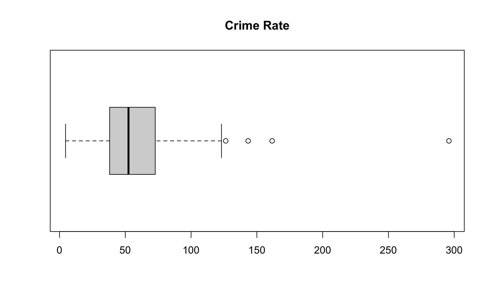
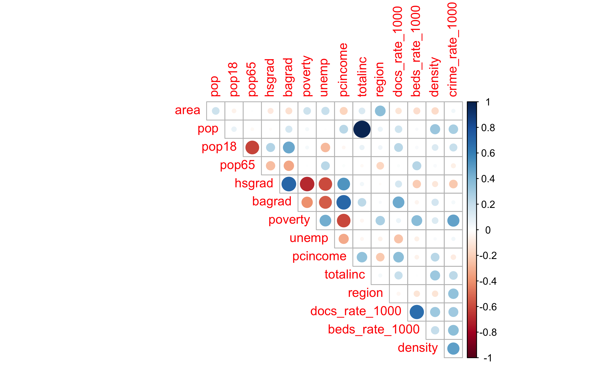
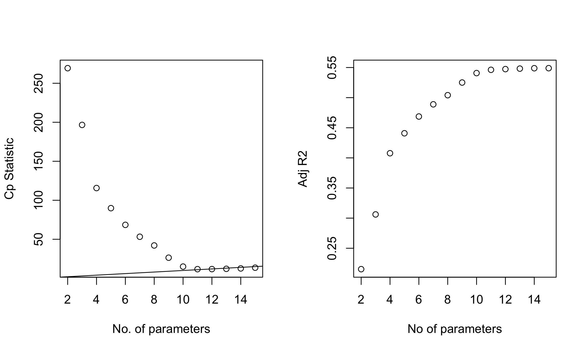
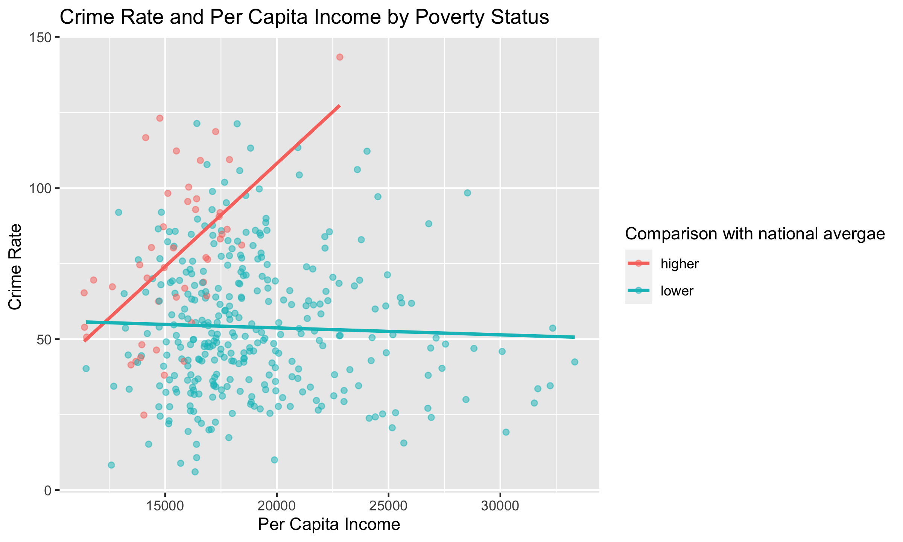
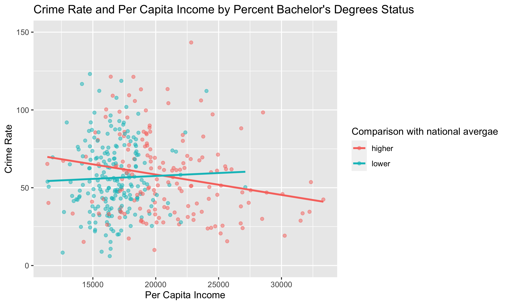

BIST8130 - Final Project Report
================
Mengfan Luo (ml4701), Yushan Wang (yw3772), Jing Lyu(jl6049), Yiqun Jin
(yj2686), Mingkuan Xu (mx2262)

## Abstract

In this project, we aim to build regression models based on a set of
demographic variables to estimate county-level crime rates. After an
exploratory analysis of the variables on their distributions and
correlations, we derived more meaningful variables by manipulating the
existing ones, removed outliers, and implement several variable
selection methods. Using the selected variables, we trained a linear
regression model, elaborate on the model by adding several interactive
terms, and did cross-validations. All 3 resulting models have achieved a
good estimation of the training set. The first model has the best
prediction on new data (in the testing set), whereas the other two
models, despite a better performance of the training data, may have the
problem of overfitting.

## Introduction

Over the last three decades, crime has become a major public concern in
the US arousing massive political discussion and public
expenditure\[1\]. Crime rates in major cities experienced a general rise
from the 1960s to 1990s, with two peaks observed in 1980 and in early
1990s\[2\]. Despite extensive attention across the nation, factors
influencing crime trends were not yet made clear\[1\]. In this project,
we examined crime rate and potential factors that affect the crime rate
in “County Demoraphic Information” (CDI), and constructed multiple
linear regression model to predict crime rate.

## Methods

### Dataset discription

We analyzed data from the “County Demographic Information” (CDI) data
set, which contains characteristics of 440 counties in the United States
collected from 1990-1992. The primary goal of this investigation is to
develop insight relevant to predicting the crime rate in counties.

### Model building method

1.  Data preprocessing:

Considering transformation of vairables in order to extract
interpretable information form correlated predictors.

2.  Exploratory analysis:

-   Calculate the pairwise correlations between variables

-   List all the correlations between the crime rate (our interest) and
    all other variables

3.  Training/Testing set split: Randomly split the dataset into training
    and testing sets. 90% is training set while 10% is testing. This
    step aims to support model assessment and avoid overestimation.

4.  Remove outliers and high leverage points

Use percentile to detect potential outliers and high leverage points.
Due to the dataset size, we remove rows containing the smallest and
largest 0.2% for each variables.

5.  Model construction:

-   Select variables using stepwise regression and criteria based
    procedure

-   Build model using the variables we selected

-   Plot interaction effects and add interaction terms

-   Diagnose and transform the models

6.  Cross validation

Cross validate on each model and get the model with the lowest RMSE.

7.  Model assessment In this section, we intend to assess the models we
    built and choose a final model used for future prediction. We
    compared the models based on three criteria: the R-square values,
    the root mean square error (RMSE), and the root mean square
    prediction error (RMSPE).

-   R square represents the proportion of the variance that can be
    explained by the regression model.
-   RMSE measures the differences between the actual values and the
    predicted values in the training dataset.
-   RMSPE estimates the prediction errors on new data outside the
    training dataset.

## Results

### Descriptive analysis

After importing the csv file containing the County Demographic
Information (CDI) data, we noticed that crimes, physicians, and hospital
beds are given as numbers, while other info are given as proportions. We
therefore compute the number of crimes, physicians, and hospital beds
per 1000 people. When considering crime rate, population density could
be a key factor. Thus, we also create a new variable, `density`, which
is population divided by area.

After drawing boxplots to show the distribution of the variables, we
identified several extreme values in each of the variables. These values
can be treated as potential outliers to be removed in further analysis.
For example, the distribution of crime rate:

``` r
boxplot(cdi_data_exp$crime_rate_1000,main="Crime Rate",horizontal = TRUE)
```

<div class="figure">


<p class="caption">
boxplot of dependent variable: crime rate
</p>

</div>

We then take a closer look of each variables, calculate the pairwise
correlations between variables, and list all the correlations between
the crime rate (our interest) and all other variables. We used
correlation analysis to prove that the derived variable density is a
more meaningful variable compared to area and population, given that it
has a stronger association with the crime rate.

``` r
# correlation plot
cdi_data_cor = cor(cdi_data_exp)
corrplot(cdi_data_cor, type = "upper", diag = FALSE)
```

<div class="figure">


<p class="caption">
Correlation heatmap
</p>

</div>

After preliminary analysis of the data, we identify several variables
that might be relevant to the crime rate as listed

| Variable          | Meaning                                     |
|:------------------|:--------------------------------------------|
| area              | Land area                                   |
| density           | Population Density                          |
| pop               | Esimate 1990 population                     |
| pop18             | Percent of population aged 18-34            |
| pop65             | Percent of population aged 65+              |
| docs\_rate\_1000  | Number of active physicians per 1000 people |
| beds\_rate\_1000  | Number of hospital beds per 1000 people     |
| crime\_rate\_1000 | Number of serious crimes per 1000 people    |
| hsgrad            | Percent high school graduates               |
| bagrad            | Percent bachelor’s degrees                  |
| poverty           | Percent below poverty level                 |
| unemp             | Percent unemployment                        |
| pcincome          | Per capita income                           |
| totalinc          | Total personal income                       |
| region            | Geographic region                           |

Potential Variables Relevant to the Crime Rate

### Traning/Testing split

We randomly sampled 10% from the dataset and made it a testing set(n =
44). The rest is training set (n = 396).

``` r
cdi_data = cdi_data %>% 
  dplyr::select(-id,-cty_state, -cty,-state) %>% 
  mutate(region = factor(region))

set.seed(1)
dt = sort(sample(nrow(cdi_data), nrow(cdi_data)*.9))
train_data = cdi_data[dt,]
test_data = cdi_data[-dt,]
```

### Data cleaning

Due to the dataset size, we removed rows containing the smallest and
largest 0.2% for each variable. 19 data points were removed out of 396.

### Model construction

1.  Variables Selection

``` r
cdi_model = cdi_data_clean
```

``` r
full.fit = lm(crime_rate_1000 ~ ., data = cdi_model)
summary(full.fit) %>% 
  broom::tidy() %>%
  mutate(p_rank = rank(p.value))
```

    ## # A tibble: 17 × 6
    ##    term               estimate  std.error statistic  p.value p_rank
    ##    <chr>                 <dbl>      <dbl>     <dbl>    <dbl>  <dbl>
    ##  1 (Intercept)    -108.        29.0         -3.71   2.40e- 4      8
    ##  2 area             -0.000699   0.000955    -0.732  4.65e- 1     16
    ##  3 pop               0.0000806  0.0000136    5.95   6.57e- 9      3
    ##  4 pop18             1.28       0.371        3.45   6.29e- 4      9
    ##  5 pop65            -0.0161     0.324       -0.0497 9.60e- 1     17
    ##  6 hsgrad            0.349      0.279        1.25   2.12e- 1     13
    ##  7 bagrad           -0.694      0.330       -2.10   3.63e- 2     11
    ##  8 poverty           1.88       0.432        4.34   1.86e- 5      6
    ##  9 unemp             0.885      0.548        1.61   1.07e- 1     12
    ## 10 pcincome          0.00325    0.000620     5.25   2.63e- 7      4
    ## 11 totalinc         -0.00341    0.000658    -5.19   3.52e- 7      5
    ## 12 region2          11.2        2.77         4.04   6.67e- 5      7
    ## 13 region3          29.8        2.70        11.1    1.47e-24      1
    ## 14 region4          24.3        3.60         6.75   6.31e-11      2
    ## 15 docs_rate_1000    1.30       1.26         1.03   3.03e- 1     14
    ## 16 beds_rate_1000    2.54       0.901        2.82   5.13e- 3     10
    ## 17 density           0.000701   0.000738     0.950  3.43e- 1     15

``` r
backward = step(full.fit, direction='backward') %>%  broom::tidy() %>%  rename(backward = "term")
```

    ## Start:  AIC=2062.47
    ## crime_rate_1000 ~ area + pop + pop18 + pop65 + hsgrad + bagrad + 
    ##     poverty + unemp + pcincome + totalinc + region + docs_rate_1000 + 
    ##     beds_rate_1000 + density
    ## 
    ##                  Df Sum of Sq    RSS    AIC
    ## - pop65           1         1  92276 2060.5
    ## - area            1       141  92416 2061.0
    ## - density         1       238  92513 2061.4
    ## - docs_rate_1000  1       280  92555 2061.6
    ## - hsgrad          1       411  92687 2062.1
    ## <none>                         92275 2062.5
    ## - unemp           1       687  92963 2063.2
    ## - bagrad          1      1164  93439 2065.1
    ## - beds_rate_1000  1      2092  94367 2068.7
    ## - pop18           1      3138  95413 2072.7
    ## - poverty         1      4967  97242 2079.7
    ## - totalinc        1      7109  99384 2087.7
    ## - pcincome        1      7269  99545 2088.3
    ## - pop             1      9328 101603 2095.8
    ## - region          3     35147 127422 2174.9
    ## 
    ## Step:  AIC=2060.47
    ## crime_rate_1000 ~ area + pop + pop18 + hsgrad + bagrad + poverty + 
    ##     unemp + pcincome + totalinc + region + docs_rate_1000 + beds_rate_1000 + 
    ##     density
    ## 
    ##                  Df Sum of Sq    RSS    AIC
    ## - area            1       144  92420 2059.1
    ## - density         1       238  92513 2059.4
    ## - docs_rate_1000  1       279  92555 2059.6
    ## - hsgrad          1       413  92689 2060.1
    ## <none>                         92276 2060.5
    ## - unemp           1       698  92974 2061.2
    ## - bagrad          1      1163  93439 2063.1
    ## - beds_rate_1000  1      2217  94493 2067.2
    ## - pop18           1      4127  96403 2074.5
    ## - poverty         1      5160  97436 2078.4
    ## - totalinc        1      7152  99428 2085.9
    ## - pcincome        1      7324  99600 2086.5
    ## - pop             1      9371 101646 2094.0
    ## - region          3     35176 127451 2173.0
    ## 
    ## Step:  AIC=2059.05
    ## crime_rate_1000 ~ pop + pop18 + hsgrad + bagrad + poverty + unemp + 
    ##     pcincome + totalinc + region + docs_rate_1000 + beds_rate_1000 + 
    ##     density
    ## 
    ##                  Df Sum of Sq    RSS    AIC
    ## - docs_rate_1000  1       282  92702 2058.2
    ## - density         1       397  92817 2058.6
    ## - hsgrad          1       474  92894 2058.9
    ## <none>                         92420 2059.1
    ## - unemp           1       626  93046 2059.5
    ## - bagrad          1      1195  93615 2061.8
    ## - beds_rate_1000  1      2220  94640 2065.8
    ## - pop18           1      4080  96500 2072.9
    ## - poverty         1      5090  97510 2076.7
    ## - totalinc        1      7017  99437 2083.9
    ## - pcincome        1      7263  99683 2084.8
    ## - pop             1      9229 101649 2092.0
    ## - region          3     35031 127452 2171.0
    ## 
    ## Step:  AIC=2058.16
    ## crime_rate_1000 ~ pop + pop18 + hsgrad + bagrad + poverty + unemp + 
    ##     pcincome + totalinc + region + beds_rate_1000 + density
    ## 
    ##                  Df Sum of Sq    RSS    AIC
    ## - hsgrad          1       394  93095 2057.7
    ## <none>                         92702 2058.2
    ## - density         1       580  93282 2058.4
    ## - unemp           1       637  93339 2058.7
    ## - bagrad          1       951  93653 2059.9
    ## - pop18           1      4264  96966 2072.7
    ## - poverty         1      5090  97792 2075.8
    ## - beds_rate_1000  1      5318  98020 2076.6
    ## - totalinc        1      6972  99674 2082.8
    ## - pcincome        1      7672 100373 2085.3
    ## - pop             1      9205 101907 2090.9
    ## - region          3     35510 128212 2171.2
    ## 
    ## Step:  AIC=2057.72
    ## crime_rate_1000 ~ pop + pop18 + bagrad + poverty + unemp + pcincome + 
    ##     totalinc + region + beds_rate_1000 + density
    ## 
    ##                  Df Sum of Sq    RSS    AIC
    ## - density         1       435  93531 2057.4
    ## <none>                         93095 2057.7
    ## - unemp           1       522  93618 2057.8
    ## - bagrad          1       561  93656 2057.9
    ## - pop18           1      3989  97084 2071.1
    ## - poverty         1      4766  97861 2074.0
    ## - beds_rate_1000  1      5331  98426 2076.2
    ## - totalinc        1      7222 100317 2083.1
    ## - pcincome        1      7324 100420 2083.5
    ## - pop             1      9501 102597 2091.4
    ## - region          3     35119 128215 2169.2
    ## 
    ## Step:  AIC=2057.43
    ## crime_rate_1000 ~ pop + pop18 + bagrad + poverty + unemp + pcincome + 
    ##     totalinc + region + beds_rate_1000
    ## 
    ##                  Df Sum of Sq    RSS    AIC
    ## - unemp           1       504  94035 2057.4
    ## <none>                         93531 2057.4
    ## - bagrad          1       709  94239 2058.2
    ## - pop18           1      4686  98217 2073.4
    ## - poverty         1      5568  99099 2076.7
    ## - beds_rate_1000  1      5625  99156 2076.9
    ## - totalinc        1      7389 100919 2083.3
    ## - pcincome        1      8910 102440 2088.8
    ## - pop             1      9968 103498 2092.6
    ## - region          3     34810 128341 2167.6
    ## 
    ## Step:  AIC=2057.4
    ## crime_rate_1000 ~ pop + pop18 + bagrad + poverty + pcincome + 
    ##     totalinc + region + beds_rate_1000
    ## 
    ##                  Df Sum of Sq    RSS    AIC
    ## <none>                         94035 2057.4
    ## - bagrad          1      1394  95428 2060.8
    ## - pop18           1      4681  98715 2073.2
    ## - beds_rate_1000  1      5122  99156 2074.9
    ## - totalinc        1      7551 101586 2083.8
    ## - poverty         1      8455 102489 2087.0
    ## - pcincome        1     10060 104095 2092.7
    ## - pop             1     10133 104167 2093.0
    ## - region          3     35812 129846 2169.8

``` r
both = step(full.fit, direction = "both") %>% broom::tidy() %>% rename(stepwise = "term")
```

    ## Start:  AIC=2062.47
    ## crime_rate_1000 ~ area + pop + pop18 + pop65 + hsgrad + bagrad + 
    ##     poverty + unemp + pcincome + totalinc + region + docs_rate_1000 + 
    ##     beds_rate_1000 + density
    ## 
    ##                  Df Sum of Sq    RSS    AIC
    ## - pop65           1         1  92276 2060.5
    ## - area            1       141  92416 2061.0
    ## - density         1       238  92513 2061.4
    ## - docs_rate_1000  1       280  92555 2061.6
    ## - hsgrad          1       411  92687 2062.1
    ## <none>                         92275 2062.5
    ## - unemp           1       687  92963 2063.2
    ## - bagrad          1      1164  93439 2065.1
    ## - beds_rate_1000  1      2092  94367 2068.7
    ## - pop18           1      3138  95413 2072.7
    ## - poverty         1      4967  97242 2079.7
    ## - totalinc        1      7109  99384 2087.7
    ## - pcincome        1      7269  99545 2088.3
    ## - pop             1      9328 101603 2095.8
    ## - region          3     35147 127422 2174.9
    ## 
    ## Step:  AIC=2060.47
    ## crime_rate_1000 ~ area + pop + pop18 + hsgrad + bagrad + poverty + 
    ##     unemp + pcincome + totalinc + region + docs_rate_1000 + beds_rate_1000 + 
    ##     density
    ## 
    ##                  Df Sum of Sq    RSS    AIC
    ## - area            1       144  92420 2059.1
    ## - density         1       238  92513 2059.4
    ## - docs_rate_1000  1       279  92555 2059.6
    ## - hsgrad          1       413  92689 2060.1
    ## <none>                         92276 2060.5
    ## - unemp           1       698  92974 2061.2
    ## + pop65           1         1  92275 2062.5
    ## - bagrad          1      1163  93439 2063.1
    ## - beds_rate_1000  1      2217  94493 2067.2
    ## - pop18           1      4127  96403 2074.5
    ## - poverty         1      5160  97436 2078.4
    ## - totalinc        1      7152  99428 2085.9
    ## - pcincome        1      7324  99600 2086.5
    ## - pop             1      9371 101646 2094.0
    ## - region          3     35176 127451 2173.0
    ## 
    ## Step:  AIC=2059.05
    ## crime_rate_1000 ~ pop + pop18 + hsgrad + bagrad + poverty + unemp + 
    ##     pcincome + totalinc + region + docs_rate_1000 + beds_rate_1000 + 
    ##     density
    ## 
    ##                  Df Sum of Sq    RSS    AIC
    ## - docs_rate_1000  1       282  92702 2058.2
    ## - density         1       397  92817 2058.6
    ## - hsgrad          1       474  92894 2058.9
    ## <none>                         92420 2059.1
    ## - unemp           1       626  93046 2059.5
    ## + area            1       144  92276 2060.5
    ## + pop65           1         4  92416 2061.0
    ## - bagrad          1      1195  93615 2061.8
    ## - beds_rate_1000  1      2220  94640 2065.8
    ## - pop18           1      4080  96500 2072.9
    ## - poverty         1      5090  97510 2076.7
    ## - totalinc        1      7017  99437 2083.9
    ## - pcincome        1      7263  99683 2084.8
    ## - pop             1      9229 101649 2092.0
    ## - region          3     35031 127452 2171.0
    ## 
    ## Step:  AIC=2058.16
    ## crime_rate_1000 ~ pop + pop18 + hsgrad + bagrad + poverty + unemp + 
    ##     pcincome + totalinc + region + beds_rate_1000 + density
    ## 
    ##                  Df Sum of Sq    RSS    AIC
    ## - hsgrad          1       394  93095 2057.7
    ## <none>                         92702 2058.2
    ## - density         1       580  93282 2058.4
    ## - unemp           1       637  93339 2058.7
    ## + docs_rate_1000  1       282  92420 2059.1
    ## + area            1       147  92555 2059.6
    ## - bagrad          1       951  93653 2059.9
    ## + pop65           1         1  92701 2060.2
    ## - pop18           1      4264  96966 2072.7
    ## - poverty         1      5090  97792 2075.8
    ## - beds_rate_1000  1      5318  98020 2076.6
    ## - totalinc        1      6972  99674 2082.8
    ## - pcincome        1      7672 100373 2085.3
    ## - pop             1      9205 101907 2090.9
    ## - region          3     35510 128212 2171.2
    ## 
    ## Step:  AIC=2057.72
    ## crime_rate_1000 ~ pop + pop18 + bagrad + poverty + unemp + pcincome + 
    ##     totalinc + region + beds_rate_1000 + density
    ## 
    ##                  Df Sum of Sq    RSS    AIC
    ## - density         1       435  93531 2057.4
    ## <none>                         93095 2057.7
    ## - unemp           1       522  93618 2057.8
    ## - bagrad          1       561  93656 2057.9
    ## + hsgrad          1       394  92702 2058.2
    ## + area            1       202  92894 2058.9
    ## + docs_rate_1000  1       201  92894 2058.9
    ## + pop65           1         4  93091 2059.7
    ## - pop18           1      3989  97084 2071.1
    ## - poverty         1      4766  97861 2074.0
    ## - beds_rate_1000  1      5331  98426 2076.2
    ## - totalinc        1      7222 100317 2083.1
    ## - pcincome        1      7324 100420 2083.5
    ## - pop             1      9501 102597 2091.4
    ## - region          3     35119 128215 2169.2
    ## 
    ## Step:  AIC=2057.43
    ## crime_rate_1000 ~ pop + pop18 + bagrad + poverty + unemp + pcincome + 
    ##     totalinc + region + beds_rate_1000
    ## 
    ##                  Df Sum of Sq    RSS    AIC
    ## - unemp           1       504  94035 2057.4
    ## <none>                         93531 2057.4
    ## + density         1       435  93095 2057.7
    ## + area            1       388  93143 2057.9
    ## + docs_rate_1000  1       351  93180 2058.1
    ## - bagrad          1       709  94239 2058.2
    ## + hsgrad          1       249  93282 2058.4
    ## + pop65           1         0  93530 2059.4
    ## - pop18           1      4686  98217 2073.4
    ## - poverty         1      5568  99099 2076.7
    ## - beds_rate_1000  1      5625  99156 2076.9
    ## - totalinc        1      7389 100919 2083.3
    ## - pcincome        1      8910 102440 2088.8
    ## - pop             1      9968 103498 2092.6
    ## - region          3     34810 128341 2167.6
    ## 
    ## Step:  AIC=2057.4
    ## crime_rate_1000 ~ pop + pop18 + bagrad + poverty + pcincome + 
    ##     totalinc + region + beds_rate_1000
    ## 
    ##                  Df Sum of Sq    RSS    AIC
    ## <none>                         94035 2057.4
    ## + unemp           1       504  93531 2057.4
    ## + density         1       417  93618 2057.8
    ## + docs_rate_1000  1       371  93664 2057.9
    ## + area            1       260  93774 2058.4
    ## + hsgrad          1       165  93870 2058.8
    ## + pop65           1        12  94023 2059.4
    ## - bagrad          1      1394  95428 2060.8
    ## - pop18           1      4681  98715 2073.2
    ## - beds_rate_1000  1      5122  99156 2074.9
    ## - totalinc        1      7551 101586 2083.8
    ## - poverty         1      8455 102489 2087.0
    ## - pcincome        1     10060 104095 2092.7
    ## - pop             1     10133 104167 2093.0
    ## - region          3     35812 129846 2169.8

Based on stepwise procedure, we selected the following variables:

``` r
bind_cols(backward[-1,1],both[-1,1]) %>% knitr::kable(caption = "Vairable selected from stepwise regression")
```

| backward         | stepwise         |
|:-----------------|:-----------------|
| pop              | pop              |
| pop18            | pop18            |
| bagrad           | bagrad           |
| poverty          | poverty          |
| pcincome         | pcincome         |
| totalinc         | totalinc         |
| region2          | region2          |
| region3          | region3          |
| region4          | region4          |
| beds\_rate\_1000 | beds\_rate\_1000 |

Vairable selected from stepwise regression

``` r
sb = regsubsets(crime_rate_1000 ~ ., data = cdi_model, nvmax = 14)
sumsb = summary(sb) # pop pop18 hsgrad bagrad poverty pcincome totalinc region beds_rate_1000 density
```

``` r
coef(sb, id = 12)
```

    ##    (Intercept)            pop          pop18         bagrad        poverty 
    ##  -8.317643e+01   8.025821e-05   1.249522e+00  -3.679141e-01   1.664217e+00 
    ##          unemp       pcincome       totalinc        region2        region3 
    ##   7.482408e-01   3.197803e-03  -3.406110e-03   1.203348e+01   2.967462e+01 
    ##        region4 beds_rate_1000        density 
    ##   2.462527e+01   3.087835e+00   8.669407e-04

``` r
par(mfrow=c(1,2))
plot(2:15, sumsb$cp, xlab="No. of parameters", ylab="Cp Statistic") 
abline(0,1)

plot(2:15, sumsb$adjr2, xlab="No of parameters", ylab="Adj R2")
```

<div class="figure">


<p class="caption">
Subset selection for best parameter numbers
</p>

</div>

According to the output of criteria based procedure, we determined that
the number of variables should be above 12 because
*C*<sub>*p*</sub> ≤ *p*. Based on this analysis, we find that `unemp`
and `density` could also be selected.

In addition, We remove `totalinc`, because it can be replaced: totalinc
= pcincome \* pop.

2.  Interaction effects

Interaction term 1: poverty+income

According to Census Bureau, the number of persons below the official
government poverty level was 33.6 million in 1990, representing 13.5
percent of the Nation’s population \[\]. Thus, we can use this criteria
to divide `poverty` into two category: higher than national poverty rate
and lower than national poverty rate.

``` r
poverty_status = cdi_model %>% 
  mutate(national_poverty = if_else(poverty > 13.5, "higher", "lower"))

ggplot(poverty_status, aes(x = pcincome, y = crime_rate_1000, color = national_poverty)) + 
  geom_point(alpha = .5) +
  geom_smooth(method = "lm", se = F, aes(group = national_poverty, color = national_poverty)) +
  labs(
    title = "Crime Rate and Per Capita Income by Poverty Status",
    x = "Per Capita Income",
    y = "Crime Rate ",
    color = "Comparison with national avergae"
  )
```

<div class="figure">


<p class="caption">
Interaction plot of Income Per Capita and Poverty
</p>

</div>

interaction term 2: pcincome + bagrad

According to Census Bureau, national percentage of persons 25 years old
or older with bachelor’s degrees is 20.8% \[4\]. Thus, we can use this
criteria to divide `bagrad` into two category: higher than national
`bagrad` and lower than national `bargrad`.

``` r
bagrad_status = cdi_model %>% 
  mutate(national_bagrad = if_else(bagrad > 20.8, "higher", "lower"))

ggplot(bagrad_status, aes(x = pcincome, y = crime_rate_1000, color = national_bagrad)) + 
  geom_point(alpha = .5) +
  geom_smooth(method = "lm", se = F, aes(group = national_bagrad, color = national_bagrad)) +
  ylim(0,150) +
  labs(
    title = "Crime Rate and Per Capita Income by Percent Bachelor's Degrees Status",
    x = "Per Capita Income",
    y = "Crime Rate",
    color = "Comparison with national avergae"
  )
```

<div class="figure">


<p class="caption">
Interaction plot of Income Per Capita and Bachelor’s Degree Status
</p>

</div>

3.  Build model

Our model building criteria is removing variable with p-values &gt; 0.2.
We then came up with the following three models.

``` r
fit_nest = lm(crime_rate_1000 ~  
                  pop + pop18 + bagrad +
                  poverty + unemp + pcincome + pcincome*pop + region +
                  beds_rate_1000 + density, data = cdi_model)
```

Our first model only using variables we selected:
$$crime\\\_rate\\\_1000 = pop + pop18 + bagrad +
                  poverty + unemp \\\\ + pcincome + pcincome\*pop + region
                  beds\\\_rate\\\_1000 + density$$

``` r
fit_int1 = lm(crime_rate_1000 ~  
                   pop + pop18 + 
                  poverty + unemp + pcincome + pcincome*pop + region +
                  beds_rate_1000  +
                  poverty*pcincome, data = cdi_model)
```

Our second model:
$$crime\\\_rate\\\_1000 = pop + pop18 + 
                  poverty + unemp + pcincome + \\\\ pcincome\*pop + region +
                  beds\\\_rate\\\_1000  +
                  poverty\*pcincome$$

``` r
fit_int2 = lm(crime_rate_1000 ~  
                  pop + pop18 + bagrad +
                  poverty + unemp + pcincome + pcincome*pop + region +
                  beds_rate_1000 + density +
                  pcincome*bagrad, data = cdi_model)
```

Our third model:
$$crime\\\_rate\\\_1000 = pop + pop18 + bagrad +
                  poverty + unemp + pcincome + \\\\ pcincome\*pop + region +
                  beds\\\_rate\\\_1000 + density +
                  pcincome\*bagrad$$

4.  Model diagnosis and transformation

Use Variable Inflation Factor(VIF), we determine if each model has high
collinearity. We choose models that only have low collinearity.

We then drew diagnose plots for each model to see how residuals behave.

In addition, we drew boxcox plots to see if each model need
transformation. The peak of all three boxcox plots are close to 0.5\~1.
As such, we try $\\sqrt{y}$ transformation for each model. Detailed
plots can be seen in main.Rmd.

Compare to the diagnose plots of untransformed models, we found that the
residuals are more unevenly distributed in all three models. Therefore,
transformed models are worse. We selected the untransformed models.

### Cross validation

We performed cross validate on each model and get the model with the
lowest RMSE. The results are shown in the table below:

``` r
set.seed(1)
train = trainControl(method = "cv", number = 5)

model_train1 = train(crime_rate_1000 ~  
                  pop + pop18 + bagrad +
                  poverty + unemp + pcincome + pcincome*pop + region +
                  beds_rate_1000 + density,data = cdi_model,
                   trControl = train,
                   method = 'lm',
                   na.action = na.pass)
```

``` r
set.seed(1)
train = trainControl(method = "cv", number = 5)

model_train2 = train(crime_rate_1000 ~  
                   pop + pop18 + 
                  poverty + unemp + pcincome + pcincome*pop + region +
                  beds_rate_1000  +
                  poverty*pcincome, data = cdi_model,
                   trControl = train,
                   method = 'lm',
                   na.action = na.pass)
```

``` r
set.seed(1)
train = trainControl(method = "cv", number = 5)

model_train3 = train(crime_rate_1000 ~  
                  pop + pop18 + bagrad +
                  poverty + unemp + pcincome + pcincome*pop + region +
                  beds_rate_1000 + density +
                  pcincome*bagrad,  data = cdi_model,
                   trControl = train,
                   method = 'lm',
                   na.action = na.pass)
```

``` r
model <- c("1", "2", "3")

RMSE <- c(round(model_train1$results$RMSE, 2),  round(model_train2$results$RMSE,2),
          round(model_train3$results$RMSE, 2))

R_sq <- c(round(model_train1$results$Rsquared, 3),
          round(model_train2$results$Rsquared, 3),
          round(model_train3$results$Rsquared, 3))

RMSE_table <- data.frame(model, RMSE, R_sq)

coefs_1 = model_train1$finalModel$coefficients
names_1 = model_train1$finalModel$xNames

knitr::kable(RMSE_table, caption = "RMSE table for three models")
```

| model |  RMSE | R\_sq |
|:------|------:|------:|
| 1     | 16.60 | 0.534 |
| 2     | 16.20 | 0.561 |
| 3     | 16.46 | 0.542 |

RMSE table for three models

### Model assessment

we assessed the models we built in the testing data and evaluated them
by *R*<sup>2</sup>,*R**M**S**E* and *R**M**S**P**E*. The results shows
in the following table:

``` r
test_data = test_data %>%
  mutate(
    y = crime_rate_1000,
    y_model_1 = predict(model_train1,test_data),
    y_model_2 = predict(model_train2,test_data),
    y_model_3 = predict(model_train3,test_data))

RMSPE_1 = sqrt(mean((test_data$y-test_data$y_model_1)^2))
RMSPE_2 = sqrt(mean((test_data$y-test_data$y_model_2)^2))
RMSPE_3 = sqrt(mean((test_data$y-test_data$y_model_3)^2))


model_assessment = 
  tibble(
    RMSPE_1 = round(RMSPE_1,2),
    RMSPE_2 = round(RMSPE_2,2),
    RMSPE_3 = round(RMSPE_3,2)) %>% 
  pivot_longer(RMSPE_1:RMSPE_3,
               names_to = "model", 
               names_prefix = "RMSPE_",
               values_to = "RMSPE") %>%
  left_join(RMSE_table,by="model") %>%
  dplyr::select(Model=model,R_square = R_sq,RMSE,RMSPE)

knitr::kable(model_assessment, caption = "Model assessment table", booktabs = TRUE)
```

| Model | R\_square |  RMSE | RMSPE |
|:------|----------:|------:|------:|
| 1     |     0.534 | 16.60 | 12.06 |
| 2     |     0.561 | 16.20 | 12.32 |
| 3     |     0.542 | 16.46 | 11.90 |

Model assessment table

## Conclusion and Discussion

According to the above table, evaluated in terms of accuracy in
estimating the training set, model 2 has the best performance with its
leading R square and the smallest RMSE, followed by model 3 and model 1.
In terms of predicting values outside the training set, model 1 has the
best performance with the smallest RMSPE on the testing set. Such an
inconsistency of model performance may be explained by model overfitting
of the training data. Above all, although models 2 and 3 have achieved a
good estimation of the training set, we will choose model 1 as the final
model, given its fair RMSE and R-square values, plus excellent testing
set performance.

Overall, our project has several strengths. First, we did feature
engineering before training the model by transforming variables using
our domain knowledge to the ones more relevant to the predicted
variable. For example, while area and population are not directly
related to the crime rate, population density (population/area) can be
more relevant. Second, we did an analysis of correlation and
collinearity, which reduced the potential bias caused by confounders.
Third, we did an interactive analysis and involved multiple interactive
terms in our model, which to some extent represented the possible
non-linear relations between the parameters and the predicted value.
Finally, we separated testing set from the dataset at the very
beginning, on which we evaluated the performance of several models,
addressing the potential predicting errors caused by model overfitting.

Meanwhile, the project also has its limitations. Essentially, we
identified several wrong data points in the original dataset: for
example, the population of Los Angles, an outstandingly large number, is
not consistent with the number found on Wikipedia.Given that some of the
data are mistaken, further works can be done on correcting the dataset
using external data sources. Furthermore, our regression model
considered only linear and interactive terms, while some parameters
could be better fitted using polynomials or exponents. More
sophisticated models can be used in the future to better estimate the
data.

## Reference and Documentation

\[1\] Committee on Law and Justice, et al. *Understanding Crime Trends:
Workshop Report*. Edited by Arthur S. Goldberger and Richard Rosenfeld,
National Academies Press, 2009. Accessed 11 December 2021.

\[2\] Rosenfeld, R., Vogel, M. & McCuddy, T. Crime and Inflation in U.
S. Cities. *J Quant Criminol* 35, 195–210 (2019).
<https://doi.org/10.1007/s10940-018-9377-x>

\[3\] U.S. Department of Commerce Economics and Statistics
Administration, Bureau of the Census. Current Population Reports.
Poverty in the United States: 1990. Series P-60, No.175

\[4\] Bureau of the Census. We asked… You told us. Census Questionnaire
Content, 1990 CQC-13

\[5\] Friedman, Jerome, Trevor Hastie, and Robert Tibshirani. The
elements of statistical learning. Vol. 1. No. 10. New York: Springer
series in statistics, 2001.

As Numerous new questions emerging during our discussion, our group
explored materials below to solve them.

1.  Question: Do we still need a test set when using k-fold
    cross-validation? Source:
    <https://stats.stackexchange.com/questions/225949/do-we-need-a-test-set-when-using-k-fold-cross-validation>
    <https://datascience.stackexchange.com/questions/80310/is-a-test-set-necessary-after-cross-validation-on-training-set>

2.  Question: How to achieve build test set & predict Source:
    <https://www.ritchieng.com/machine-learning-evaluate-linear-regression-model/>
    <https://campus.datacamp.com/courses/machine-learning-with-caret-in-r/regression-models-fitting-them-and-evaluating-their-performance?ex=8>

3.Question: How to evaluate continuous by continuous interactions
Source: Continuous by Continuous Interactions, Joel S Steele
<http://web.pdx.edu/~joel8/resources/ConceptualPresentationResources/ContinuousByContinousInteractions_walkthrough_v2.pdf>
